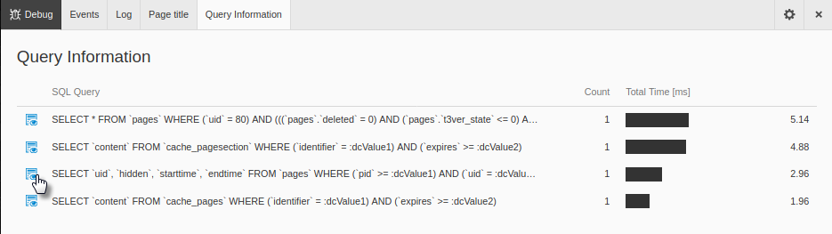

.. include:: /Includes.rst.txt

.. _debug:

================
Debugging a page
================

Click :guilabel:`Debug` on the Admin Panel bar to show general information
about the page.

.. figure:: ../../Images/Events.png
   :alt: The Events tab of the Debug section of the Admin Panel
   :class: with-border

   The **Events** tab of the Debug section of the Admin Panel

There are four tabs in the **Debug** section.

Events
------

The Events list shows all events that were dispatched while the current page
was rendered. A developer can use this list while extending TYPO3 to find out
which event to use on any given page.

Click the arrow to expand the details for an event to see basic information
about the event's parameters.

.. figure:: ../../Images/EventDetails.png
   :alt: An expanded event showing extra detail
   :class: with-border

   An expanded event showing extra detail

Log
---

The log tab shows all log entries that were generated during the current
request. You can adjust the log levels and grouping in the settings.

Click the cog icon at the top right of the Admin Panel bar to configure the
settings.

.. figure:: ../../Images/LogSettings.png
   :alt: The settings for the Log tab of the Admin Panel
   :class: with-border

   The settings for the Log entries

Page title
----------

TYPO3 has a concept of “Page Title Providers”. The section “Page title”
displays all registered providers that were checked for the current
page. This helps to debug where the currently used page title is coming from.

Query Information
-----------------

Displays a list of SQL queries that were generated on the current page and
their performance.

   The **Query** tab of the Debug section of the Admin Panel

Click on a query to open a detail view with the values used for the
placeholders.

   The values used in a query run on the page

..  note::
    The list of SQL queries misses around 20 boot queries as they are executed
    before logging is enabled.
