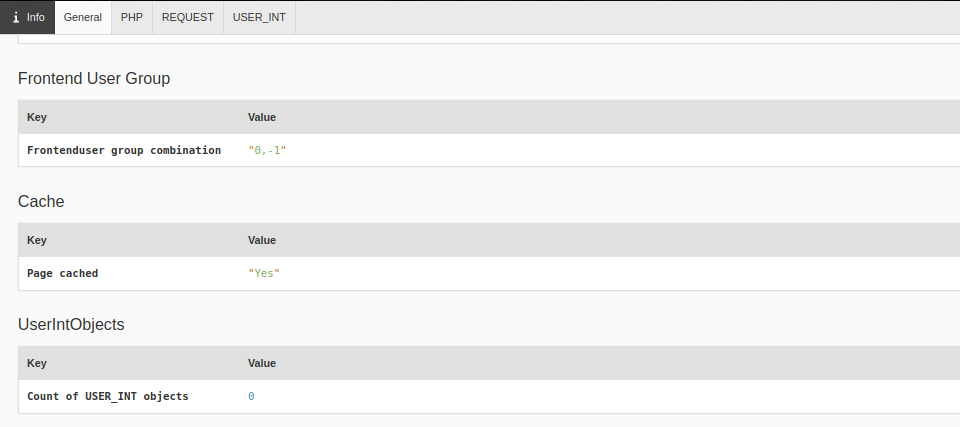

.. include:: /Includes.rst.txt

.. _info:

========================
Information about a page
========================

Click :guilabel:`Info` on the Admin Panel bar to show general information
about the page. There are four tabs in the Info section.

   The **General** tab of the Info section of the Admin Panel

General
-------

The **General** tab displays general TYPO3 related information about the
current page.

Document Size
   The size of the loaded HTML document

Page
   The current page ID and type.

Frontend User Group
   The current frontend user group restriction. Default is 0,-1 (no login
   required).

Cache
   Whether the current page is cached or not.

UserIntObjects
   Whether there are any USER_INT objects (uncached plugins) on the page. This
   is useful for performance analysis. See the **USER_INT** tab for more
   details.

Total Parsetime
   The total parsetime TYPO3 needed to render the page.

PHP
---

Information about the PHP installation on the server. This helps developers to
quickly analyze available PHP Extensions, global constants or version
constraints.

REQUEST
-------

This tab contains global PHP request information, for example the current
content of the $_COOKIE variable and the $_SERVER variable.

This information helps developers to analyze the server environment further
and find ini file paths or the IP address with which a user accesses the site.

USER_INT
--------

This is the detail view of the UserIntObjects section of the **General**
tab. If there are USER_INT objects, an integrator or developer can see details
here and use it to figure out which plugins are impacting the caching behavior.
