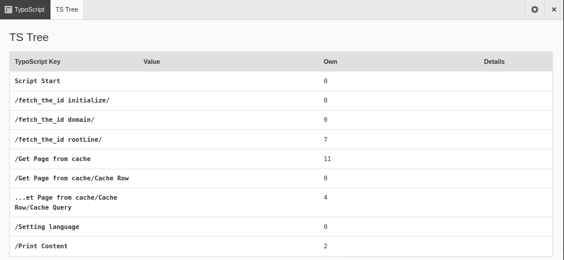
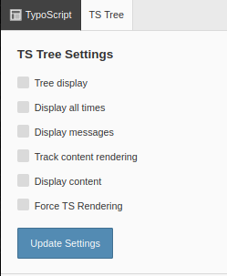

.. include:: /Includes.rst.txt

.. _TypoScript:

==========
TypoScript
==========

Click :guilabel:`TypoScript` on the Admin Panel bar to show the TypoScript (TS)
Tree. The TypoScript Tree view shows information about the loaded TypoScript
that is used for rendering the current page.

   The TypoScript Tree of the Admin Panel

Click the cog icon at the top right of the Admin Panel bar to configure the
settings.

   The settings for the TypoScript Tree

Tree display
   Displays TypoScript in a tree structure

Display all times
   Adds rendering times to each area. This is helpful when debugging
   performance issues.

Display messages
   Displays messages/details (if any). This can help to figure out what
   exactly is being rendered - but it does make the display quite big.

Track content rendering
   Tracks each step in the content rendering process. This is most useful in
   combination with “Force TS Rendering”, because a page from cache
   may well be loaded without any content being individually rendered.

Display content
   Displays the loaded content. This is especially helpful in the context of
   content rendering, because the content of each content element is displayed.

Force TS Rendering
   Instead of loading the TypoScript from cache, this setting forces
   the full rendering of the TypoScript.
