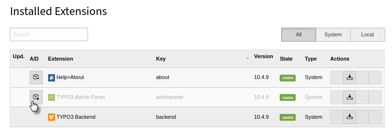

.. include:: /Includes.rst.txt

.. _installation:

============
Installation
============

This extension is part of the TYPO3 Core.

Installation with composer
==========================

Check whether you are already using the extension with::

   composer show | grep adminpanel

This should either give you no result or something similar to::

   typo3/cms-adminpanel v10.4.9

If it is not yet installed, use the ``composer require`` command to install
the extension::

   composer require typo3/cms-adminpanel

The given version depends on the version of the TYPO3 Core you are using.

Once installed, you will need to activate the extension.

Installation without composer
=============================

In an installation without composer, the extension is already shipped. You
just have to activate it.

Activate the extension
======================
#. In the backend, navigate to the :guilabel:`Admin Tools > Extensions`
   module.
#. Click the **Activate** icon for the Admin Panel extension.

   Extension manager showing Admin Panel extension
