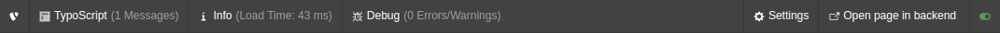
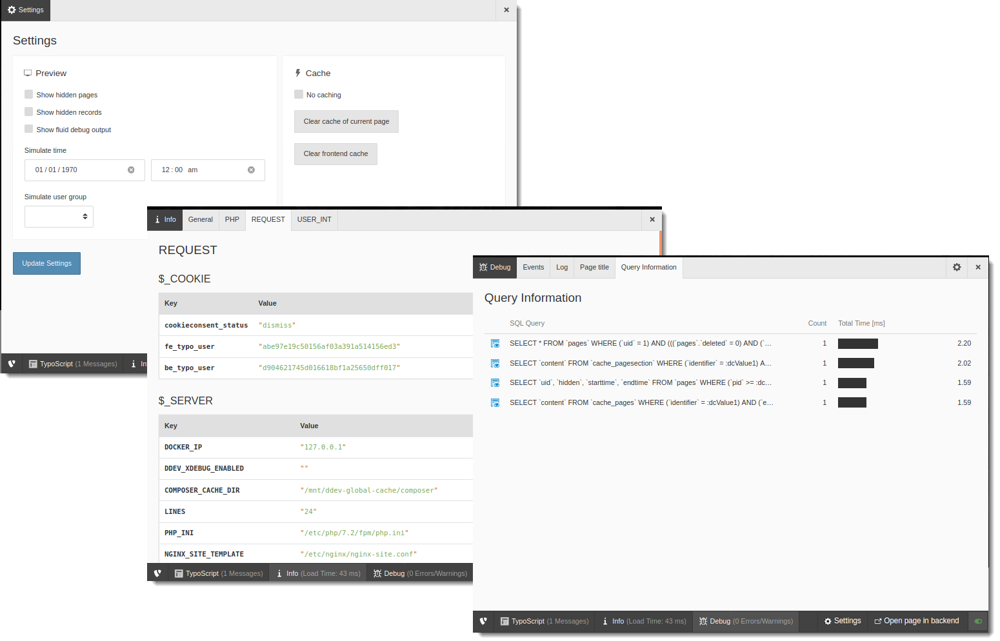

.. include:: /Includes.rst.txt

.. _introduction:

============
Introduction
============

.. _what-it-does:

What does it do?
================

This extension displays a bar at the bottom of the screen on the frontend,
from which you can access information per page.

You can use it to simulate scenarios to test page content, for example, user
groups, time-restricted content or showing hidden content. You can also use it
for general debugging.

The bar shows a summary of information about the page, an option to adjust the
settings and a link to the according page in the backend.

   The admin panel bar displayed at the bottom of the page on the frontend

Some important metrics are displayed right in the admin panel bar:

*   **TypoScript:** number of messages
*   **Info:** page load time / peak memory usage
*   **Debug:** number of errors and warnings / amount of SQL queries /
    time spent executing SQL queries

From the bar you can open a larger panel to access detailed information about
the page.

   A selection of screenshots showing different pages of the admin panel.

There is a switcher at the bottom right of the admin panel bar to turn it on
and off for the page.

See it in action
----------------

This TYPO3 Feature Demo video from August 2018 shows the admin panel in
action.

.. youtube:: 8I7hRZ4VyAE
