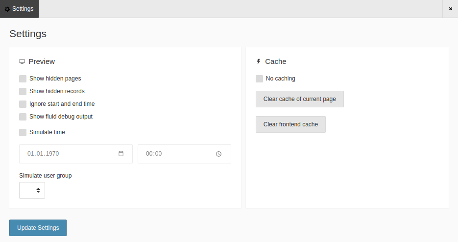

.. include:: /Includes.rst.txt

.. _settings:

========
Settings
========

The Settings section of the Admin Panel can be useful for editors and
integrators to simulate user groups and times, and to show hidden content. It
also lets you work with the cache.

   The Settings screen of the Admin Panel

.. _show-hidden-content:

Show hidden content
-------------------

Use :guilabel:`Show hidden pages` and :guilabel:`Show hidden records` to
reload the page and see any content that is set to 'disabled' in the backend.

The :guilabel:`Show fluid debug output` reloads the page with an overlay
indicating the Fluid sections and partials in use.

.. _simulate-users-and-times:

Simulate users and times
------------------------

Use the :guilabel:`Simulate time` control to specify a time for the page. This
is particularly useful for editors who want to verify the display of scheduled
or seasonal content.

Use the :guilabel:`Simulate user group` control to impersonate a particular
user group when viewing the page. This is useful for editors who want to
verify the display of restricted or permissions-based content.

.. _work-with-the-cache:

Work with the cache
-------------------

Use the controls in this section to clear the current page from the cache, to
clear the entire frontend cache or to turn off caching altogether.
