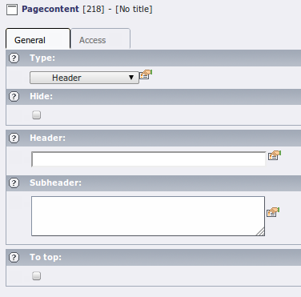

.. ==================================================
.. FOR YOUR INFORMATION
.. --------------------------------------------------
.. -*- coding: utf-8 -*- with BOM.

.. include:: ../../../Includes.txt

.. _objects-header:

Header
""""""

Being just a header, most of this content element type's rendering
is done by :ref:`setup-lib-stdheader`. The rest of the rendering takes care of
the "subheader" field.

   Input of a header content element in the TYPO3 backend

