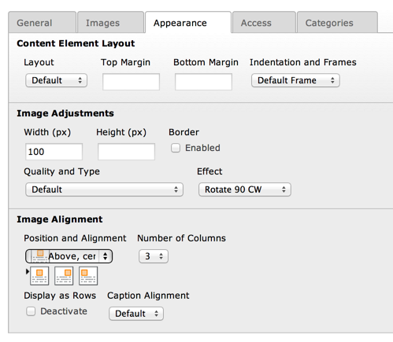

.. ==================================================
.. FOR YOUR INFORMATION
.. --------------------------------------------------
.. -*- coding: utf-8 -*- with BOM.

.. include:: ../../../Includes.txt

.. _objects-image:

Image
"""""

Image-type content elements are not rendered using a standard TypoScript
content object but instead rely on a :ref:`USER <t3tsref:cobj-user>` object provided by
CSS Styled Content, as can be seen in the TypoScript setup::

	tt_content.image = COA
	tt_content.image.10 = < lib.stdheader
	tt_content.image.20 = USER
	tt_content.image.20 {
		userFunc = \TYPO3\CMS\CssStyledContent\Controller\CssStyledContentController->render_textpic
		...
	}

   Defining the appearance of an image content element in the TYPO3 backend

The :code:`render_textpic` function supports a whole variety of specific
properties, which are detailed below.

.. note::

   All properties of USER objects also apply, in particular :ref:`stdWrap <t3tsref:stdwrap>`.

.. _objects-image-reference:

Reference
~~~~~~~~~

.. _objects-image-reference-text:

text
''''

.. container:: table-row

   Property
         text

   Data type
         :ref:`CARRAY <t3tsref:carray>` / :ref:`stdWrap <t3tsref:stdwrap>`

   Description
         Use this to import / generate the content, that should flow around the
         imageblock.

.. _objects-image-reference-textpos:

textPos
'''''''

.. container:: table-row

   Property
         textPos

   Data type
         int / :ref:`stdWrap <t3tsref:stdwrap>`

   Description
         Textposition:

         bit[0-2]: 000 = centre, 001 = right, 010 = left

         bit[3-5]: 000 = over, 001 = under, 010 text

         0 - Above: Centre

         1 - Above: Right

         2 - Above: Left

         8 - Below: Centre

         9 - Below: Right

         10 - Below: Left

         17 - In Text: Right

         18 - In Text: Left

         25 - In Text: Right (no wrap)

         26 - In Text: Left (no wrap)

.. _objects-image-reference-imglist:

imgList
'''''''

.. container:: table-row

   Property
         imgList

   Data type
         list of imagefiles / :ref:`stdWrap <t3tsref:stdwrap>`

   Description
         list of images from ".imgPath"

         **Example:**

         This imports the list of images from tt\_content's image-field

         "imgList.field = image"

   Default
         field = image

.. _objects-image-reference-imgpath:

imgPath
'''''''

.. container:: table-row

   Property
         imgPath

   Data type
         path / :ref:`stdWrap <t3tsref:stdwrap>`

   Description
         Path to the images

         **Example:**

         "uploads/pics/"

   Default
         uploads/pics/

.. _objects-image-reference-imgmax:

imgMax
''''''

.. container:: table-row

   Property
         imgMax

   Data type
         int / :ref:`stdWrap <t3tsref:stdwrap>`

   Description
         max number of images

   Default
         0 [all]

.. _objects-image-reference-imgstart:

imgStart
''''''''

.. container:: table-row

   Property
         imgStart

   Data type
         int / :ref:`stdWrap <t3tsref:stdwrap>`

   Description
         start with image-number ".imgStart"

   Default
         0

.. _objects-image-reference-imgobjnum:

imgObjNum
'''''''''

.. container:: table-row

   Property
         imgObjNum

   Data type
         *imgObjNum* + :ref:`optionSplit <t3tsref:objects-optionsplit>`

   Description
         Here you define which :ref:`IMAGE <t3tsref:cobj-image>`-cObjects from the array "1,2,3,4..."
         should render which image.

         "current" is set to the image-filename.

         **Example:**

         "imgObjNum = 1 \|\*\|\|\*\| 2":

         If your ".imgList" contains 3 images, this would render the first two
         images with "1. ..." and the last image with "2. ...".

   Default
         1

.. _objects-image-reference-1-2-3-4:

1,2,3,4,...
'''''''''''

.. container:: table-row

   Property
         1,2,3,4,...

   Data type
         :ref:`IMAGE <t3tsref:cobj-image>`

   Description
         Rendering of the individual images

         The register "IMAGE\_NUM" is set with the number of image being
         rendered for each rendering of an image-object. Starting with zero.

         The image-object should not be of type GIFBUILDER!

         **Important:**

         "file.import.current = 1" fetches the name of the images!

.. _objects-image-reference-caption:

caption
'''''''

.. container:: table-row

   Property
         caption

   Data type
         :ref:`CARRAY <t3tsref:carray>` / :ref:`stdWrap <t3tsref:stdwrap>`

   Description
         Caption

.. _objects-image-reference-captionalign:

captionAlign
''''''''''''

.. container:: table-row

   Property
         captionAlign

   Data type
         align / :ref:`stdWrap <t3tsref:stdwrap>`

   Description
         Caption alignment

   Default
         field = imagecaption\_position

.. _objects-image-reference-imagetextsplit:

imageTextSplit
''''''''''''''

.. container:: table-row

   Property
         imageTextSplit

   Data type
         boolean

   Description
         If this is set, the caption/alttext/title/longdescURL text is split by
         the character (or string) from ".token" , and every item is rendered
         to the accordant image in the image block.

.. _objects-image-reference-border:

border
''''''

.. container:: table-row

   Property
         border

   Data type
         boolean / :ref:`stdWrap <t3tsref:stdwrap>`

   Description
         If true, a border is generated around the images.

   Default
         field = imageborder

.. _objects-image-reference-bordercol:

borderCol
'''''''''

.. container:: table-row

   Property
         borderCol

   Data type
         HTML-color / :ref:`stdWrap <t3tsref:stdwrap>`

   Description
         Color of the border, if ".border" is set.

         This is used just to create the CSS class that will be added to an
         image block that needs a border. The border itself will have to be
         specified in CSS. See CSS section later.

   Default
         black

.. _objects-image-reference-borderthick:

borderThick
'''''''''''

.. container:: table-row

   Property
         borderThick

   Data type
         pixels / :ref:`stdWrap <t3tsref:stdwrap>`

   Description
         Width of the border around the pictures

         This is used just to create the CSS class that will be added to an
         image block that needs a border. The border itself will have to be
         specified in CSS. See CSS section later.

   Default
         2

.. _objects-image-reference-cols:

cols
''''

.. container:: table-row

   Property
         cols

   Data type
         int / :ref:`stdWrap <t3tsref:stdwrap>`

   Description
         Columns

   Default
         field = imagecols

.. _objects-image-reference-rows:

rows
''''

.. container:: table-row

   Property
         rows

   Data type
         int / :ref:`stdWrap <t3tsref:stdwrap>`

   Description
         Rows (higher priority than "cols")

.. _objects-image-reference-norows:

noRows
''''''

.. container:: table-row

   Property
         noRows

   Data type
         boolean / :ref:`stdWrap <t3tsref:stdwrap>`

   Description
         If set, the rows are not divided by table-rows. Thus images are more
         nicely shown if the height differs a lot (normally the width is the
         same!)

   Default
         field = image\_noRows

.. _objects-image-reference-nocols:

noCols
''''''

.. container:: table-row

   Property
         noCols

   Data type
         boolean / :ref:`stdWrap <t3tsref:stdwrap>`

   Description
         If set, the columns are not made in the table. The images are all put
         in one row separated by a clearer to space them apart.

         If noRows is set, noCols will be unset. They cannot be set
         simultaneously.

.. _objects-image-reference-colspace:

colSpace
''''''''

.. container:: table-row

   Property
         colSpace

   Data type
         int / :ref:`stdWrap <t3tsref:stdwrap>`

   Description
         Space between columns. If you use the default CSS this will be added
         automatically as margin-right to the images.

.. _objects-image-reference-maxw:

maxW
''''

.. container:: table-row

   Property
         maxW

   Data type
         int / :ref:`stdWrap <t3tsref:stdwrap>`

   Description
         Max width of the image-table.

         This will scale images not in the right size! Takes the number of
         columns into account!

.. _objects-image-reference-maxwintext:

maxWInText
''''''''''

.. container:: table-row

   Property
         maxWInText

   Data type
         int / :ref:`stdWrap <t3tsref:stdwrap>`

   Description
         Max width of the image-table, if the text is wrapped around the image-
         table (on the left or right side).

         This will scale images not in the right size! Takes the number of
         columns into account!

   Default
         50% of maxW

.. _objects-image-reference-equalh:

equalH
''''''

.. container:: table-row

   Property
         equalH

   Data type
         int / :ref:`stdWrap <t3tsref:stdwrap>`

   Description
         If this value is greater than zero, it will secure that images in a
         row have the same height. The width will be calculated.

         If the total width of the images raises above the "maxW"-value of the
         table the height for each image will be scaled down equally so that
         the images still have the same height but are within the limits of the
         totalWidth.

         Please note that this value will override the properties "width",
         "maxH", "maxW", "minW", "minH" of the IMAGE-objects generating the
         images. Furthermore it will override the "noRows"-property and
         generate a table with no columns instead!

.. _objects-image-reference-colrelations:

colRelations
''''''''''''

.. container:: table-row

   Property
         colRelations

   Data type
         string / :ref:`stdWrap <t3tsref:stdwrap>`

   Description
         This value defines the width-relations of the images in the columns of
         IMGTEXT. The syntax is "[int] : [int] : [int] : ..." for each column.
         If there are more image columns than figures in this value, it's
         ignored. If the relation between two of these figures exceeds 10, this
         function is ignored.

         It works only fully if all images are downscaled by their maxW-
         definition.

         **Example:**

         If 6 images are placed in three columns and their width's are high
         enough to be forcibly scaled, this value will scale the images in the
         to be e.g. 100, 200 and 300 pixels from left to right

         1 : 2 : 3

.. _objects-image-reference-image-compression:

image\_compression
''''''''''''''''''

.. container:: table-row

   Property
         image\_compression

   Data type
         int / :ref:`stdWrap <t3tsref:stdwrap>`

   Description
         Image Compression:

         0= Default

         1= Don't change! (removes all parameters for the image\_object!!)

         (adds gif-extension and color-reduction command)

         10= GIF/256

         11= GIF/128

         12= GIF/64

         13= GIF/32

         14= GIF/16

         15= GIF/8

         (adds jpg-extension and quality command)

         20= IM: -quality 100

         21= IM: -quality 90 <=> Photoshop 60 (JPG/Very High)

         22= IM: -quality 80 (JPG/High)

         23= IM: -quality 70

         24= IM: -quality 60 <=> Photoshop 30 (JPG/Medium)

         25= IM: -quality 50

         26= IM: -quality 40 (JPG/Low)

         27= IM: -quality 30 <=> Photoshop 10

         28= IM: -quality 20 (JPG/Very Low)

         The default ImageMagick quality seems to be 75. This equals Photoshop
         quality 45. Images compressed with ImageMagick with the same visual
         quality as a Photoshop-compressed image seems to be 50% bigger in file
         size!!

         .. note::

            Works ONLY if IMAGE-obj is NOT GIFBUILDER

.. _objects-image-reference-image-effects:

image\_effects
''''''''''''''

.. container:: table-row

   Property
         image\_effects

   Data type
         int / :ref:`stdWrap <t3tsref:stdwrap>`

   Description
         Adds these IM/GM commands to the parameters for scaling. This function
         has no effect if "image\_compression" above is set to 1!!

         1 => "-rotate 90",

         2 => "-rotate 270",

         3 => "-rotate 180",

         10 => "-colorspace GRAY",

         11 => "-sharpen 70",

         20 => "-normalize",

         23 => "-contrast",

         25 => "-gamma 1.3",

         26 => "-gamma 0.8"

         .. note::

            Works ONLY if IMAGE-obj is NOT GIFBUILDER

.. _objects-image-reference-image-frames:

image\_frames
'''''''''''''

.. container:: table-row

   Property
         image\_frames

   Data type
         Array

         \+ .key / :ref:`stdWrap <t3tsref:stdwrap>`

   Description
         **Frames:**

         .key points to the frame used.

         ".image\_frames.x" is imgResource-mask (".m")properties which will
         override to the [imgResource].m properties of the imageObjects. This
         is used to mask the images into a frame. See how it's done in the
         default configuration and IMGTEXT in the static\_template-table.

         **Example:**

         ::

            1 {
              mask = media/uploads/darkroom1_mask.jpg
              bgImg = GIFBUILDER
              bgImg {
                XY = 100,100
                backColor = {$bgCol}
              }
              bottomImg = GIFBUILDER
              bottomImg {
                XY = 100,100
                backColor = black
              }
              bottomImg_mask = media/uploads/darkroom1_bottom.jpg
            }

		 .. note::

            This cancels the jpg-quality settings sent as ordinary
            ".params" to the imgResource. In addition the output of this operation
            will always be jpg or gif!

         .. note::

            Works ONLY if IMAGE-obj is NOT GIFBUILDER

.. _objects-image-reference-editicons:

editIcons
'''''''''

.. container:: table-row

   Property
         editIcons

   Data type
         string

   Description
         See :ref:`stdWrap.editIcons <t3tsref:stdwrap-editicons>`.

.. _objects-image-reference-rendermethod:

renderMethod
''''''''''''

.. container:: table-row

   Property
         renderMethod

   Data type
         string / :ref:`stdWrap <t3tsref:stdwrap>`

   Description
         The rendering method to use for this content object. The name of the
         method must be one of the entries in the  **rendering** setting.

   Default
         singleNoCaption

.. _objects-image-reference-fallbackrendering:

fallbackRendering
'''''''''''''''''

.. container:: table-row

   Property
         fallbackRendering

   Data type
         cObj

   Description
         If no rendering is specified, this is the fallback that will be used.
         Can be used to overwrite the rendering method in specific "edge"
         situations (e.g. when rendering only one image, or when rendering a
         list of files without captions). This cObject will be called once the
         major "rendering" type is defined (dl, ul, div) and when the pre-
         processor already has gathered some information about how many images
         to render (register:imageCount) and if the current rendering will
         output a global caption for the whole image block or split captions
         are needed (register:renderGlobalCaption). Using this information the
         fallbackRendering can output some string, which will overwrite the
         default rendering method (e.g. dl, ul, div and newly introduced
         "simple", which renders least structure, intended for one image only).

         The default css\_styled\_content setup in TYPO3 v4.3 provides these
         fallbacks:

         - with rendering=dl,ul,div, a single image fallbacks to rendering=simple

         - with rendering=dl, a list of images with no caption fallbacks to
           rendering=ul

         - with rendering=dl, a list of images with one "global" caption (no
           splitCaption configured) fallbacks to rendering=ul

   Default
         dl

.. _objects-image-reference-rendering:

rendering
'''''''''

.. container:: table-row

   Property
         rendering

   Data type
         Array of

         :ref:`IMGTEXT <t3tsref:cobj-imgtext>` properties

   Description
         In this array, a list of renderers can be created from which the user
         chooses which one will render each "Text with image" content object.
         The settings in each entry can override settings from this table, and
         there is also a set of :ref:`stdWrap <t3tsref:stdwrap>`'s that allows you to create the XHTML
         structure of your choosing for rendering the imageblock.

         In the standard installation the rendering will be loaded from the
         lib.imgtextrendering TypoScript object, so you might want to
         change/add stuff here.

         **Example:**

         ::

            tt_content.textpic.20.rendering {
              dl {
                  imageRowStdWrap.wrap = 
 | 

                  imageRowStdWrap.insertData = 1
                  noRowsStdWrap.wrap =
                  oneImageStdWrap.wrap = <dl class="csi-image" style="width:{register:imagewidth}px;"> | </dl>
                  oneImageStdWrap.insertData = 1
                  imgTagStdWrap.wrap = <dt> | </dt>
                  editIconsStdWrap.wrap = <dd> | </dd>
                  captionStdWrap.wrap = <dd class="csi-caption"> | </dd>
              }
              # Now we add another rendering method:
              dl-nospace < .dl
              dl-nospace.addClasses = csi-textpic-dl-nospace
            }

.. _objects-image-reference-addclasses:

addClasses
''''''''''

.. container:: table-row

   Property
         addClasses

   Data type
         string / :ref:`stdWrap <t3tsref:stdwrap>`

   Description
         Add the specified classes to the csc-textpic 
 (the outer
         surrounding block). This is useful to override in a specific
         "rendering" engine, allowing you for example to have different margin
         styles (one with margin around images, the other without).

.. _objects-image-reference-addclassesimage:

addClassesImage
'''''''''''''''

.. container:: table-row

   Property
         addClassesImage

   Data type
         String / :ref:`stdWrap <t3tsref:stdwrap>`

   Description
         Add the specified classes to the image element

.. _objects-image-reference-separaterows:

separateRows
''''''''''''

.. container:: table-row

   Property
         separateRows

   Data type
         boolean / :ref:`stdWrap <t3tsref:stdwrap>`

   Description
         Separate the rows of images in different :code:`
` tags, so that they can be
         styled in some other way. See CSS-section for more details.

   Default
         0

.. _objects-image-reference-imgtagstdwrap:

imgTagStdWrap
'''''''''''''

.. container:: table-row

   Property
         imgTagStdWrap

   Data type
         string / :ref:`stdWrap <t3tsref:stdwrap>`

   Description
         Wrapping around the :code:`` tag.

.. _objects-image-reference-editiconsstdwrap:

editIconsStdWrap
''''''''''''''''

.. container:: table-row

   Property
         editIconsStdWrap

   Data type
         string / :ref:`stdWrap <t3tsref:stdwrap>`

   Description
         Wrapping around the frontend editing icons

.. _objects-image-reference-oneimagestdwrap:

oneImageStdWrap
'''''''''''''''

.. container:: table-row

   Property
         oneImageStdWrap

   Data type
         string / :ref:`stdWrap <t3tsref:stdwrap>`

   Description
         Wrapping around one "image" in the block (with image and caption)

.. _objects-image-reference-imagerowstdwrap:

imageRowStdWrap
'''''''''''''''

.. container:: table-row

   Property
         imageRowStdWrap

   Data type
         string / :ref:`stdWrap <t3tsref:stdwrap>`

   Description
         Wrapping around one row of images

.. _objects-image-reference-imagelastrowstdwrap:

imageLastRowStdWrap
'''''''''''''''''''

.. container:: table-row

   Property
         imageLastRowStdWrap

   Data type
         string / :ref:`stdWrap <t3tsref:stdwrap>`

   Description
         Wrapping around the last row of images

.. _objects-image-reference-norowsstdwrap:

noRowsStdWrap
'''''''''''''

.. container:: table-row

   Property
         noRowsStdWrap

   Data type
         string / :ref:`stdWrap <t3tsref:stdwrap>`

   Description
         Wrapping around all images if there are no separate rows (either by
         **separateRows** setting, of if we just have one row).

.. _objects-image-reference-imagestdwrap:

imageStdWrap
''''''''''''

.. container:: table-row

   Property
         imageStdWrap

   Data type
         string / :ref:`stdWrap <t3tsref:stdwrap>`

   Description
         Wrapping around the whole image block if a width is needed. This is
         the case when

         - position is center

         - there is more than 1 row

         - or we have a global caption

.. _objects-image-reference-imagestdwrapnowidth:

imageStdWrapNoWidth
'''''''''''''''''''

.. container:: table-row

   Property
         imageStdWrapNoWidth

   Data type
         string / :ref:`stdWrap <t3tsref:stdwrap>`

   Description
         Wrapping around the whole image block if no width is needed.
