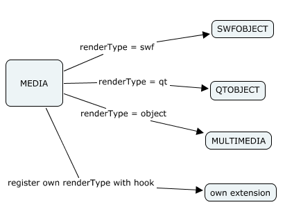

.. ==================================================
.. FOR YOUR INFORMATION
.. --------------------------------------------------
.. -*- coding: utf-8 -*- with BOM.

.. include:: ../../../Includes.txt

.. _objects-media:

Media
"""""

The Media content element acts as a dispatcher for different media
output formats.

   The MEDIA element and the various media formats

The Media content element is a dispatcher which gets its HTML output
from one of the available render objects. By default, these render
objects include SWFOBJECT (Flash driven by Javascript), QTOBJECT
(Quicktime driven by Javascript) and MULTIMEDIA (the original
MULTIMEDIA object rendered with EMBED tags).

The renderType defines which object is used for rendering. If set to
its default value of "auto", the Media content element uses the media
file's extension to choose the right renderer. This auto-detection may
not work as well for external URLs so setting the renderType manually
is preferable in that case.

If one of the existing renderTypes does not meet your needs, new
renderTypes can be registered and rendered with a custom extension.

The Media content element contains the following third-party
files in :file:`typo3/contrib/flashmedia`:

- :file:`qtobject/qtobject.js` (Javascript for QTOBJECT)

- :file:`swfobject/swfobject.js` (Javascript for SWFOBJECT)

- :file:`swfobject/expressInstall.swf` (this is displayed if Flash version of
  client is too low)

- :file:`flvplayer.swf` (TYPO3 video player for flv, swf, mp4, m4u etc)

- :file:`player.swf` (Audio player from 1pixelout)

- :file:`player.txt` (License for audio player)

If you want to use a different player, it can be configured via
TypoScript.

.. _objects-media-reference:

MEDIA Reference
~~~~~~~~~~~~~~~

.. _objects-media-reference-flexparams:

flexParams
''''''''''

.. container:: table-row

   Property
         flexParams

   Data type
         :ref:`stdWrap <t3tsref:stdwrap>`

   Description
         Used for Flexform configuration of the content element

   Default
         flexParams.field = pi\_flexform

.. _objects-media-reference-alternativecontent:

alternativeContent
''''''''''''''''''

.. container:: table-row

   Property
         alternativeContent

   Data type
         :ref:`stdWrap <t3tsref:stdwrap>`

   Description
         Alternative content

   Default
         alternativeContent.field = bodytext

.. _objects-media-reference-type:

type
''''

.. container:: table-row

   Property
         type

   Data type
         string

   Description
         Defines media type: video/audio

   Default
         video

.. _objects-media-reference-rendertype:

renderType
''''''''''

.. container:: table-row

   Property
         renderType

   Data type
         string

   Description
         Used for select the render object. Possible renderTypes are:
         auto/swf/qt/object. Extensions may add custom renderTypes as well.

   Default
         auto

.. _objects-media-reference-allowemptyurl:

allowEmptyUrl
'''''''''''''

.. container:: table-row

   Property
         allowEmptyUrl

   Data type
         boolean

   Description
         If set to 0 you see a warning if no file/URL is configured. If you do
         some advanced setup such as a Javascript-driven player with a playlist
         you may use the object without a URL and need to set the value to 1.

   Default
         0

.. _objects-media-reference-mimehandler:

mimeHandler
'''''''''''

.. container:: table-row

   Property
         mimeHandler

   Data type
         array

   Description
         The mappings between file extensions and render types can be
         configured here and will be used when renderType=auto. Possible values
         are MEDIA, SWF, QT

   Default
         ::

			 mimeHandler {
				 default = MEDIA
				 mp3 = SWF
				 mp4 = SWF
				 m4v = SWF
				 mov = QT
				 avi = MEDIA
				 asf = MEDIA
				 class = MEDIA
				 swa = SWF
			 }

.. _objects-media-reference-mimeconf-swfobject:

mimeConf.swfobject
''''''''''''''''''

.. container:: table-row

   Property
         mimeConf.swfobject

         mimeConf.qtobject

   Data type
         array

   Description
         Copy of configuration for SWFOBJECT and QTOBJECT

   Default
         mimeConf.swfobject < tt\_content.swfobject.20

         mimeConf.qtobject < tt\_content.qtobject.20

.. _objects-media-reference-video:

Video Player Reference
~~~~~~~~~~~~~~~~~~~~~~

.. _objects-media-reference-video-player:

player
''''''

.. container:: table-row

   Property
         player

   Data type
         string

   Description
         Location of video player

   Default
         {$styles.content.media.videoPlayer}

         typo3/contrib/flashmedia/flvplayer.swf

.. _objects-media-reference-video-defaultwidth:

defaultWidth
''''''''''''

.. container:: table-row

   Property
         defaultWidth

   Data type
         int

   Description
         Default video media width

   Default
         {$styles.content.media.defaultVideoWidth}

         600

.. _objects-media-reference-video-defaultheight:

defaultHeight
'''''''''''''

.. container:: table-row

   Property
         defaultHeight

   Data type
         int

   Description
         Default video media height

   Default
         {$styles.content.media.defaultVideoHeight}

         400

.. _objects-media-reference-video-default:

default
'''''''

.. container:: table-row

   Property
         default

   Data type
         array

   Description
         Default parameters for flashvars / params / attributes

         **Usage:**

         ::

            default {
               flashvars.allowFullScreen = true
               params.wmode = transparent
               attributes.align = center
            }

         flashvars are used for swf file configuration. There is no standard
         across players, but for flvplayer see description below.

         For detailed description of possible params/attributes visit this URL:

         http://helpx.adobe.com/flash/kb/flash-object-embed-tag-attributes.html

   Default
         ::

			 default {
				 params.quality = high
				 params.wmode = transparent
				 params.menu = false
				 params.allowScriptAccess =
				 sameDomain
				 params.allowFullScreen = true
			 }

.. _objects-media-reference-video-mapping:

mapping
'''''''

.. container:: table-row

   Property
         mapping

   Data type
         array

   Description
         If you want to rename predefined vars you can use mapping. See
         tt\_content.media.20.audio where it's needed

.. _objects-media-reference-audio:

Audio Player Reference
~~~~~~~~~~~~~~~~~~~~~~

.. _objects-media-reference-audio-player:

player
''''''

.. container:: table-row

   Property
         player

   Data type
         string

   Description
         Location of audio player

   Default
         {$styles.content.media.audioPlayer}

         typo3/contrib/flashmedia/player.swf

.. _objects-media-reference-audio-defaultwidth:

defaultWidth
''''''''''''

.. container:: table-row

   Property
         defaultWidth

   Data type
         int

   Description
         Default audio media width

   Default
         {$styles.content.media.defaultAudioWidth}

         600

.. _objects-media-reference-audio-defaultheight:

defaultHeight
'''''''''''''

.. container:: table-row

   Property
         defaultHeight

   Data type
         int

   Description
         Default audio media height

   Default
         {$styles.content.media.defaultAudioHeight}

         400

.. _objects-media-reference-audio-default:

default
'''''''

.. container:: table-row

   Property
         default

   Data type
         array

   Description
         Default parameter for flashvars / params / attributes

         Usage::

			 default {
				 flashvars.allowFullScreen = true
				 params.wmode = transparent
				 attributes.align = center
			 }

         Flashvars are used for swf file configuration. There is no standard
         across players, but for flvplayer see description below.

         For detailed description of possible params/attributes visit this URL:

         http://helpx.adobe.com/flash/kb/flash-object-embed-tag-attributes.html

   Default
         ::

		 	 default {
				 params.quality = high
				 params.wmode = transparent
				 params.allowScriptAccess =
				 sameDomain
				 params.menu = false
			 }

.. _objects-media-reference-audio-mapping:

mapping
'''''''

.. container:: table-row

   Property
         mapping

   Data type
         array

   Description
         The audio player doesn't work with file, but instead expects the file
         with the flashvar soundFile. mapping does the rename of parameter for
         you by default.

   Default
         ::

         	mapping {
         		flashvars.file = soundFile
         	}

.. _objects-media-reference-swfobject:

SWFOBJECT Reference
~~~~~~~~~~~~~~~~~~~

.. _objects-media-reference-swfobject-file:

file
''''

.. container:: table-row

   Property
         file

   Data type
         :ref:`stdWrap <t3tsref:stdwrap>`

   Description
         Media file or URL

.. _objects-media-reference-swfobject-width:

width
'''''

.. container:: table-row

   Property
         width

   Data type
         int

   Description
         Width of swfObject

.. _objects-media-reference-swfobject-height:

height
''''''

.. container:: table-row

   Property
         height

   Data type
         int

   Description
         Height of swfObject

.. _objects-media-reference-swfobject-flexparams:

flexParams
''''''''''

.. container:: table-row

   Property
         flexParams

   Data type
         Flexform configuration

   Description
         Used for Flexform configuration of the CE

   Default
         flexParams.field = pi\_flexform

.. _objects-media-reference-swfobject-alternativecontent:

alternativeContent
''''''''''''''''''

.. container:: table-row

   Property
         alternativeContent

   Data type
         :ref:`stdWrap <t3tsref:stdwrap>`

   Description
         Alternative content

   Default
         alternativeContent.field = bodytext

.. _objects-media-reference-swfobject-layout:

layout
''''''

.. container:: table-row

   Property
         layout

   Data type
         :ref:`stdWrap <t3tsref:stdwrap>`

   Description
         HTML Template for the Object. ###SWFOBJECT### is replaced with the
         sfwobject, ###ID### is replaced with the unique Id of the div/object

   Default
         ###SWFOBJECT###

.. _objects-media-reference-swfobject-video-player:

video.player
''''''''''''

.. container:: table-row

   Property
         :ref:`video.player <objects-media-reference-video>`

         :ref:`audio.player <objects-media-reference-audio>`

   Data type
         Array of properties

   Description
         Properties of each player.

.. _objects-media-reference-qtobject:

QTOBJECT Reference
~~~~~~~~~~~~~~~~~~

.. _objects-media-reference-qtobject-file:

file
''''

.. container:: table-row

   Property
         file

   Data type
         :ref:`stdWrap <t3tsref:stdwrap>`

   Description
         Media file or URL

.. _objects-media-reference-qtobject-width:

width
'''''

.. container:: table-row

   Property
         width

   Data type
         int

   Description
         Width of qtObject

.. _objects-media-reference-qtobject-height:

height
''''''

.. container:: table-row

   Property
         height

   Data type
         int

   Description
         Height of qtObject

.. _objects-media-reference-qtobject-flexparams:

flexParams
''''''''''

.. container:: table-row

   Property
         flexParams

   Data type
         Flexform configuration

   Description
         Used for Flexform configuration of the CE

   Default
         flexParams.field = pi\_flexform

.. _objects-media-reference-qtobject-alternativecontent:

alternativeContent
''''''''''''''''''

.. container:: table-row

   Property
         alternativeContent

   Data type
         :ref:`stdWrap <t3tsref:stdwrap>`

   Description
         Alternative content

   Default
         alternativeContent.field = bodytext

.. _objects-media-reference-qtobject-layout:

layout
''''''

.. container:: table-row

   Property
         layout

   Data type
         :ref:`stdWrap <t3tsref:stdwrap>`

   Description
         HTML Template for the Object. ###QTOBJECT### is replaced with the
         qtobject, ###ID### is replaced with the unique Id of the div/object

   Default
         ###QTOBJECT###

.. _objects-media-reference-qtobject-video-player:

video.player
''''''''''''

.. container:: table-row

   Property
         :ref:`video.player <objects-media-reference-video>`

         :ref:`audio.player <objects-media-reference-audio>`

   Data type
         Array of properties

   Description
         Properties of each player.

