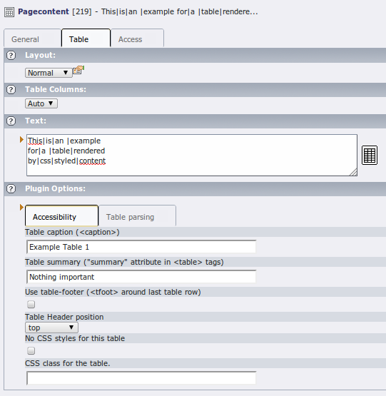

.. ==================================================
.. FOR YOUR INFORMATION
.. --------------------------------------------------
.. -*- coding: utf-8 -*- with BOM.

.. include:: ../../../Includes.txt

.. _objects-table:

Table
"""""

Table-type content elements are not rendered using a standard TypoScript
content object but instead rely on a :ref:`USER <t3tsref:cobj-user>` object provided by
CSS Styled Content, as can be seen in the TypoScript setup::

	tt_content.table = COA
	tt_content.table {
		10 = < lib.stdheader

		20 = USER
		20.userFunc = \TYPO3\CMS\CssStyledContent\Controller\CssStyledContentController->render_table
		20.field = bodytext
		...
	}

   Input of a table content element in the TYPO3 backend

The :code:`render_table` function supports a whole variety of specific
properties, which are detailed below.

.. note::

   All properties of USER objects also apply, in particular :ref:`stdWrap <t3tsref:stdwrap>`.

.. _objects-table-reference:

Reference
~~~~~~~~~

.. _objects-table-reference-field:

field
'''''

.. container:: table-row

   Property
         field

   Data type
         data

   Description
         The field to fetch the content from.

   Default
         bodytext

.. _objects-table-reference-innerstdwrap:

innerStdWrap
''''''''''''

.. container:: table-row

   Property
         innerStdWrap

   Data type
         :ref:`stdWrap <t3tsref:stdwrap>`

   Description
         StdWrap to the content of the table cells.

         With this you can for example pass the content through lib.parseFunc

   Default
         innerStdWrap.parseFunc =< lib.parseFunc

.. _objects-table-reference-color:

color
'''''

.. container:: table-row

   Property
         color

   Data type
         :ref:`t3tsref:data-type-html-color`

   Description
         Background Color of the table. Some predefined values are already
         there. (Look into the background color dropdown of the table element)

         Add your own with

         ::

            color.[dropDownId] = #000000

         Fallback is

         ::

            color.default =

   Default
         1 = #EDEBF1

         2 = #F5FFAA

.. _objects-table-reference-tableparams-layout:

tableParams\_[layout]
'''''''''''''''''''''

.. container:: table-row

   Property
         tableParams\_[layout]

   Data type
         border,

         cellpadding,

         cellspacing

   Description
         Table params dependent on the selected layout (dropdown). You should
         better use CSS to style your tables.

         For example:

         ::

            tableParams_0 {
                    border =
                    cellpadding =
                    cellspacing =
            }
