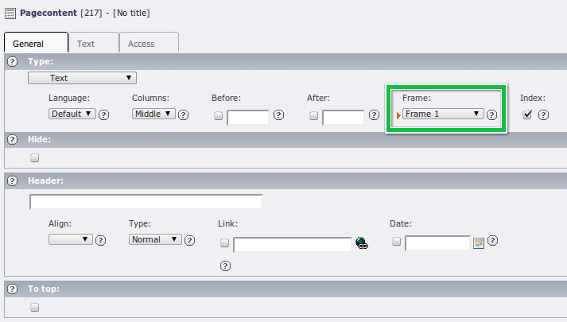
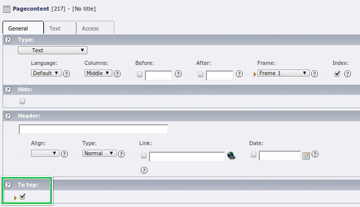

.. ==================================================
.. FOR YOUR INFORMATION
.. --------------------------------------------------
.. -*- coding: utf-8 -*- with BOM.

.. include:: ../../Includes.txt

.. _setup:

Setup
^^^^^

.. _setup-styles-content:

styles.content
""""""""""""""

.. _setup-styles-content-get:

get
~~~

.. container:: table-row

   Property
         get

   Data type
         cObj

   Description
         Predefined CONTENT objects for getting content from columns.
         Column: Normal

   Default
         :ref:`t3tsref:cobj-content`

.. _setup-styles-content-getright:

getRight
~~~~~~~~

.. container:: table-row

   Property
         getRight

   Data type
         cObj

   Description
         Predefined CONTENT objects for getting content from columns.
         Column: Right

   Default
         :ref:`t3tsref:cobj-content`

.. _setup-styles-content-getleft:

getLeft
~~~~~~~

.. container:: table-row

   Property
         getLeft

   Data type
         cObj

   Description
         Predefined CONTENT objects for getting content from columns.
         Column: Left

   Default
         :ref:`t3tsref:cobj-content`

.. _setup-styles-content-getborder:

getBorder
~~~~~~~~~

.. container:: table-row

   Property
         getBorder

   Data type
         cObj

   Description
         Predefined CONTENT objects for getting content from columns.
         Column: Border

   Default
         :ref:`t3tsref:cobj-content`

.. _setup-styles-content-getnews:

getNews
~~~~~~~

.. container:: table-row

   Property
         getNews

   Data type
         cObj

   Description
         Predefined CONTENT object for getting News from a special page
         (defined in Constants)

   Default
         :ref:`t3tsref:cobj-content`

.. _setup-styles-content-editpanelpage:

editPanelPage
~~~~~~~~~~~~~

.. container:: table-row

   Property
         editPanelPage

   Data type
         cObj

   Description
         Predefined EDITPANEL object for displaying a panel to edit the page
         (frontend editing).

   Default
         :ref:`t3tsref:cobj-editpanel`

.. _setup-styles-content-get-example:

Example 1
~~~~~~~~~

Here is some example setup code for :code:`styles.content`. Note that all properties of
:ref:`t3tsref:cobj-content` objects apply.

::

   styles.content.get = CONTENT
   styles.content.get {
           table = tt_content
           select.orderBy = sorting
           select.where = colPos=0
           select.languageField = sys_language_uid
   }

.. _setup-styles-content-editpanel-example:

Example 2
~~~~~~~~~

And here is an example setup for the edit panel. Note that all propoperties of
:ref:`t3tsref:cobj-editpanel` objects apply.

::

   styles.content.editPanelPage = EDITPANEL
   styles.content.editPanelPage {
           allow = toolbar,move,hide
           label.data = LLL:EXT:css_styled_content/Resources/Private/Language/locallang.xlf:eIcon.page
           label.wrap = |&nbsp;<b>%s</b>
   }

.. _setup-lib-parsefunc-rte:

lib.parsefunc\_RTE
""""""""""""""""""

The lib.parsefunc\_RTE is responsible for rendering the RTE content.
It's mainly a copy of lib.parsefunc with some modifications.

For reference see :ref:`t3tsref:parsefunc`, :ref:`t3tsref:htmlparser`
and :ref:`t3tsref:htmlparser-tags` in the TypoScript Reference.

.. _setup-lib-stdheader:

lib.stdheader
"""""""""""""

With the lib.stdheader object the headlines are rendered. Here you can
influence how the different header layouts will appear on your site.

.. _setup-tt-content:

tt\_content
"""""""""""

This is the heart of CSS Styled Content. The :ref:`t3tsref:cobj-case` object for rendering
the different content element types. The use of CASE (based on the "tt_content" field "CType")
makes it possible to provide a different rendering for each element type.

.. _setup-tt-content-stdwrap-innerwrap:

stdWrap.innerWrap
~~~~~~~~~~~~~~~~~

The innerWrap part is responsible for the rendering of section frames.
This is the definition of what happens if you choose a frame in a
content element.

   Section frame selector in the TYPO3 backend

.. _setup-tt-content-stdwrap-innerwrap2:

stdWrap.innerWrap2
~~~~~~~~~~~~~~~~~~

Generates the link to top if the editor activated it in the content
element.

   The link to top field in the TYPO3 backend

.. _setup-tt-content-stdwrap-prepend:

stdWrap.prepend
~~~~~~~~~~~~~~~

Used to prepend the localized uid of the content element (in case it
is translated).

.. _setup-tt-content-stdwrap-editpanel:

stdWrap.editPanel
~~~~~~~~~~~~~~~~~

Defines the edit panels for the content elements.
