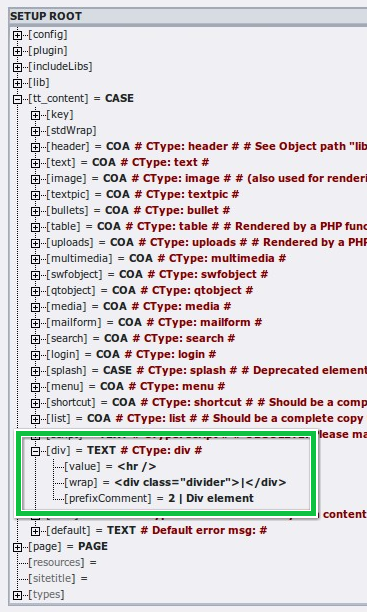
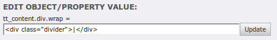

.. ==================================================
.. FOR YOUR INFORMATION
.. --------------------------------------------------
.. -*- coding: utf-8 -*- with BOM.

.. include:: ../Includes.txt

.. _how-to:

How to...
---------

.. _constant-editor:

... use the Constant Editor for configuration
^^^^^^^^^^^^^^^^^^^^^^^^^^^^^^^^^^^^^^^^^^^^^

Basic configuration for CSS Styled Content is done using the constant
editor. Go to the Web > Template module on your root page and switch
to the Constant Editor. Choose the category "CONTENT". You'll now get
a list of possible constants and their descriptions. The descriptions
should be pretty self explaining.

.. figure:: ../Images/ConstantEditor.png
   :alt: The constant editor

   Changing the main settings of css\_styled\_content in the Constant Editor

.. _object-browser:

... use the Object Browser to change a single value
^^^^^^^^^^^^^^^^^^^^^^^^^^^^^^^^^^^^^^^^^^^^^^^^^^^

If you want to change a certain value – like a wrap around an element
– you should use the TypoScript Object Browser. Go to the Web >
Template module and choose "TypoScript Object Browser". Now expand the
:code:`tt_content` tree to the element you want to change (for example the
"div" [Divider] element):

   Locating a specific property in the TypoScript Object Browser (TSOB)

On pressing "Update" the value is written into the setup field
of your current template. If you edit quite a few values you should
later manually cleanup the setup field (setting curly braces for
better readability, deleting double entries...).

   Editing a TypoScript property

For more information about working with TypoScript, please refer to the
:ref:`t3tssyntax:start` manual.
