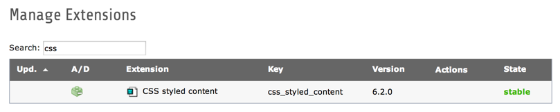

.. ==================================================
.. FOR YOUR INFORMATION
.. --------------------------------------------------
.. -*- coding: utf-8 -*- with BOM.

.. include:: ../Includes.txt

.. _installation:

Installation
------------

.. _extension-manager:

Extension Manager
^^^^^^^^^^^^^^^^^

The extension is normally installed by default – you can check it in
the extension manager.

   Verifying that css_styled_content is loaded in the Extension Manager

.. _web-template:

Web > Template
^^^^^^^^^^^^^^

To use the default rendering definitions CSS Styled Content provides
you have to add the static template to your TypoScript template.

.. figure:: ../Images/StaticTemplateInclusion.png
   :alt: Including the static template

   Inclusion of the static template in a system template

Normally you should choose the template "CSS Styled Content".
If you upgraded from a previous TYPO3 version and notice that
something breaks your layout – try the template corresponding to your
version (for example "CSS Styled Content TYPO3 v4.7").

.. note::

   The upgrade wizard in the install tool automatically inserts
   the static template corresponding to your compatibility version.

.. _your-template:

Inserting content into your template
""""""""""""""""""""""""""""""""""""

To get the different columns from the backend displayed in the
frontend you can use predefined :ref:`CONTENT <t3tsref:cobj-content>` objects. Normally you would do
something like the following to get the content from the "Normal"
column into your template:

::

   page = PAGE
   page.10 = TEMPLATE
   page.10 {
           file = your/html/template.html
           subparts {
                   MAIN_CONTENT = CONTENT
                   MAIN_CONTENT {
                           table = tt_content
                           select {
                                   orderBy = sorting
                                   where = colPos=0
                                   languageField = sys_language_uid
                           }
                   }
           }
   }

With CSS Styled Content you can shorten that code quite a bit:

::

   page = PAGE
   page.10 = TEMPLATE
   page.10 {
           file = your/html/template.html
           subparts {
                   MAIN_CONTENT < styles.content.get
           }
   }

:code:`styles.content.get` is one of the predefined CONTENT objects, that
renders the "normal" column. The following predefined CONTENT objects
exist:

======================== ====================================
CONTENT object           Column
======================== ====================================
styles.content.get       Normal
styles.content.getLeft   Left
styles.content.getRight  Right
styles.content.getBorder Border
======================== ====================================

