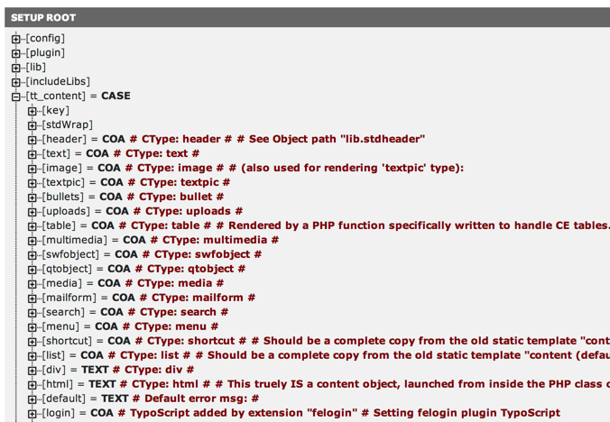

.. ==================================================
.. FOR YOUR INFORMATION
.. --------------------------------------------------
.. -*- coding: utf-8 -*- with BOM.

.. include:: ../Includes.txt

.. _introduction:

Introduction
------------

.. _what-does-it-do:

What does it do?
^^^^^^^^^^^^^^^^

This extension provides a static TypoScript template file and
additional resources for CSS based, XHTML or HTML5 compliant rendering of
content elements in TYPO3.

This document covers only elements specific to "css\_styled\_content".
For a general overview of all the properties of TypoScript objects,
please refer to the :ref:`TypoScript Reference <t3tsref:start>`.

.. _modern-rendering:

Modern content element rendering
^^^^^^^^^^^^^^^^^^^^^^^^^^^^^^^^

From the birth of TYPO3 content elements have been rendered by the
*static template* called "content (default)". This was mainly based on
font-tags for styling and tables for positioning which was needed to
achieve the visual constructions of the old versions of web browsers.
However, with the widespread acceptance of CSS "content (default)"
became obsolete and deprecated. This extension aims to provide a
complete substitution of "content (default)"'s content rendering.

The objectives are to:

- use standard XHTML or HTML5 compliant tags for rendering, styled by CSS, tagged
  by various classes.

- reduce the amount of TypoScript Setup code, in particular cut down
  redundancy; this makes adjustments easier and cleaner.

- reduce the amount of TypoScript constants to a necessary minimum; this
  makes configuration more "no-nonsense" since most layout related stuff
  is in the style sheets now.

- use PHP for special rendering where a TypoScript implementation
  becomes too complex (this is the case for images, tables and file link
  elements).

- use TypoScript for what it does absolutely best. This includes menus
  (HMENU, etc.) and image manipulation (IMAGE, IMGTEXT), simple wrapping
  operations, parsing of content and rendering of some standard elements
  like forms, file links etc. And of course the base setup of page
  objects, frame sets etc. (which is not affected at all by this
  plugin). And being a generally brilliant way to pass parameters to PHP
  from TYPO3's backend.

- use non-TYPO3 specific tags with the RTE: only the link-tags are
  preserved as a concept. Bullet lists, tables and headers are now
  native HTML stored in the database. Still simple content lines are
  dissolved into lines with no 
 tags wrapped around.

- achieve full XHTML-transitional and HTML5 compliance.

- preserve backwards compatibility where it wouldn't compromise quality
  and modernity.

These are the more technical specs:

- A new static template file is provided which works as a substitute for
  "content (default)". A certain number of "styles.content.xxx" objects
  are preserved as well as constants from those templates. No
  dependencies on any static template record at all. The new static
  template file contains a TLO "tt\_content" which is a CASE cObject
  just like in "content (default)".

- All rendering of the content elements is done in TypoScript except for
  the Content Elements "Table", "Images" and "File links" which are
  rendered by a USER cObject calling methods from
  "tx\_cssstyledcontent\_pi1" for rendering.

- TYPO3 specific tags: Preserving the <LINK> tag.

- The position of the parseFunc object has changed to "lib.parseFunc"
  and with TYPO3 versions > 3.6.0RC1 parseFunc can be referenced (which
  avoids redundancy!). Backwards compatibility with "added" custom tags
  should be available, but might fail depending on implementation.

- The "lib.stdheader" is also largely preserved in structure, which
  means the "lib.stdheader.10 = CASE " object is still there as a true
  content object, thus backwards compatible for any added header-types.

- RTE based on 
, <Hx>-tags, images, tables, bullet lists (<OL>/<UL>).
  Only <LINK>-tags are converted to/from <A>-tags.

.. _content-rendering:

The Content Rendering & CSS Styled Content
^^^^^^^^^^^^^^^^^^^^^^^^^^^^^^^^^^^^^^^^^^

Content in TYPO3 is rendered by a so-called render object. CSS Styled
Content mainly provides the render object for rendering content from
the "tt\_content" table. In TypoScript this means it defines the object
:code:`tt_content.[renderingDefinitions]`. You can always have a look at your
configuration with the help of the TS Object Browser. With the
rendering configuration you can decide how your content elements are
wrapped, for example if a headline should be wrapped in a <h1> or
in 
<h1> or if all of your content elements should be wrapped by a
default 
 for styling. CSS Styled Content tries to make it easier
for you by providing sensible defaults for wraps, link targets, image
rendering and more.

   Overview of the tt_content configuration

