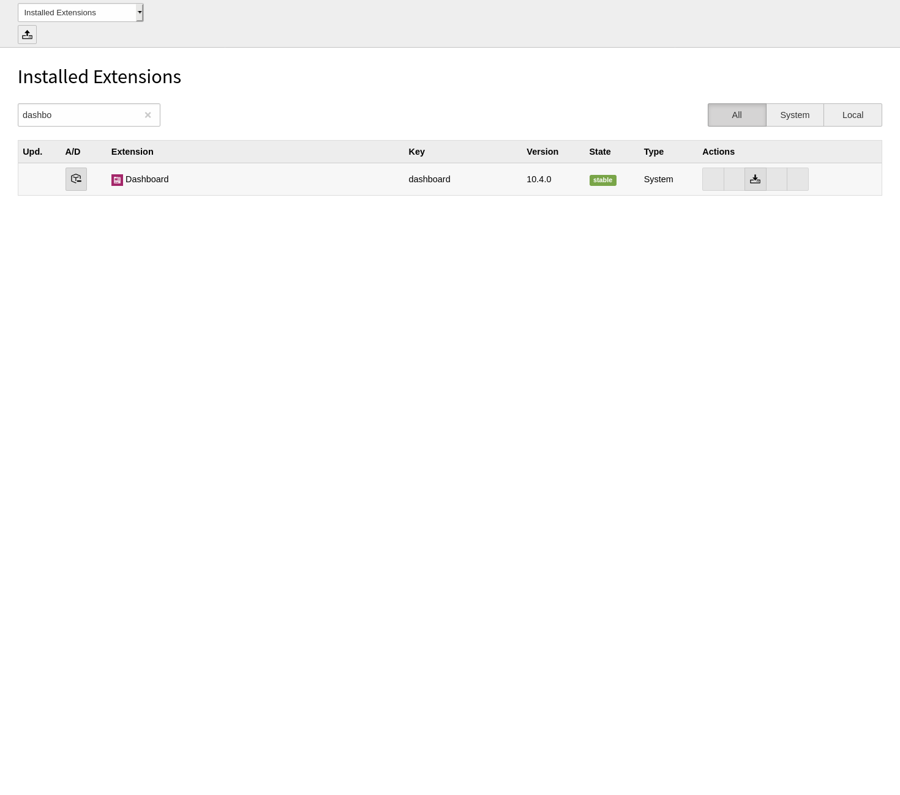

.. include:: /Includes.rst.txt
.. highlight:: bash

.. _installation:

============
Installation
============

Target group: **Administrators**

This extension is part of the TYPO3 core.

Installation with composer
==========================

Check whether you are already using the extension with::

   composer show | grep dashboard

This should either give you no result or something similar to:::

   typo3/cms-dashboard v10.4.0 Dashboard for TYPO3.

If it is not yet installed, use the ``composer require`` command to install the extension::

   composer require typo3/cms-dashboard ^10.4

The given version depends on the version of the TYPO3 core you are using.

Now head over to the extension manager and activate the extension.

   Extension manager with filtered dashboard extension

Installation without composer
=============================

In an installation without composer, the extension is already shipped. You just have to activate it.
Head over to the extension manager and activate the extension.

   Extension manager with filtered dashboard extension
