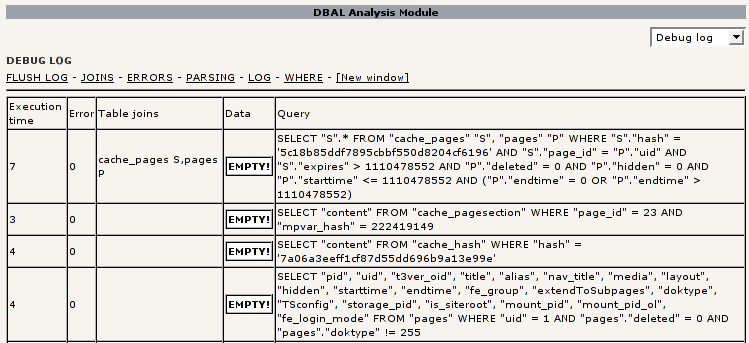

.. ==================================================
.. FOR YOUR INFORMATION
.. --------------------------------------------------
.. -*- coding: utf-8 -*- with BOM.

.. include:: ../../Includes.txt

.. _the-debug-log:

The debug log
^^^^^^^^^^^^^

When the debug options are enabled queries are logged to a table
including various details. You can use the "DBAL debug" backend module
to view the log:

   The DBAL debug log

Above the table you see a few items to click on:

- **FLUSH LOG** clears the logging table.

- **JOINS** shows you the logged table joins, if that feature has been
  enabled.

- **ERRORS** shows just the entries that caused an error.

- **PARSING** shows the results of the SQL parsing check, if that
  feature has been enabled.

- **LOG** is what you see when you enter the module.

- **WHERE** shows a log of all WHERE-clauses. This may be used to
  optimize the database structure or spot performance bottlenecks.

The main log table shows you when how many queries where executed from
what script in how much time. If an error occurred, this is noted as
well. If you click on the script name, you'll get a list of all
queries to help you with debugging.

To aid in debugging problems with null value comparisons '', IS NULL
and IS NOT NULL are highlighted in the log and where views in red and
green respectively. This indicates no error in itself, so don't worry
too much about it.

