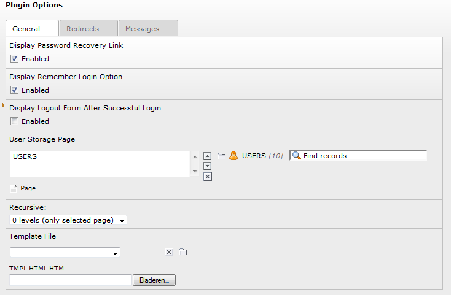
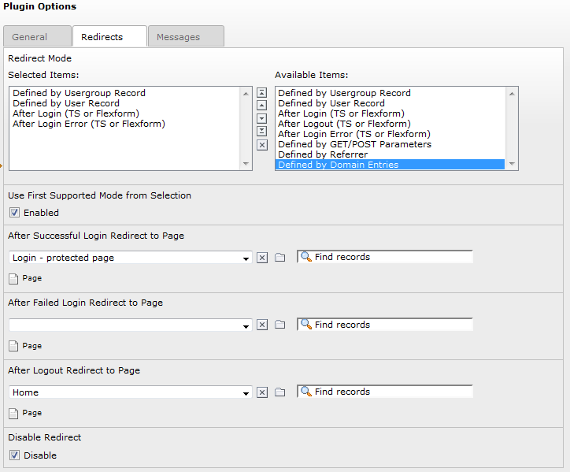
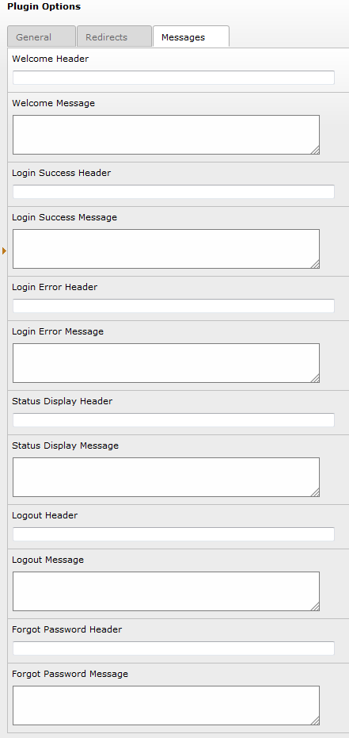

.. include:: /Includes.rst.txt

.. _introduction:

============
Introduction
============

.. _what-does-it-do:

What does it do?
================

The Frontend Login for Website Users (felogin) extension is a general
purpose extension for frontend logins. In addition to the actual login
box, it includes several methods for redirecting after login/logout
and includes forgot password functionality.

.. _screenshots:

Screenshots
===========

.. _general-settings:

General Settings
----------------

   The plugin's general settings

.. _redirect-configuration:

Redirect Configuration
----------------------

   Configuration of the redirection options

.. _messages-tab:

Messages Tab
------------

   Configuration of the various messages (screenshot shows not all options)

