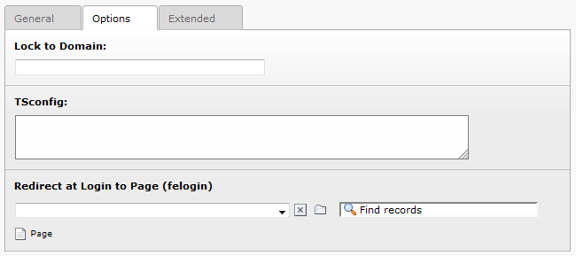
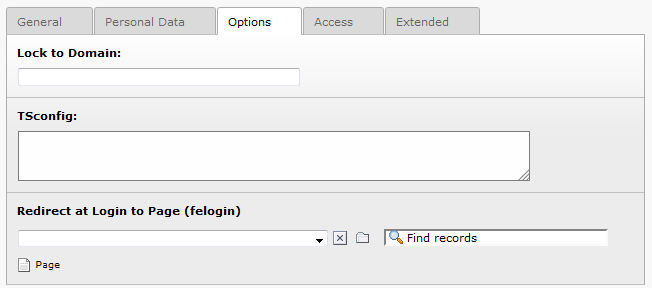

.. ==================================================
.. FOR YOUR INFORMATION
.. --------------------------------------------------
.. -*- coding: utf-8 -*- with BOM.

.. include:: ../../Includes.txt

.. _redirect-modes:

Redirect Modes
^^^^^^^^^^^^^^

The following redirect options are supported.

.. _defined-by-usergroup-record:

defined by Usergroup Record
"""""""""""""""""""""""""""

Within a Website usergroup record, you can specify a page where
usergroup members will be redirected after login.

   The redirection field for Website user groups

.. _defined-by-user-record:

defined by User Record
""""""""""""""""""""""

This is identical to the redirection option for "defined by Usergroup
Record" but applies to a single website user instead of an entire user
group.

   The redirection field for Website users

.. _after-login-ts-or-flexform:

after Login (TS or Flexform)
""""""""""""""""""""""""""""

This redirect page is set either in TypoScript
(:code:`plugin.tx_felogin_pi1.redirectPageLogin`) or in the FlexForm of the
felogin plugin.

.. _after-logout-ts-or-flexform:

after Logout (TS or Flexform)
"""""""""""""""""""""""""""""

Defines the redirect page after a user has logged out. Again, it can
be set in TypoScript or in the felogin plugin's FlexForm.

.. _after-login-error-ts-of-flexform:

after Login Error (TS of Flexform)
""""""""""""""""""""""""""""""""""

Defines the redirect page after a login error occurs. Can be set in
TypoScript or in the felogin plugin's FlexForm.

.. _defined-by-get-post-vars:

defined by GET/POST-Vars
""""""""""""""""""""""""

Redirect the visitor based on the GET/POST variable :code:`redirect_url`.
If the TypoScript configuration
:code:`config.typolinkLinkAccessRestrictedPages` is set, the GET/POST
parameter :code:`redirect_url` is used.

Example url::

   http://www.domain.ext/index.php?id=12&redirect\_url=http%3A%2F%2Fwww%2Edomain%2Eext%2Fdestiny%2F

.. _defined-by-referrer:

defined by Referrer
"""""""""""""""""""

The referrer page is used for the redirect. This basically means that
the user is sent back to the page he originally came from.

.. _defined-by-domain-entries:

defined by Domain entries
"""""""""""""""""""""""""

Same as 'defined by Referrer', except that only the domains listed in
:code:`plugin.tx_felogin_pi1.domains` are allowed. If someone is sent to the
login page coming from a domain which is not listed, the redirect will
not happen.

By using the option "Use the first method found" you can define
several fallback methods.

