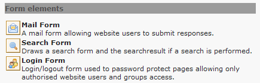

.. ==================================================
.. FOR YOUR INFORMATION
.. --------------------------------------------------
.. -*- coding: utf-8 -*- with BOM.

.. include:: ../Includes.txt

.. _users-manual:

Users manual
------------

The felogin extension requires no special configuration. All options
are available in the plugin's FlexForm as shown in the :ref:`screenshots`.

.. _using-plugin:

Using the plugin
^^^^^^^^^^^^^^^^

Just as with the old login box, the felogin plugin is available
through the Content Wizard as "Login Form":

   The Login Form plugin in the content element wizard

.. _storage-folder:

Choosing a Storage Folder for Website Users
^^^^^^^^^^^^^^^^^^^^^^^^^^^^^^^^^^^^^^^^^^^

In order for Website Users to be able to log in, the felogin plugin
must know where the records are stored. There are three possibilities
for setting this storage folder:

- Go to the page where the felogin plugin exists and edit the page
  properties, setting the field for the "General Record Storage Page" to
  your storage folder.

- Or edit the felogin plugin, setting the field for the "User Storage
  Page" to your storage folder.

- Or set the UID of you storage folder through TypoScript in the setup
  field of your TypoScript Template:

::

   plugin.tx_felogin_pi1.storagePid = xxx

