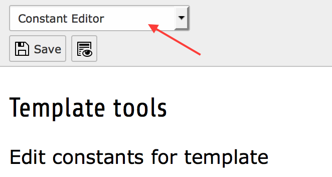
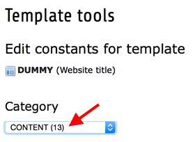

.. include:: ../../Includes.txt

.. _constant-editor:

===============
Constant Editor
===============

The Constant Editor can be found in the module "Web > Template".

.. figure:: Images/WebTemplate.png
   :alt: Location of the Template module

   Web > Template

Select the page in the page tree which contains the root template of your website. This is
mostly the root page of your website as well.

.. figure:: Images/RootPage.png
   :alt: Location of the Root Page in the page tree

   The Root Page in the page tree

Select "Constant Editor" in the dropdown at the top of the "Web > Template" module. This
should show the root template of your website if it is available below the sentence
"Edit constants for template".

   The dropdown in the template module

In the dropdown list "Category" select the category "Content".

   The category dropdown in the template module

This will give you a list with all the constants of this extension. All constants are
described and can be edited by clicking the pencil in front of the current value or by
editing the available field.

Don't forget to save the new values afterwards by using the appropriate button at the top
of the module. The new values will be stored in the "Constants" field of the root template
of your website.
