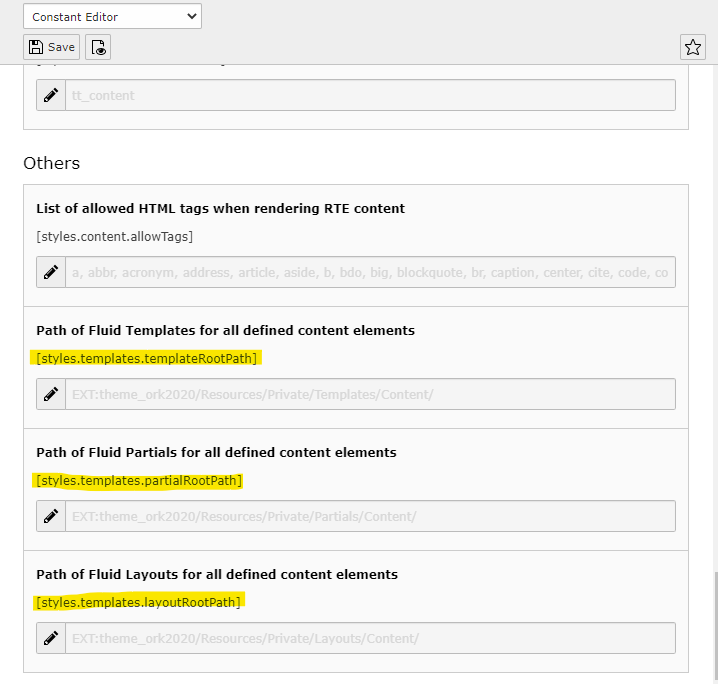

.. include:: ../../Includes.txt

.. _overriding-fluid-templates:

==============================
Overriding the FLUID templates
==============================

At :ref:`typoscript` we have described the way content elements are rendered.

By default these settings are defined in the file :file:`setup.typoscript` which
can be found in the folder :file:`EXT:fluid_styled_content/Configuration/TypoScript/`.
The configuration file uses constants that are empty by default. This gives
us three ways to override the default templates.

.. _overriding-fluid-templates-using-constant-editors:

Using the constant editor
=========================
The easiest way to override FLUID templates is to use the constant editor.
There you can select the CONTENT category and add the `templateRootPath`,
`partialRootPath` and `layoutRootPath` of your own.

   The template's constant editor category CONTENT

.. _overriding-fluid-templates-sdding-constants:

Adding constants
================
Instead of using the constant editor you can add these lines directly to an
external TypoScript file and include it to the constants. These constants will
be used as `templateRootPaths`.10 in the setting file (see
:ref:`overriding-fluid-templates-using-lib-fluidcontent`)

.. code-block:: typoscript

   styles.templates {
      templateRootPath = EXT:your_extension_key/Resources/Private/Templates/
      partialRootPath = EXT:your_extension_key/Resources/Private/Partials/
      layoutRootPath = EXT:your_extension_key/Resources/Private/Layouts/
   }

.. _overriding-fluid-templates-using-lib-fluidcontent:

Using lib.contentElement
========================

By extending the setup of lib.contentElement, you'll have the possibility
to add additional `templateRootPaths`, `partialRootPaths` and `layoutRootPaths`
what might be the best way when writing a tiny extension enhancing content
elements.

.. code-block:: typoscript

   lib.contentElement {
      templateRootPaths {
         200 = EXT:your_extension_key/Resources/Private/Templates/
      }
      partialRootPaths {
         200 = EXT:your_extension_key/Resources/Private/Partials/
      }
      layoutRootPaths {
         200 = EXT:your_extension_key/Resources/Private/Layouts/
      }
   }

A content element is using a `templateName`, which is defined in :file:`setup.typoscript`. You
can override this value, but the template from the extension "fluid_styled_content" will
not be loaded then, since its name is still the default value.

.. code-block:: typoscript

   tt_content {
      bullets {
         templateName = ChangedName
      }
   }

