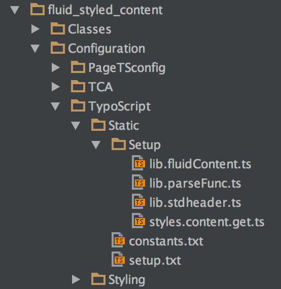

.. include:: ../../Includes.txt

.. _typoscript:

==========
TypoScript
==========

At the section :ref:`using-the-rendering-definitions` you've already added the static
templates. Static templates are a collection of TypoScript files. These files are located
in the directory :file:`EXT:fluid_styled_content/Configuration/TypoScript/Static/`.

   Structure of the TypoScript files

In this folder there are two files:

- :file:`constants.txt` - The file with the default constants. The "Constant Editor", as
  described above, is using this file for its default settings.

- :file:`setup.txt` - This file will first include some other files which are located in
  the "Setup" folder in the same directory. More about these files later. Secondly the
  rendering definitions of all the content elements, which belong to this extension, are
  declared. Since we move away from TypoScript as much as possible, these rendering
  definitions only declare the following:

  - Can FLUIDTEMPLATE be used immediately or do we need data processing first?
    A processor is sometimes used to do some data manipulation before all the data is sent
    to the Fluid template.

  - Assigning the Fluid template file for each type of content element separately.

  - The configuration of the edit panel and the edit buttons for frontend editing. You
    need to activate the extension "Frontend Editing (feedit)" in the Extension Manager to
    see this in action.

In the folder :file:`Setup` there are files which are included by the file
:file:`setup.txt` as mentioned above. These are:

- :file:`lib.parseFunc.ts` - Creates persistent ParseFunc setup for non-HTML content

- :file:`lib.stdheader.ts` - Copies the "Header only" content element into the `lib.stdheader`.

- :file:`styles.content.get.ts` - Defines `styles.content.get` as a `CONTENT` object for `colPos = 0`.

- :file:`lib.fluidContent.ts` - Default configuration for content elements using
  FLUIDTEMPLATE
