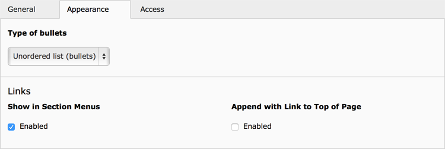
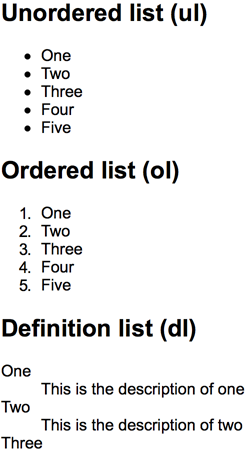

.. include:: ../../Includes.txt

.. _content-element-bullets:

===========
Bullet list
===========

.. figure:: Images/BackendFieldBodytext.png
   :alt: Backend display of the field for the Bullet list in the General tab

   The field "Bullet list" in the "General" tab

With this content element you can provide unordered and ordered bullet lists, but also a
definition list, in the frontend.

The content is added in the field "Bullet list", where each new line is a new bullet.

.. code-block:: none

   Bullet 1
   Bullet 2
   Bullet 3

For definition lists you use one line for a single definition which starts with the term,
followed by the description, separated by a vertical bar "|".

.. code-block:: none

   Term 1|Description 1
   Term 2|Description 2
   Term 3|Description 3

   The "Appearance" tab

The type of list can be defined with the field "Type of bullets", available in the
"Appearance" tab.

   Frontend output, showing all three types of bullet lists.
