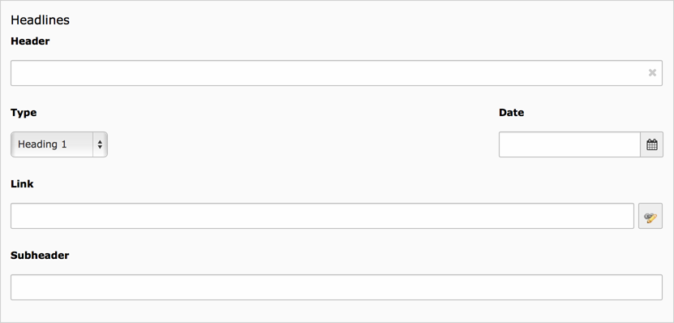
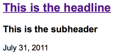

.. include:: ../../Includes.txt

.. _content-element-header:

======
Header
======

   The backend fields

The content element "Header" will render a header, which can be linked. There is the
possibility to add a subheader and a date. The fields used for this content elements are
the same as :ref:`content-elements-general-header`, but with a field for the subheader.

         grouped together

   Frontend rendering of the content element header, with a subheader and date

