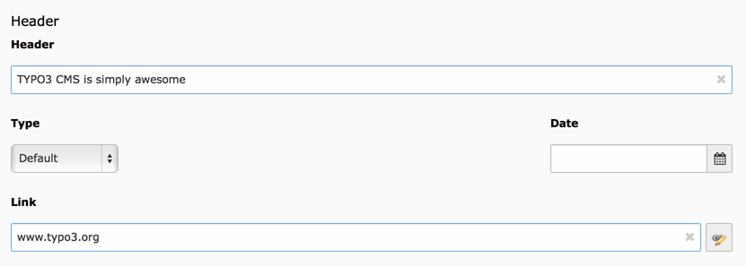
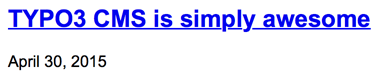
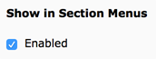
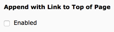
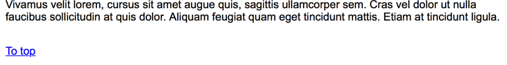
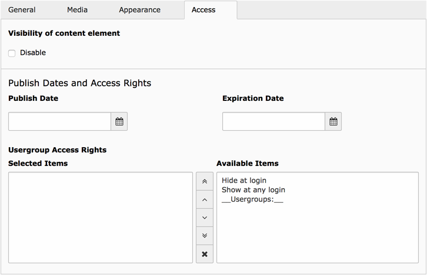

.. include:: ../Includes.txt

.. _content-elements:

====================
The content elements
====================

This chapter will describe the basic set of content elements provided by the TYPO3 CMS
core. It will show you a description, screenshots of the backend fields and a screenshot
of the frontend rendering, only styled with the basic styling provided by the static
template "Content Elements CSS (optional) (fluid_styled_content)" described in chapter
:ref:`using-the-rendering-definitions`.

The screenshots of the fields are made with the extension configuration option
"Show only a minimum set of editing fields" SET TO OFF as described in chapter
:ref:`extension-manager-configuration`.

.. _content-elements-general:

General fields
==============

These are fields which are used by (almost) every content element.

.. _content-elements-general-header:

Header
------

   The header fields

Almost every content element can contain a header, which consists of the following parts:

Header
   The text of the header

Type
   The type of heading (heading 1, heading 2, heading 3 ... or if the header is hidden).
   When not choosing an option, the default heading will be used, which can be configured
   at :ref:`constant-editor`.

Date
   Have the possibility to group the header with a date

Link
   Link wrapping the header text. This can be a TYPO3 CMS page, an external page, an email
   address or a link to a file.

The header fields can be found in the "General" tab of a content element.

   Frontend rendering of a linked header with a date

.. _content-elements-general-show-in-section-menus:

Show in section menu's
----------------------

Using this option will only be visible when using menu's based on sections. This will be
described in the chapter :ref:`content-element-menu`.

This field can be found in the *Appearance* tab.

   The field "Show In Section Menu's"

.. _content-elements-general-link-to-top:

Append with Link to Top of Page
-------------------------------

   The field "Append with link to top of page"

When checked, this will render a link below the content element to bring the visitor the
top of the page. This will be very convenient for your visitors when having long pages.

   Frontend rendering of the To Top link

.. _content-elements-general-access:

Access
------

   The Access tab with all its fields

These fields define if and when a visitor has access to this content element. The access
fields all reside in the *Access* tab:

Visibility of content element
   By checking this option the content element will not be visible to any visitor.

Publish Date
   The date on which the content has to be published, which means making visible at a
   certain date.

Expiration Date
   The date on which the content will be expired, which means the content will be hidden
   on a certain date

Usergroup Access Rights
   Here you can select whether the content element only is available to a certain
   frontend user group, if it has to be visible only when the visitor is logged in or if
   it has to be hidden at a login.

.. toctree::
   :maxdepth: 5
   :titlesonly:
   :glob:

   Header/Index
   TextMedia/Index
   Bullets/Index
   Table/Index
   Uploads/Index
   Menu/Index
   Shortcut/Index
   List/Index
   Div/Index
   Html/Index

