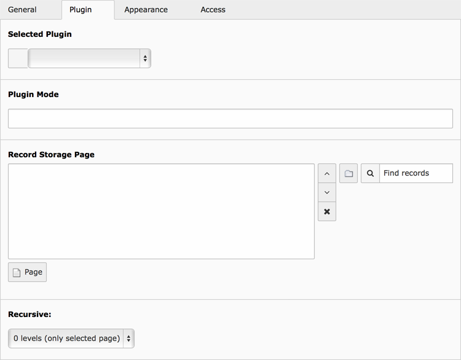

.. include:: ../../Includes.txt

.. _content-element-list:

=============
Insert plugin
=============

         Plugin tab

   The fields for "Insert Plugin" in the "Plugin" tab. This can be different for selected
   plugins.

Extensions sometimes provide plugins to render frontend output, but basically they are the
same as content elements. When an extension depends on a plugin, select the plugin in this
content element. The fields might change depending on the plugin.

