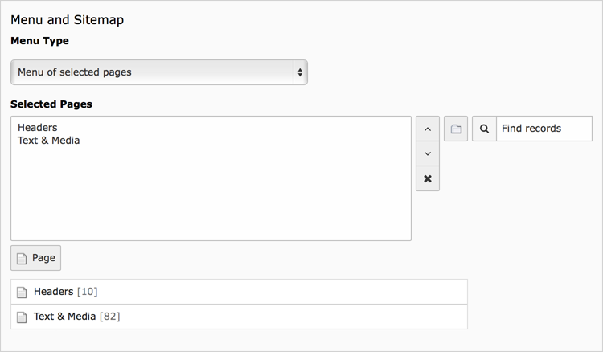
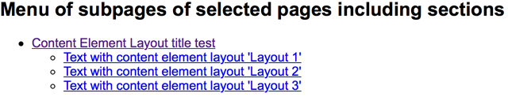

.. include:: ../../Includes.txt

.. _content-element-menu:

=====
Menus
=====

In websites menus are often created outside the content element scope, because they have
to reappear within every page. These could be the main menu, a sub menu, a bread crumb or
a language menu. However, there are situations where you would like to create a menu
specifically on one page. The following content elements will give you some options to render
a menu. These available content elements are:

Menu of selected pages
   The menu consists of links to the selected pages in the TYPO3 CMS backend.

Menu of subpages of selected pages
   The menu consists of links to the subpages of the selected pages in the TYPO3 CMS
   backend.

Menu of subpages of selected pages including abstracts
   The same as above, but showing the abstract of these pages as well, when not empty.

Menu of subpages of selected pages including sections
   This will render a menu of the subpages of the selected pages. Below each subpage an
   extra menu will be showing the titles of content elements which belong to that certain
   subpage, which have the option "Show in Section Menus" in the Appearance tab enabled.
   This makes it possible for the website visitor to jump to the selected content element,
   within that page, immediately.

Sitemap
   Render a full sitemap of the website, starting at the root page.

Sitemaps of selected pages
   Render one or more sitemaps at once. The starting point of each site map will be a
   single selected page.

Section index (page content marked for section menus)
   Menu of content elements within the selected page, which have the option "Show in
   Section Menus" in the Appearance tab enabled. This makes it possible for the website
   visitor to jump to the selected content element, within that page, immediately.

Recently updated pages
   Shows a list of pages which are updated in the last 7 days. Updated does only mean a
   change in the page properties, not the content on the page.

Related pages (based on keywords)
   Shows a list of the selected page and all other pages, which have one or more keywords,
   entered in the page properties, in common.

Pages for selected categories
   Displays a menu of all pages which have been assigned one or more of the selected
   categories.

Content elements for selected categories
   Displays a menu of all content elements which have been assigned one or more of the
   selected categories.

The availability of links in each type of menu will depend on access rights. If a website
visitor has no access to a certain part (with a frontend login), the link will not be
shown.

   The fields for "Menu and Sitemap" in the "General" tab

In case no pages are selected (in most options), the menu will be rendered from the
current page where the menu is put on.

   Example of the frontend output of a menu
