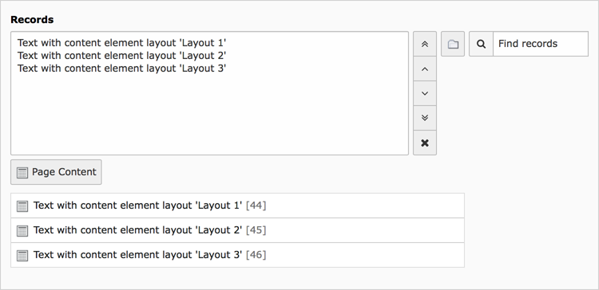

.. include:: ../../Includes.txt

.. _content-element-shortcut:

==============
Insert Records
==============

Ever have content on one page that you want on another one? But you don't want to have to
maintain both, keeping them in sync? And you don't want to show the whole content from one
page on another. Using insert records you can add one content element from a page or all
the content elements from a page. You can also add content element from several pages.

   The fields for "Insert Records" in the "General" tab

Just select the content elements you want to display and if necessary, put them in the
right order.

In the frontend the referenced content elements will show up the same as the original one
(if the styling is not different for that page)

.. note::

   This is the only content element still using a bit of TypoScript in the rendering
   process. This is done because you can add different rendering for records from
   different tables. Take a look at :ts:`tt_content.shortcut.20`.

