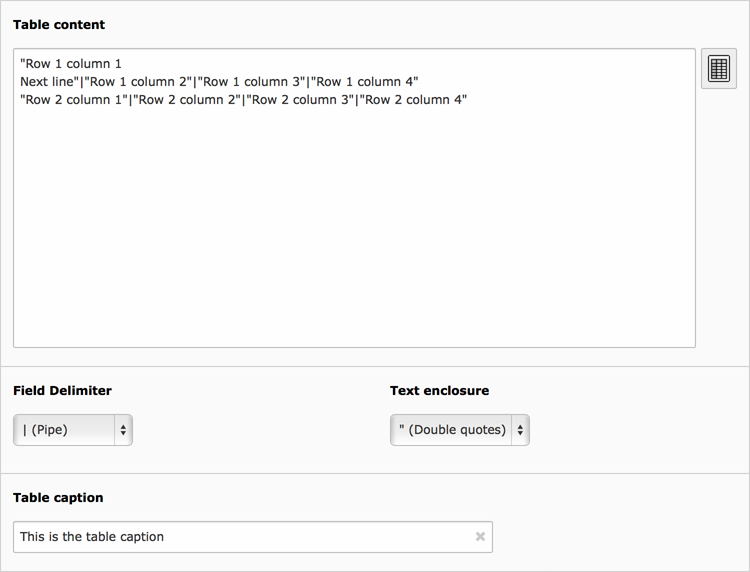
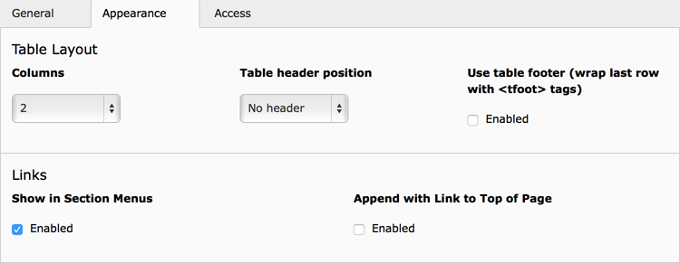
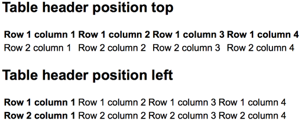

.. include:: ../../Includes.txt

.. _content-element-table:

=====
Table
=====

The "Table" content element allows to provide data as "comma separated values (CSV)", a
plain text form of storing tabular data (numbers and text). This form is often used to
move tabular data between two programs that natively operate on incompatible (often
proprietary and/or undocumented) formats, like Microsoft Office Excel. These programs
often provide CSV as an export method.

   The "General" table settings

Each line in the field *Table content* represents a row in the table. Columns are
separated by a *field delimiter*, which can be configured with the corresponding field.
Columns can be enclosed by a character, configured in the field
*Text enclosure*. This is especially helpful when you want to have newlines within a
column. By default the *Field delimiter* is a vertical bar "|", the *Text enclosure* set
to **none**.

.. code-block:: none

   row 1 column 1|row 1 column 2|row 1 column 3
   row 2 column 1|row 2 column 2|row 2 column 3
   row 3 column 1|row 3 column 2|row 3 column 3

A *Table caption* can be provided as a heading for the table.

   The "Appearance" tab

Also some appearance options are available for the table. These can be found in the
*Appearance* tab:

Columns
   The maximum amount of columns. Even when more columns are defined in the
   *Table content* field, the table will only show the maximum amount of columns.

Table header position
   The first row or the first column can be used as a table header.

Use table footer
   The last row will be used to group the table’s footer area (which may be a summary, an
   addition of column values, or some call to action based on the preceding content).

   Frontend output, showing the different options of "Table header position"

