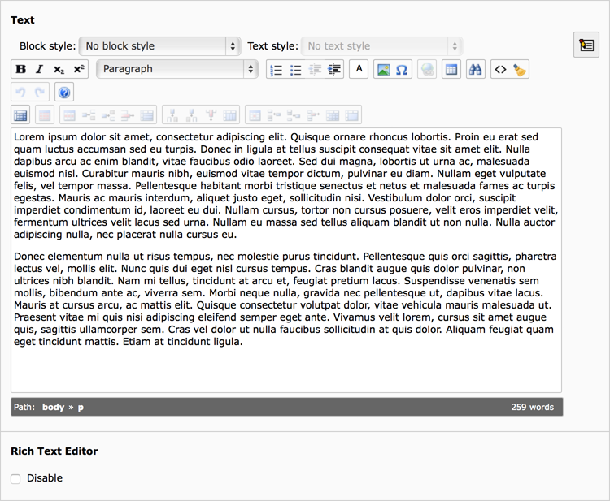
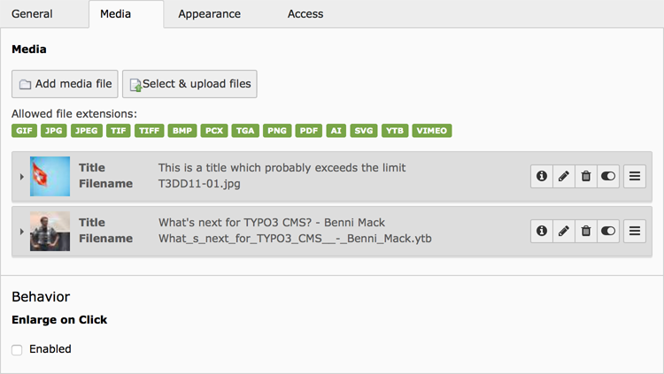
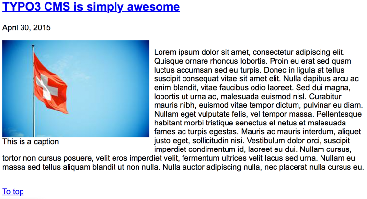

.. include:: ../../Includes.txt

.. _content-element-textmedia:

============
Text & Media
============

This content element allows to combine text and media elements, like images and/or movies.

The text can be entered in the Rich Text Editor (RTE) on the "General" tab.

   The Rich Text Editor (RTE) in the "General" tab

The media elements can be added in the "Media" tab. In this tab there is also the option
to turn the "enlarge on click" behaviour on for images.

   The "Media" tab

Multiple images and movies are combined as a gallery, which can be configured using the
"Appearance" tab. Options there are specific width or height for each element, if a border
should be shown around each element, the position of the gallery in relation to the text
and the amount of columns which should be used for the gallery.

.. figure:: Images/BackendTabAppearance.png
   :alt: Backend display of the Appearance tab

   The "Appearance" tab

The maximum width of the gallery can be different when the gallery is on top or bottom of
the text, or inside the text. This can be set using the :ref:`constant-editor`:

   Frontend output, using one image aligned left of the text. The text is wrapping the
   image.
