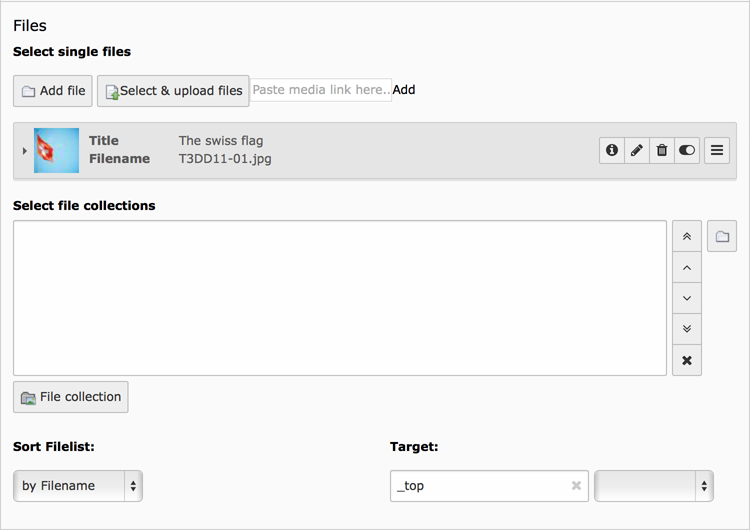
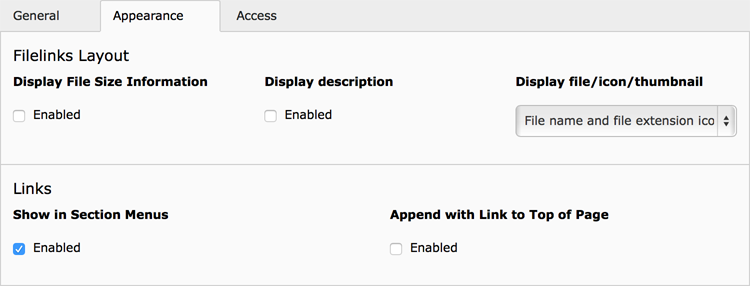
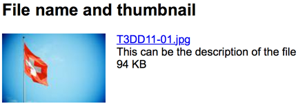

.. include:: ../../Includes.txt

.. _content-element-uploads:

==========
File links
==========

This content element gives you the opportunity to offer downloadable files to the visitors
of your website.

   The "General" file links fields

You can add or select single files but also use a file collection. A file collection can
be one of the following:

- A static selection of files
- A folder within a storage, holding the files
- A file selection by category

When combining both methods, single files and file collections, all files from these
methods will be presented to the website visitor.

   The "Appearance" settings for file links

In the "Appearance" tab you will find several options how the files will be presented:

Display file/icon/thumbnail
   In this dropdown you can select if you only want to show the file name, the file name
   and a corresponding icon, based on the file extension, or the file name with a
   thumbnail, if it is possible for TYPO3 CMS to generate a thumbnail from the file.

Display file size information
   Will show the file size calculated from the amount of bytes and presented as a human
   readable string with the proper unit (B, KB, MB ...).

Display description
   Will display the description of each file, if available.

   Frontend output of a file, with thumbnail, description and file size set

