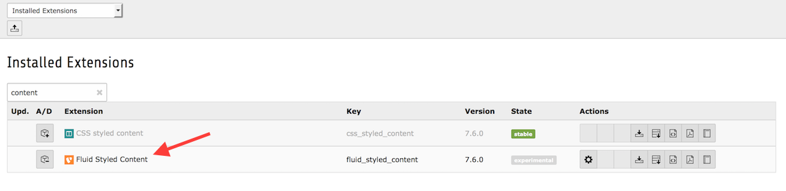
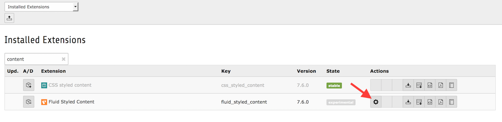
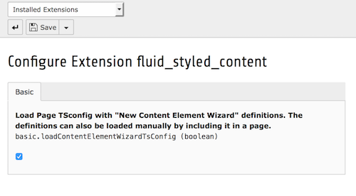

.. include:: ../../Includes.txt

.. _extension-manager:

=================
Extension Manager
=================

The extension is a system extension and is installed by default.

   "fluid_styled_content" is installed by default in the Extension Manager

.. _extension-manager-configuration:

Configuration
=============

In the extension manager you have the possibility to configure the extension. Click on the
name of the extension or click the "cogwheel" icon under "Actions" behind the extension
name.

   The location of the "cogwheel" icon under "Actions"

At the configuration screen you will find the next configuration options:

- **Load Page TSconfig with "New Content Element Wizard" definitions. The definitions can also**
  **be loaded manually by including it in a page.** - When this option is selected, the PageTSconfig
  of the extension is automatically included and does not need to be included manually. Use this
  if you have a TYPO3 installation that uses `fluid_styled_content` everywhere without exception.

   The configuration options in the Extension manager

When you are done configuring the extension, you can store your preferences by clicking
the "Save" (you will stay at the configuration screen) or "Save and Close" button (you
will be redirected to the extension list).
