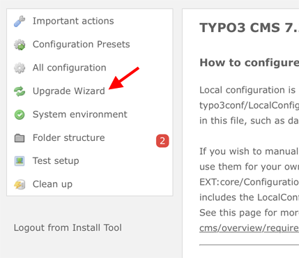

.. include:: ../../Includes.txt

.. _upgrading:

=========
Upgrading
=========

If you upgrade your TYPO3 CMS installation from one major version to another (for example
7.6 to 8.7), it is advised to run the Upgrade Wizards. They guide you through the
necessary steps to upgrade your database records or explicitly install extensions that
ship with the latest TYPO3 CMS version.

Some database fields of the table tt_content are no longer used, the fields of FlexForms
have been moved to proper database fields. To make sure you do not lose any information
or the content elements look differently on your upgraded website run these Upgrade Wizards.

The upgrade wizards can be found in the Install tool.

   Upgrade Wizard

.. attention::

   The predefined CONTENT objects :ts:`styles.content.getLeft`,
   :ts:`styles.content.getRight` and :ts:`styles.content.getBorder` are not
   provided anymore. :ts:`styles.content.get` still exists for your convenience. Most of
   the current websites are using "backend layouts", where the predefined numbering of the
   columns does not make sense.

.. tip::

   If you are still using the predefined CONTENT objects, you can use the following
   TypoScript:

   .. code-block:: typoscript

      styles.content {

         # get content, left
         getLeft < styles.content.get
         getLeft.select.where = {#colPos}=1

         # get content, right
         getRight < styles.content.get
         getRight.select.where = {#colPos}=2

         # get content, border
         getBorder < styles.content.get
         getBorder.select.where = {#colPos}=3

         # get news
         getNews < styles.content.get
         getNews.select.pidInList = {$styles.content.getNews.newsPid}
      }
