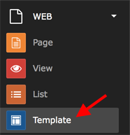
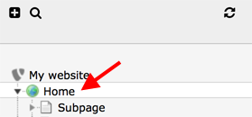
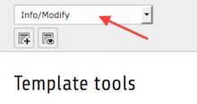
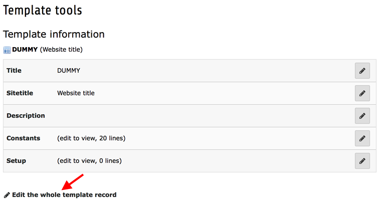
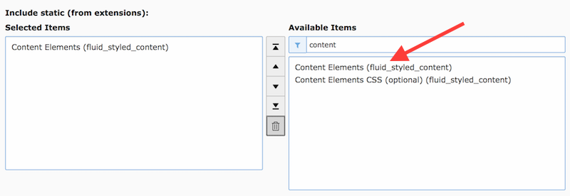
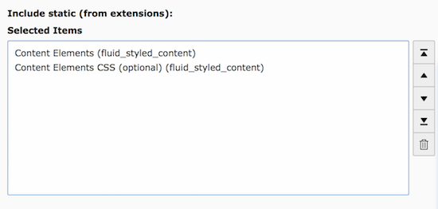

.. include:: ../../Includes.txt

.. _using-the-rendering-definitions:

===============================
Using the rendering definitions
===============================

To use the default rendering definitions "fluid_styled_content" provides, you have to add
the static template to your TypoScript template. Go to the module "Web > Template":

   Web > Template

In the page tree select the page which contains the root template of your website. This is
mostly the root page of your website as well:

   The Root Page in the page tree

Select "Info/Modify" in the dropdown at the top of the "Web > Template" module. This
should show you the root template of your website if it is available:

   The dropdown in the template module

Select ``Edit the whole template record`` at the bottom. This will open all the settings
of the root template:

   Edit the whole template record

Click on the tab "Includes" and select "Content Elements (fluid_styled_content)" in the part
"Available items" under "Include static (from extensions)". The selection will move to the
"Selected items":

   Including a static template from an extension

TYPO3 CMS is now using the rendering definitions of "fluid_styled_content" for the basic set of
content elements. This is basically unstyled HTML5 markup.

Unless you know what you are doing also include "Content Elements CSS (optional)
(fluid_styled_content)". Some CSS styling will be added to the output of your page to make sure all
the parts of a content elements have basic styling, like alignment and position. The
styling will not add any colors, do font changes or similar which should be related to
your website styles. This static include is optional, because some integrators want to
override even the basic styling.

   Including the static template for CSS styling

Save the template by using the appropriate button at the top of the module.
