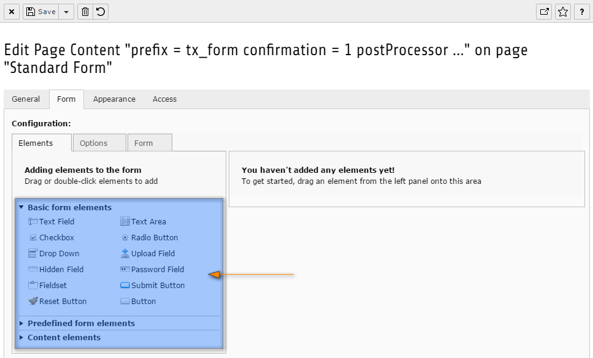

.. include:: ../../../../Includes.txt

.. _wizard-settings-defaults-elements-tab:

==============
Tab "Elements"
==============

The elements tab contains an accordion with buttons, grouped by their
type. These buttons identify a form element, like a text field, password
field or submit button. When dragging a button to the form on the right
and dropping it at a certain point in the form, the element will be added
to the form at that point. An editor can also double click a button. When
doing so, the element will be added at the end of the form.

.. contents::
    :local:
    :depth: 1

.. _wizard-settings-defaults-elements-showaccordions:

showAccordions
==============

(:ts:`mod.wizards.form.defaults.tabs.elements.showAccordions`)

:aspect:`Property:`
    showAccordions

:aspect:`Data type:`
    string

:aspect:`Description:`
    Comma-separated list of the accordions that will be shown in the
    wizard. Each of the three accordions contain a single showButton
    property which defines which form elements will be shown in a given
    accordion.

:aspect:`Default:`
    basic, predefined, content

.. _wizard-settings-defaults-elements-accordions-showbuttons:

showButtons
===========

(:ts:`mod.wizards.form.defaults.tabs.elements.accordions.[NameOfAccordion].showButtons`)

:aspect:`Property:`
    showButtons

:aspect:`Data type:`
    string

:aspect:`Description:`
    Comma-separated list of the buttons that will be shown in the accordion.
    Please note, in the shown path has [NameOfAccordion] to be replaced with
    the name of the specific accordion.

:aspect:`Default:`
    **"basic" elements**

    - textline (Text Field)
    - textarea (Textarea)
    - checkbox (Checkbox)
    - radio (Radio Button)
    - select (Drop Down)
    - fileupload (Upload Field)
    - hidden (Hidden Field)
    - password (Password Field)
    - fieldset (Fieldset)
    - submit (Submit Button)
    - reset (Reset Button)
    - button (Button)

    |

    **"predefined" elements**

    - name (Full Name)
    - email (Email)
    - checkboxgroup (Checkbox Group)
    - radiogroup (Radio Button Group)

    |

    **"content" elements**

    - header (Header)
    - textblock (Text Block)

.. _wizard-settings-defaults-elements-tab-configuration:

Default configuration
=====================

The default configuration of the elements tab is as follows.

.. code-block:: typoscript

  mod.wizards {
    form {
      defaults {
        showTabs = elements, options, form
        tabs {
          elements {
            showAccordions = basic, predefined, content
            accordions {
              basic {
                showButtons = textline, textarea, checkbox, radio, select, fileupload, hidden, password, fieldset, submit, reset, button
              }
              predefined {
                showButtons = name, email, checkboxgroup, radiogroup
              }
              content {
                showButtons = header, textblock
              }
            }
          }
        }
      }
    }
  }

