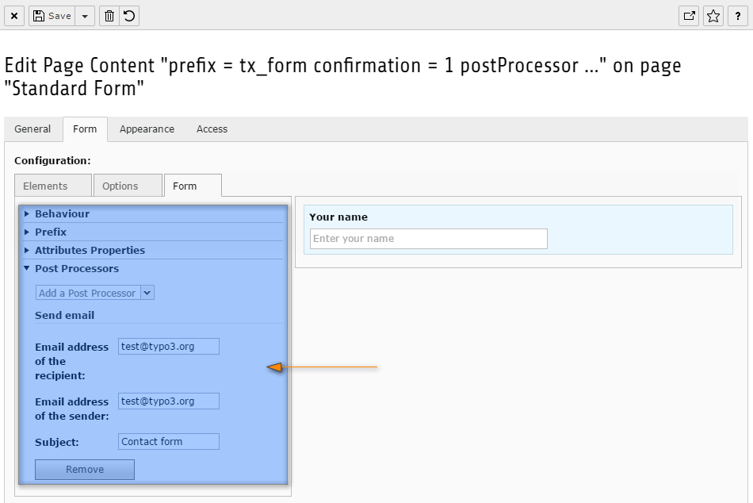

.. include:: ../../../../Includes.txt

.. _wizard-settings-defaults-form-tab:

==========
Tab "Form"
==========

The form tab shows the configuration of the outer form, like the attributes
of the form or the prefix as well as the post-processor configuration.

.. contents::
    :local:
    :depth: 1

.. _wizard-settings-defaults-form-showaccordions:

showAccordions
==============

(:ts:`mod.wizards.form.defaults.tabs.form.showAccordions`)

:aspect:`Property:`
    showAccordions

:aspect:`Data type:`
    string

:aspect:`Description:`
    Comma-separated list of the accordions that are allowed to be shown in
    the wizard. This does not mean they are all shown by default, but
    depends on the chosen element type.

    Some accordions have further properties, which are described below.

:aspect:`Default:`
    The following accordions are available in the form tab:

    * behaviour
    * prefix
    * :ref:`attributes <wizard-settings-defaults-form-attributes>`
    * :ref:`postProcessor <wizard-settings-defaults-form-postprocessor>`

.. _wizard-settings-defaults-form-attributes:

Attributes accordion
====================

.. _wizard-settings-defaults-form-attributes-showproperties:

showProperties
--------------

.. attention::

    The configuration of the attributes accordion is not working as
    expected and has to be fixed in a coming version of TYPO3. There is
    a workaround which is shown below.

(:ts:`mod.wizards.form.defaults.tabs.form.accordions.attributes.showProperties`)

:aspect:`Property:`
    showProperties

:aspect:`Data type:`
    string

:aspect:`Description:`
    Comma-separated list of the form attributes that are allowed to be shown
    in the accordion.

:aspect:`Default:`
    accept, action, dir, enctype, lang, method, novalidate, class, id, style, title

Since the above shown configuration is not working, the following workaround can
be applied. To configure the attribute accordion of the form element, address the
object directly via :ts:`mod.wizards.form.elements.form.accordions.attributes.showProperties`.

.. _wizard-settings-defaults-form-postprocessor:

Post-processors accordion
=========================

.. _wizard-settings-defaults-form-postprocessor-showpostprocessors:

showPostProcessors
------------------

(:ts:`mod.wizards.form.defaults.tabs.form.accordions.postProcessor.showPostProcessors`)

:aspect:`Property:`
    showPostProcessors

:aspect:`Data type:`
    string

:aspect:`Description:`
   Comma-separated list of the post-processors that are allowed to be shown
   in the wizard.

   For each post-processors a list of properties to be shown can be defined.

:aspect:`Default:`
    mail, redirect

.. _wizard-settings-defaults-options-postprocessor-postprocessors:

postProcessors.[post-processor].showProperties
----------------------------------------------

(:ts:`mod.wizards.form.defaults.tabs.form.accordions.postProcessor.postProcessors.[post-processor].showProperties`)

:aspect:`Property:`
    postProcessors.[post-processor].showProperties

:aspect:`Data type:`
    string

:aspect:`Description:`
    Configuration for the post-processors individually.

    The syntax is :ts:`postProcessors.[name of the post-processor].showProperties`.

:aspect:`Default:`
    The following element properties are available:

    .. t3-field-list-table::
        :header-rows: 1

        - :Field:
                Element:
          :Description:
                Properties:
        - :Field:
                mail
          :Description:
                recipientEmail, senderEmail, subject
        - :Field:
                redirect
          :Description:
                destination

.. _wizard-settings-defaults-form-tab-configuration:

Default configuration
=====================

The default configuration of the form tab looks as follows:

.. code-block:: typoscript

  mod.wizards {
    form {
      defaults {
        tabs {
          form {
            showAccordions = behaviour, prefix, attributes, postProcessor
            accordions {
              postProcessor {
                showPostProcessors = mail, redirect
                postProcessors {
                  mail {
                    showProperties = recipientEmail, senderEmail, subject
                  }
                  redirect {
                    showProperties = destination
                  }
                }
              }
            }
          }
        }
      }
    }
  }

