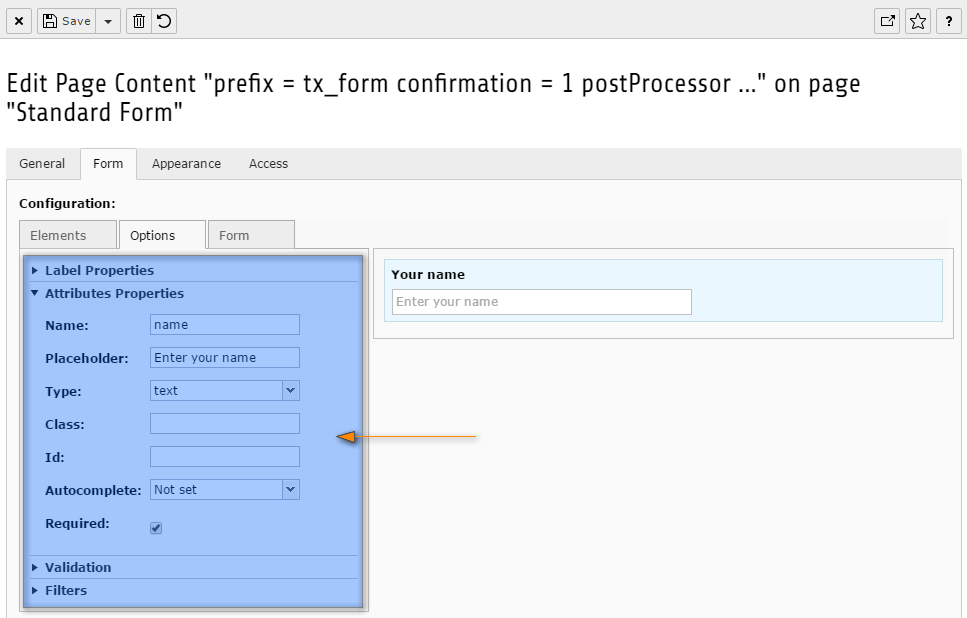

.. include:: ../../../../Includes.txt

.. _wizard-settings-defaults-options-tab:

=============
Tab "Options"
=============

The options tab will show the configuration of a particular element in
the form. When no element has been selected, it will show a message that
the editor has to select an element in the form.

The content of this tab depends on the type of element the editor has chosen
in the form.

.. contents::
    :local:
    :depth: 1

.. _wizard-settings-defaults-options-showaccordions:

showAccordions
==============

:aspect:`Property:`
    showAccordions

:aspect:`TypoScript Path:`
    :ts:`mod.wizards.form.defaults.tabs.options.showAccordions`

:aspect:`Data type:`
    string

:aspect:`Description:`
    Comma-separated list of the accordions that are allowed to be shown
    in the wizard. This does not mean they are all shown by default,
    but depends on the chosen element type.

    Some tabs have further configuration which is described below.

:aspect:`Default:`
    The following accordions are available:

    - *legend*: Legend Properties
    - *label*: :ref:`Label Properties <wizard-settings-defaults-options-label>`
    - *attributes*: :ref:`Attributes Properties <wizard-settings-defaults-options-attributes>`
    - *options*: Field Options
    - *validation*: :ref:`Validation <wizard-settings-defaults-validation-label>`
    - *filters*: :ref:`Filters <wizard-settings-defaults-filters-label>`
    - *various*: Various Properties

:aspect:`Example:`
    .. code-block:: typoscript

      mod.wizards {
        form {
          defaults {
            tabs {
              options {
                showAccordions = legend, label, attributes, options, validation, filters, various
              }
            }
          }

        }
      }

.. _wizard-settings-defaults-options-label:

Label accordion
===============

.. _wizard-settings-defaults-options-label-showproperties:

showProperties
--------------

:aspect:`Property:`
    showProperties

:aspect:`TypoScript Path:`
    :ts:`mod.wizards.form.defaults.tabs.options.accordions.label.showProperties`

:aspect:`Data type:`
    string

:aspect:`Description:`
    Comma-separated list of the label options that are allowed to be shown
    in the accordion. The appearance of an option depends on the chosen
    element type. If an element type does not support an option, it will not
    be shown.

:aspect:`Default:`
    label

.. _wizard-settings-defaults-options-attributes:

Attributes accordion
====================

.. _wizard-settings-defaults-options-attributes-showproperties:

showProperties
--------------

:aspect:`Property:`
    showProperties

:aspect:`TypoScript Path:`
    :ts:`mod.wizards.form.defaults.tabs.options.accordions.attributes.showProperties`

:aspect:`Data type:`
    string

:aspect:`Description:`
    Comma-separated list of attributes that are allowed to be shown in the
    accordion. The appearance of an attribute depends on the chosen element
    type. If an element type does not support an attribute, it will not be
    shown.

:aspect:`Default:`
    accept, accept-charset, accesskey, action, alt, autocomplete, autofocus,
    checked, class, cols, contenteditable, contextmenu, dir, draggable,
    dropzone, disabled, enctype, hidden, height, id, inputmode, label, lang,
    list, max, maxlength, method, min, minlength, multiple, name,
    novalidate, pattern, placeholder, readonly, required, rows, selected,
    selectionDirection, selectionEnd, selectionStart, size, spellcheck, src,
    step, style, tabindex, text, title, translate, type, value, width, wrap

.. _wizard-settings-defaults-validation-label:

Validation accordion
====================

.. _wizard-settings-defaults-options-validation-showrules:

showRules
---------

:aspect:`Property:`
    showRules

:aspect:`TypoScript Path:`
    :ts:`mod.wizards.form.defaults.tabs.options.accordions.validation.showRules`

:aspect:`Data type:`
    string

:aspect:`Description:`
    Comma-separated list of rules that are allowed to be shown in the
    wizard.

:aspect:`Default:`
    alphabetic, alphanumeric, between, date, digit, email, equals,
    fileallowedtypes, filemaximumsize, fileminimumsize, float, greaterthan,
    inarray, integer, ip, length, lessthan, regexp, required, uri

.. _wizard-settings-defaults-options-validation-rules:

rules.[rule].showProperties
---------------------------

:aspect:`Property:`
    rules.[rule].showProperties

:aspect:`TypoScript Path:`
    :ts:`mod.wizards.form.defaults.tabs.options.accordions.validation.rules.[rule].showProperties`

:aspect:`Data type:`
    [array of objects]

:aspect:`Description:`
    For each rule one can define which properties should appear.
    The syntax is :ts:`rules.[name of the rule].showProperties`.

:aspect:`Default:`
    The following element properties are available:

    =================== ========================================================
    Element             Properties
    =================== ========================================================
    alphabetic          message, error, showMessage, allowWhiteSpace
    alphanumeric        message, error, showMessage, allowWhiteSpace
    between             message, error, showMessage, minimum, maximum, inclusive
    date                message, error, showMessage, format
    digit               message, error, showMessage
    email               message, error, showMessage
    equals              message, error, showMessage, field
    fileallowedtypes    message, error, showMessage, types
    filemaximumsize     message, error, showMessage, maximum
    fileminimumsize     message, error, showMessage, minimum
    float               message, error, showMessage
    greaterthan         message, error, showMessage, minimum
    inarray             message, error, showMessage, array, strict
    integer             message, error, showMessage
    ip                  message, error, showMessage
    length              message, error, showMessage, minimum, maximum
    lessthan            message, error, showMessage, maximum
    regexp              message, error, showMessage, expression
    required            message, error, showMessage
    uri                 message, error, showMessage
    =================== ========================================================

.. _wizard-settings-defaults-filters-label:

Filters accordion
=================

.. _wizard-settings-defaults-options-filtering-showfilters:

showFilters
-----------

:aspect:`Property:`
    showFilters

:aspect:`TypoScript Path:`
    :ts:`mod.wizards.form.defaults.tabs.options.accordions.filtering.showFilters`

:aspect:`Data type:`
    string

:aspect:`Description:`
    Comma-separated list of the filters that are allowed to be shown in
    the wizard.

    For each filter a list of properties to be shown can be defined.

:aspect:`Default:`
    alphabetic, alphanumeric, currency, digit, integer, lowercase, regexp,
    stripnewlines, titlecase, trim, uppercase

.. _wizard-settings-defaults-options-filtering-filters:

filters.[filter].showProperties
-------------------------------

:aspect:`Property:`
    filters.[filter].showProperties

:aspect:`TypoScript Path:`
    :ts:`mod.wizards.form.defaults.tabs.options.accordions.filtering.filters.[filter].showProperties`

:aspect:`Data type:`
    string

:aspect:`Description:`
    Configuration for the filters individually. Not all filters have a
    configuration. Only the filters which are mentioned below can be
    configured.

    The syntax is :ts:`filters.[name of the filter].showProperties`.

:aspect:`Default:`
    The following element properties are available:

    =================== ===============================
    Element             Properties
    =================== ===============================
    alphabetic          allowWhiteSpace
    alphanumeric        allowWhiteSpace
    currency            decimalPoint, thousandSeparator
    regexp              expression
    trim                characterList
    =================== ===============================

.. _wizard-settings-defaults-options-tab-configuration:

Default configuration
=====================

The default configuration of the options tab looks like this:

.. code-block:: typoscript

  options {
     showAccordions = legend, label, attributes, options, validation, filters, various
     accordions {
         label {
            showProperties = label
         }
         attributes {
            showProperties = accept, accept-charset, accesskey, action, alt, autocomplete, autofocus, checked, class, cols, contenteditable, contextmenu, dir, draggable, dropzone, disabled, enctype, hidden, height, id, inputmode, label, lang, list, max, maxlength, method, min, minlength, multiple, name, novalidate, pattern, placeholder, readonly, required, rows, selected, selectionDirection, selectionEnd, selectionStart, size, spellcheck, src, step, style, tabindex, text, title, translate, type, value, width, wrap
         }
         validation {
            showRules = alphabetic, alphanumeric, between, date, digit, email, equals, fileallowedtypes, filemaximumsize, fileminimumsize, float, greaterthan, inarray, integer, ip, length, lessthan, regexp, required, uri
            rules {
               alphabetic {
                  showProperties = message, error, showMessage, allowWhiteSpace
               }
               alphanumeric {
                  showProperties = message, error, showMessage, allowWhiteSpace
               }
               between {
                  showProperties = message, error, showMessage, minimum, maximum, inclusive
               }
               date {
                  showProperties = message, error, showMessage, format
               }
               digit {
                  showProperties = message, error, showMessage
               }
               email {
                  showProperties = message, error, showMessage
               }
               equals {
                  showProperties = message, error, showMessage, field
               }
               fileallowedtypes {
                  showProperties = message, error, showMessage, types
               }
               filemaximumsize {
                  showProperties = message, error, showMessage, maximum
               }
               fileminimumsize {
                  showProperties = message, error, showMessage, minimum
               }
               float {
                  showProperties = message, error, showMessage
               }
               greaterthan {
                  showProperties = message, error, showMessage, minimum
               }
               inarray {
                  showProperties = message, error, showMessage, array, strict
               }
               integer {
                  showProperties = message, error, showMessage
               }
               ip {
                  showProperties = message, error, showMessage
               }
               length {
                  showProperties = message, error, showMessage, minimum, maximum
               }
               lessthan {
                  showProperties = message, error, showMessage, maximum
               }
               regexp {
                  showProperties = message, error, showMessage, expression
               }
               required {
                  showProperties = message, error, showMessage
               }
               uri {
                  showProperties = message, error, showMessage
               }
            }
         }
         filtering {
            showFilters = alphabetic, alphanumeric, currency, digit, integer, lowercase, regexp, stripnewlines, titlecase, trim, uppercase
            filters {
               alphabetic {
                  showProperties = allowWhiteSpace
               }
               alphanumeric {
                  showProperties = allowWhiteSpace
               }
               currency {
                  showProperties = decimalPoint, thousandSeparator
               }
               digit {
                  showProperties =
               }
               integer {
                  showProperties =
               }
               lowercase {
                  showProperties =
               }
               regexp {
                  showProperties = expression
               }
               removexss {
                  showProperties =
               }
               titlecase {
                  showProperties =
               }
               trim {
                  showProperties = characterList
               }
               uppercase {
                  showProperties =
               }
            }
         }
      }
  }
