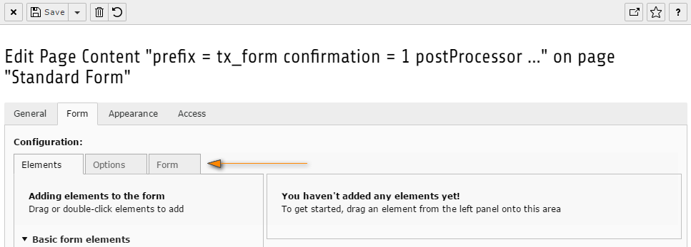

.. include:: ../../../../Includes.txt

.. _wizard-settings-defaults-showtabs:

========
showTabs
========

(:ts:`mod.wizards.form.defaults.showTabs`)

The configuration "showTabs" defines the outermost tabs on the left
side of the form wizard.

:aspect:`Property:`
   showTabs

:aspect:`Data type:`
    string

:aspect:`Description:`
    Comma-separated list of the tabs that will be shown in the wizard.

:aspect:`Default:`
    elements, options, form

.. _wizard-settings-defaults-tabs:

tabs
====

(:ts:`mod.wizards.form.defaults.tabs`)

Each of the 3 tabs can be further customized.

:aspect:`Property:`
    tabs

:aspect:`Data type:`
    [array of objects]

    ->tabs.[tabName]

:aspect:`Description:`
    Configuration for each tab.

Example
=======

.. code-block:: typoscript

  mod.wizards {
    form {
      defaults {
        showTabs = elements, options, form
        tabs {
          elements {
            ...
          }
          options {
            ...
          }
          form {
            ...
          }
        }
      }
    }
  }

