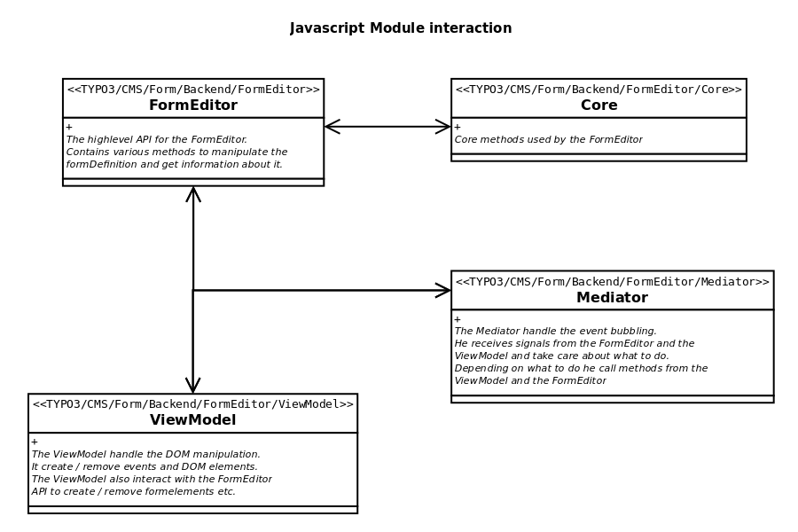

.. include:: ../../Includes.txt

.. _concepts-formeditor:

Form editor
===========

.. _concepts-formeditor-general:

What does it do?
----------------

The ``form editor`` is a powerful graphical user interface which allows the
backend editor to create ``form definitions`` without writing a single line
of code. Those ``form definitions`` will be used by the frontend process to
render beautiful forms.

The ``form editor`` is a modular interface which consists of several
components:

- Stage: central visual component of the ``form editor`` which displays the
  form elements in an abstract view and a frontend preview
- Tree: displays the structure of the form as a tree
- Inspector: context specific toolbar which handles the visual display of
  form element options and allows editing those
- Core: includes core functionalities of the ``form editor``
- ViewModel: defines and steers the visual display
- Mediator: delegates events of the components
- Modals: processes modals
- FormEditor: provides API functions
- Helper: helper functions which mainly allow the manipulation of DOM
  elements

Generally speaking, the ``Modals``, ``Inspector``, and ``Stage`` components
can be adapted through configuration. Especially the ``Inspector`` component
is modular and extremely flexible. As an integrator, you can reuse so-called
``inspector editors``. Those elements are input fields of different types
which allow the backend editor to alter all of the available form element
options.

   JavaScript module interaction

There is a general ``form editor`` configuration which can be found below
the following configuration path:

.. code-block:: yaml

   TYPO3:
     CMS:
       Form:
         prototypes:
           standard:
             formEditor:

Furthermore, you are able to configure the ``form editor`` regarding its
different aspects. The configuration can be found below the following
configuration paths:

.. code-block:: yaml

   TYPO3:
     CMS:
       Form:
         prototypes:
           standard:
             formElementsDefinition:
               <formElementTypeIdentifier>:
                 formEditor:
             finishersDefinition:
               <finisherIdentifier>
                 formEditor:
             validatorsDefinition:
               <validatorIdentifier>
                 formEditor:

.. _concepts-formeditor-stage:

Stage
-----

The ``Stage`` is the central visual component of the form editor which
displays the form elements in two different modes:

- abstract view: all form elements of a ``Page`` are presented in an
  abstract way,
- frontend preview: renders the form like it will (nearly) be displayed in
  the frontend ('nearly' since you have to make sure that your frontend CSS
  is also loaded in the backend in order to get the exact preview).

Per default, the frontend templates of EXT:form are based on Twitter
Bootstrap. Since the backend of TYPO3 CMS also depends on this CSS framework,
the corresponding CSS files are already loaded in the backend context.
Nevertheless, certain parts of the CSS were overridden and extended in order
to meet the specific needs of the TYPO3 backend. Thus, the frontend preview
in the backend could differ compared to the "real" frontend.

If your frontend preview requires loading additional CSS or a CSS framework
then go ahead and configure a specific ``prototype`` accordingly.

Beside the frontend templates, there are also templates for the abstract
view, i.e. you can customize the rendering of the abstract view for each
form element. If you have created your own form elements, in most cases you
will fall back to the already existing Fluid templates. But remember, you
are always able to create you own Fluid templated and adapt the abstract view
till it suits your needs.

For more information, read the following chapter: ':ref:`Common abstract view form element templates<apireference-formeditor-stage-commonabstractformelementtemplates>`'.

.. _concepts-formeditor-inspector:

Inspector
---------

The ``Inspector`` component is situated on the right side of the ``form
editor``. It is a modular, extremely flexible, and context specific toolbar
which depends on the chosen form element. The ``Inspector`` allows editing
the form element's options with the help of so-called ``inspector editors``.
For the most parts, the interface can be easily customized by writing
YAML configuration. For each form element you can define which properties
are available and in which way they can be edited.

In addition to the editable form element properties (like ``properties.placeholder``)
there are so-called ``property collections`` which can be written by the
``form editor`` as well. Their definition is stored on the hierarchical
level of a form element. Right now, there are the following ``property
collections``:

- validators
- finishers

``Property collections`` also make use of ``inspector editors`` in order to
configure them properly. Due to this, we can do a lot of cool stuff. Imagine
we have got a validator "Number range" with two validator options called
"Minimum" and "Maximum". Additionally, we have got two form elements "Age
spouse" and "Age infant". For both form elements the validator is available
but for the form element "Age child" the validator option "Minimum" is not
editable and the option "Maximum" is pre-filled with a certain value.

.. _concepts-formeditor-basicjavascriptconcepts:

Basic JavaScript concepts
-------------------------

The form framework was designed to be as extendible as possible. Sooner or
later, you want to customize the components of the ``form editor`` using
JavaScript. This is especially true if you want to create your own
``inspector editors``. In order to achieve this, you can implement your own
JavaScript modules. Those modules will include the required algorithms for
the ``inspector editors`` and the ``abstract view`` as well as your own
event listing.

.. _concepts-formeditor-basicjavascriptconcepts-registercustomjavascriptmodules:

Register custom JavaScript modules
^^^^^^^^^^^^^^^^^^^^^^^^^^^^^^^^^^

The following YAML configuration registers an additional JavaScript module.

.. code-block:: yaml

   TYPO3:
     CMS:
       Form:
         prototypes:
           standard:
             formEditor:
               dynamicRequireJsModules:
                 additionalViewModelModules:
                   10: 'TYPO3/CMS/MySitePackage/Backend/FormEditor/ViewModel'

According to the example shown above, the JavaScript files have to be stored
within the folder ``my_site_package/Resources/Public/JavaScript/Backend/FormEditor/ViewModel.js``.
In the TYPO3 backend JavaScript files are loaded via RequireJS which depends
on a certain convention. The name of the module starts with **TYPO3/CMS**/MySitePackage/Backend/FormEditor/ViewModel
followed by your extension key TYPO3/CMS/**MySitePackage**/Backend/FormEditor/ViewModel.
Thus, you have to ensure that the module is stored within a subfolder of ``my_site_package/Resources/Public/JavaScript/``.
The part TYPO3/CMS/MySitePackage/**Backend/FormEditor**/ViewModel tells you
that your files have to be stored in my_site_package/Resources/Public/JavaScript/**Backend/FormEditor**/.
The last section TYPO3/CMS/MySitePackage/Backend/FormEditor/**ViewModel**
states the name of the JavaScript file without the file extension (.js).

Check out the following base template which shows you the recommended way
for setting up your own module.

.. code-block:: javascript

   /**
    * Module: TYPO3/CMS/MySitePackage/Backend/FormEditor/ViewModel
    */
   define(['jquery',
           'TYPO3/CMS/Form/Backend/FormEditor/Helper'
           ], function($, Helper) {
           'use strict';

       return (function($, Helper) {

           /**
            * @private
            *
            * @var object
            */
           var _formEditorApp = null;

           /**
            * @private
            *
            * @return object
            */
           function getFormEditorApp() {
               return _formEditorApp;
           };

           /**
            * @private
            *
            * @return object
            */
           function getPublisherSubscriber() {
               return getFormEditorApp().getPublisherSubscriber();
           };

           /**
            * @private
            *
            * @return object
            */
           function getUtility() {
               return getFormEditorApp().getUtility();
           };

           /**
            * @private
            *
            * @param object
            * @return object
            */
           function getHelper() {
               return Helper;
           };

           /**
            * @private
            *
            * @return object
            */
           function getCurrentlySelectedFormElement() {
               return getFormEditorApp().getCurrentlySelectedFormElement();
           };

           /**
            * @private
            *
            * @param mixed test
            * @param string message
            * @param int messageCode
            * @return void
            */
           function assert(test, message, messageCode) {
               return getFormEditorApp().assert(test, message, messageCode);
           };

           /**
            * @private
            *
            * @return void
            * @throws 1491643380
            */
           function _helperSetup() {
               assert('function' === $.type(Helper.bootstrap),
                   'The view model helper does not implement the method "bootstrap"',
                   1491643380
               );
               Helper.bootstrap(getFormEditorApp());
           };

           /**
            * @private
            *
            * @return void
            */
           function _subscribeEvents() {
               getPublisherSubscriber().subscribe('some/eventName/you/want/to/handle', function(topic, args) {
                   myCustomCode();
               });
           };

           /**
            * @private
            *
            * @return void
            */
           function myCustomCode() {
           };

           /**
            * @public
            *
            * @param object formEditorApp
            * @return void
            */
           function bootstrap(formEditorApp) {
               _formEditorApp = formEditorApp;
               _helperSetup();
               _subscribeEvents();
           };

           /**
            * Publish the public methods.
            * Implements the "Revealing Module Pattern".
            */
           return {
               bootstrap: bootstrap
           };
       })($, Helper);
   });

.. _concepts-formeditor-basicjavascriptconcepts-events:

Events
^^^^^^

The event handling of EXT:form is based on the ``Publish/Subscribe Pattern``.
To learn more about this terrific pattern, check out this website: https://addyosmani.com/resources/essentialjsdesignpatterns/book/.
Please not that the processing sequence of the subscribers cannot be
influenced. Furthermore, there is no information flow between the
subscribers. All events have to be arranged asynchronously.

For more information, head to the API reference and read the section about
':ref:`Events<concepts-formeditor-basicjavascriptconcepts-events>`'.

.. _concepts-formeditor-basicjavascriptconcepts-formelementmodel:

FormElement model
^^^^^^^^^^^^^^^^^

Within the JavaScript code, each form element is represented by a
`FormElement model``. This model can be seen as a copy of the ``form
definition'' enriched by some additional data. The following example shows
you a ``form definition`` and the debug output of the corresponding
``FormElement model``.

.. code-block:: yaml

   identifier: javascript-form-element-model
   label: 'JavaScript FormElement model'
   type: Form
   finishers:
     -
       identifier: EmailToReceiver
       options:
         subject: 'Your message: {subject}'
         recipientAddress: your.company@example.com
         recipientName: 'Your Company name'
         senderAddress: '{email}'
         senderName: '{name}'
         replyToAddress: ''
         carbonCopyAddress: ''
         blindCarbonCopyAddress: ''
         format: html
         attachUploads: 'true'
         translation:
           language: ''
   renderables:
     -
       identifier: page-1
       label: 'Contact Form'
       type: Page
       renderables:
         -
           identifier: name
           label: Name
           type: Text
           properties:
             fluidAdditionalAttributes:
               placeholder: Name
           defaultValue: ''
           validators:
             -
               identifier: NotEmpty

.. code-block:: javascript

   {
     "identifier": "javascript-form-element-model",
     "label": "JavaScript FormElement model",
     "type": "Form",
     "prototypeName": "standard",
     "__parentRenderable": null,
     "__identifierPath": "example-form",
     "finishers": [
       {
         "identifier": "EmailToReceiver",
         "options": {
           "subject": "Your message: {subject}",
           "recipientAddress": "your.company@example.com",
           "recipientName": "Your Company name",
           "senderAddress": "{email}",
           "senderName": "{name}",
           "replyToAddress": "",
           "carbonCopyAddress": "",
           "blindCarbonCopyAddress": "",
           "format": "html",
           "attachUploads": true,
           "translation": {
             "language": ""
           }
         }
       }
     ],
     "renderables": [
       {
         "identifier": "page-1",
         "label": "Contact Form",
         "type": "Page",
         "__parentRenderable": "example-form (filtered)",
         "__identifierPath": "example-form/page-1",
         "renderables": [
           {
             "identifier": "name",
             "defaultValue": "",
             "label": "Name",
             "type": "Text",
             "properties": {
               "fluidAdditionalAttributes": {
                 "placeholder": "Name"
               }
             },
             "__parentRenderable": "example-form/page-1 (filtered)",
             "__identifierPath": "example-form/page-1/name",
             "validators": [
               {
                 "identifier": "NotEmpty"
               }
             ]
           }
         ]
       }
     ]
   }

For each form element which has child elements, you will find a property
called ``renderables``. Those ``renderables`` are arrays whose elements
consists of ``FormElement models`` of the particular child elements.

As previously mentioned, the ``FormElement model`` is a conglomerate of the
data of the ``form definition`` and some additional information:

- __parentRenderable
- __identifierPath

The following methods can be utilized in order to access the data of a
``FormElement model``:

- get()
- set()
- unset()
- on()
- off()
- getObjectData()
- toString()
- clone()

For more information, head to the API reference and read the section about
the ':ref:`FormElement model<apireference-formeditor-basicjavascriptconcepts-formelementmodel>`'.

.. _concepts-formeditor-translation-formeditor:

Translation of form editor
--------------------------

All option values which reside below the following configuration keys can be
translated:

.. code-block:: yaml

   TYPO3:
     CMS:
       Form:
         prototypes:
           standard:
             formEditor:
             formElementsDefinition:
               <formElementTypeIdentifier>:
                 formEditor:
             finishersDefinition:
               <finisherIdentifier>
                 formEditor:
             validatorsDefinition:
               <validatorIdentifier>
                 formEditor:

The translation files of the ``form editor`` are loaded as follows:

.. code-block:: yaml

   TYPO3:
     CMS:
       Form:
         prototypes:
           standard:
             formEditor:
               translationFile:
                 # translation files for the form editor
                 10: 'EXT:form/Resources/Private/Language/Database.xlf'
                 20: 'EXT:my_site_package/Resources/Private/Language/Database.xlf'

The process searches for each option value within all of the defined
translation files. If a translation is found, the translated option value
will be used in preference.

Imagine, the following is defined for an option value:

.. code-block:: yaml

   ...
   label: 'formEditor.elements.Form.editor.finishers.label'
   ...

First of all, the process searches for the translation key ``formEditor.elements.Form.editor.finishers.label``
within the file ``20: 'EXT:my_site_package/Resources/Private/Language/Database.xlf'``
and after it inside the file ``10: 'EXT:form/Resources/Private/Language/Database.xlf'``.
If nothing is found, the option value will be displayed unmodified.

Due to compatibility issues, the setting ``translationFile`` is not defined
as an array in the default configuration. To load your own translation files,
you should define an array containing 'EXT:form/Resources/Private/Language/Database.xlf'
as first entry (key ``10``) followed by your own file (key ``20``) as
displayed in the example above.

.. _concepts-formeditor-extending:

Examples for extending the editor
---------------------------------

Learn :ref:`here <concepts-finishers-customfinisherimplementations-extend-gui>`
how to make the finisher configurable in the backend UI.
