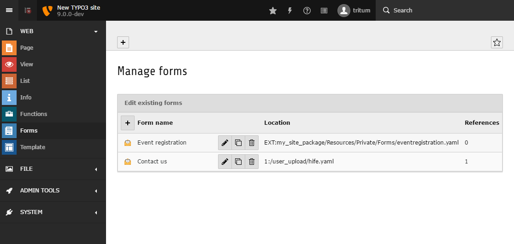

.. include:: ../../Includes.txt

.. _concepts-formmanager:

Form manager
============

.. _concepts-formmanager-general:

What does it do?
----------------

The ``form manager`` can be accessed by opening the backend module 'Forms'.
It allows the editor to administer all of the existing forms stored on the
accessible filemounts. The central element of the ``form manager`` is a
table view which...

- lists all forms
- allows users to create, edit, duplicate, and delete forms
- names the storage folder
- gives a broad overview on which pages the listed forms are used in.

The creation and duplication of forms is supported by a so-called ``form
wizard``. The wizard guides the editor through the process and offers a
variety of settings depending on the form configuration. Those settings
include choosing filemounts, prototypes, and start templates.

   TYPO3 Backend with opened module 'Forms' displaying the form manager.

.. _concepts-formmanager-starttemplate:

Start templates
---------------

This is a very nifty feature. When creating a new form, the ``form manager``
allows the backend editor to select a so-called ``Start template``. Such a
template is a predefined ``form definition`` without the property
``prototypeName`` which is normally used as a foundation of a new form.

As an integrator, you can specify as many ``Start templates`` as you desire
for a given ``prototype``. After you have defined such a template, follow
these easy steps to use your defined ``Start templates`` as a foundation:

- open the ``Forms`` module
- create a new form by clicking on the appropriate button
- enter the 'Form name' and click the checkbox 'Advanced settings'
- during the next steps you can select a ``Start template``

For each ``prototype``, you have to define a ``Start template`` in order to
enable the editor to choose one. Additionally, the same ``Start template``
can be used for several ``prototypes``. To do so, make sure the included
form elements of the template are defined in the corresponding ``prototype``.

For example, imagine your integrator has :ref:`configured<typo3.cms.form.formmanager.selectablePrototypesConfiguration>`
a prototype called 'routing' which contains a custom form element with the
``<formElementTypeIdentifier>`` 'locationPicker'. The element is only
defined for this prototype. The integrator has created a ``Start template``
which carries the 'locationPicker' form element. A backend editor could now
select and use this ``Start template``, including the custom form element,
as long as the ``prototype`` is set to 'routing'. If the integrator also
adds this custom form element to another ``prototype``, the process would
crash. The custom form element is only known by the ``prototype`` 'routing'.

The following code block shows the minimal configuration of a ``Start
template``. You need at least the root form element ('Form') and a 'Page'.

.. code-block:: yaml

   type: 'Form'
   identifier: 'blankForm'
   label: '[Blank Form]'
   renderables:
     -
       type: 'Page'
       identifier: 'page-1'
       label: 'Page'

As mentioned previously, the form wizard within the ``form manager`` offers
a list of all existing, :ref:`pre-configured<typo3.cms.form.formmanager.selectableprototypesconfiguration.*.newformtemplates>`
``Start templates``. As soon as the backend editor creates a form with the
help of such a template, a new ``form definition`` is generated based on the
one of the selected ``Start template``. The ``form definition`` will be
enriched by the property ``propertyName`` defining the chosen ``prototype``.
The ``identifier`` of the root form element ('Form') is automatically set
based on the entered "Form name". Additionally, this name is used for the
property `` label`` of the 'Form' element. Finally, the ``form editor`` is
loaded and displays the newly created form.

.. _concepts-formmanager-translation-starttemplate:

Translation of the form manager
-------------------------------

All option values which reside below the following configuration keys can be
translated:

.. code-block:: yaml

   TYPO3:
     CMS:
       Form:
         formManager:

The translation files of the ``form manager`` are loaded as follows:

.. code-block:: yaml

   TYPO3:
     CMS:
       Form:
         formManager:
           translationFile:
             # translation files for the form manager
             10: 'EXT:form/Resources/Private/Language/Database.xlf'
             20: 'EXT:my_site_package/Resources/Private/Language/Database.xlf'

The process searches for each option value within all of the defined
translation files. If a translation is found, the translated option value
will be used in preference.

Imagine, the following is defined for an option value:

.. code-block:: yaml

   ...
   label: 'formManager.selectablePrototypesConfiguration.standard.label'
   ...

First of all, the process searches for the translation key ``formManager.selectablePrototypesConfiguration.standard.label``
within the file ``20: 'EXT:my_site_package/Resources/Private/Language/Database.xlf'``
and after it inside the file ``10: 'EXT:form/Resources/Private/Language/Database.xlf'``.
If nothing is found, the option value will be displayed unmodified.

Due to compatibility issues, the setting ``translationFile`` is not defined
as an array in the default configuration. To load your own translation files,
you should define an array containing 'EXT:form/Resources/Private/Language/Database.xlf'
as first entry (key ``10``) followed by your own file (key ``20``) as
displayed in the example above.
