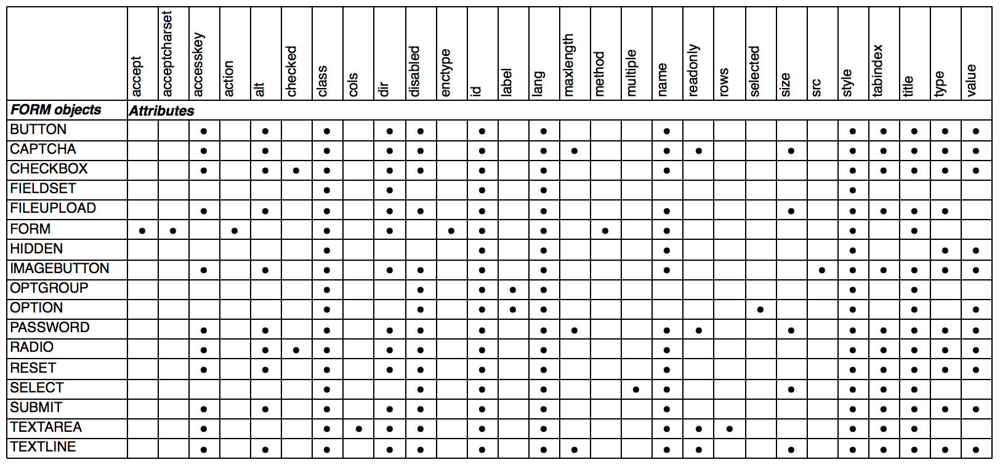
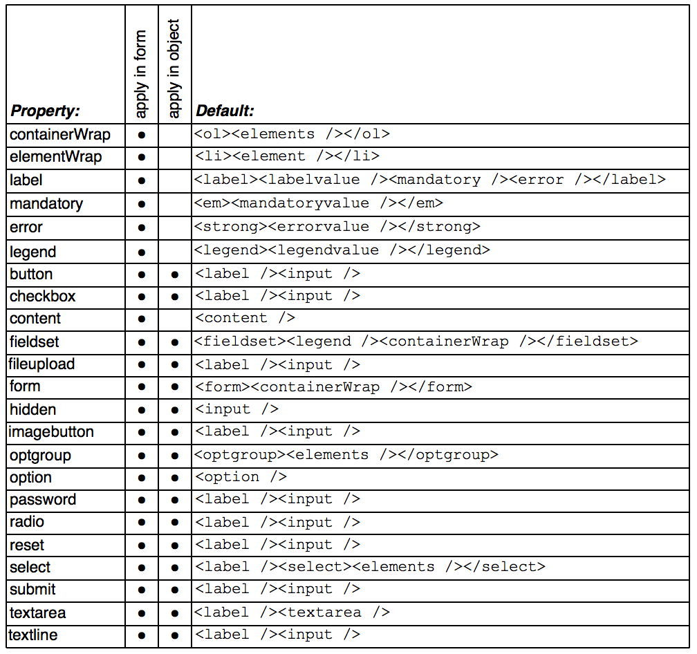
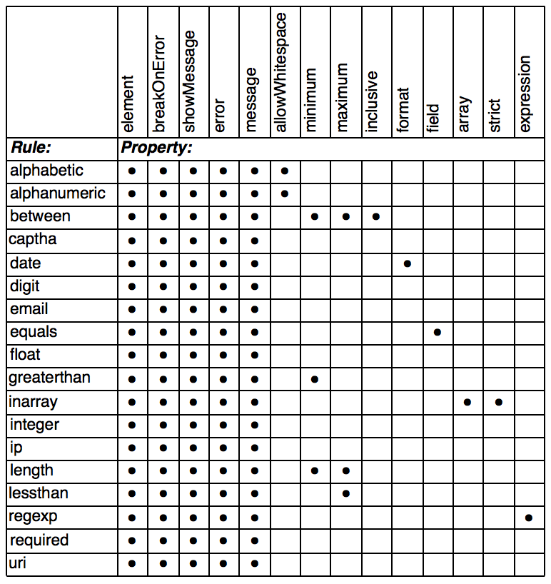
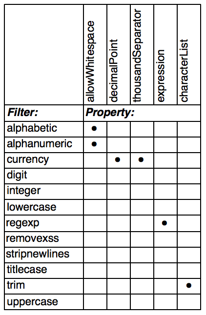

.. ==================================================
.. FOR YOUR INFORMATION
.. --------------------------------------------------
.. -*- coding: utf-8 -*- with BOM.

.. include:: ../../Includes.txt

.. _cheatsheets:

Cheat sheets
^^^^^^^^^^^^

This section contains cheat sheets for all attributes and layouts
of each FORM object, as well as for validation rules and filters.

.. _cheatsheets-attributes:

FORM objects attributes
"""""""""""""""""""""""

   All possible attributes of FORM objects, per object type

.. _cheatsheets-layouts:

FORM objects layouts
""""""""""""""""""""

   Default layouts of each FORM object

.. _cheatsheets-rules:

Validation rules
""""""""""""""""

   Rules applied for each validation type

.. _cheatsheets-filters:

Filters
"""""""

   Rules applied for each filter
