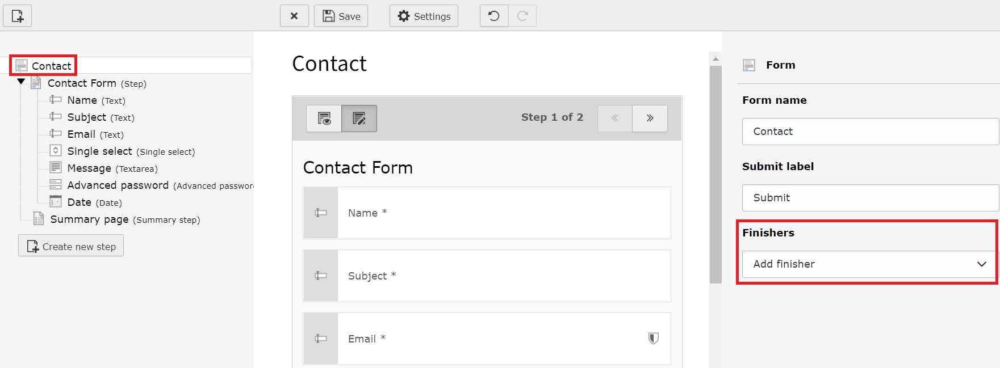

.. include:: /Includes.rst.txt

.. _finishers:

=========
Finishers
=========

.. _finishers-introduction:

Introduction
------------

To each form any number of so-called "finishers" can be added. Finishers allow
you to specify actions that will be executed once the form has been submitted by
the user.

In the following chapter, each finisher and its functions are explained. Not all
of the existing finishers can be added via the form editor. There are additional
finishers that can only be added by integrators/ administrators. The following
finishers are available by default:

* :ref:`Email to sender (form submitter)<finishers-email-to-sender>`
* :ref:`Email to receiver (you)<finishers-email-to-receiver>`
* :ref:`Redirect to a page<finishers-redirect>`
* :ref:`Delete uploads<finishers-delete-uploads>`
* :ref:`Confirmation message<finishers-confirmation-message>`

   Form editor - add new finishers

.. important::

   Finishers are executed in the order defined in your form definition. This is
   especially important when you are using the ``Redirect finisher``. Make sure
   this finisher is the very last one to be executed. The ``Redirect finisher``
   stops the execution of all subsequent finishers in order to perform the redirect.
   I.e. finishers defined after the ``Redirect finisher`` will not be executed in
   any case.

.. _finishers-overview-of-finishers:

Overview of finishers
---------------------

.. _finishers-email-to-sender:

Email to sender (form submitter)
================================

This finisher sends an email to the form submitter - i.e. the user - with the
contents of the form. The settings of the finisher are as follows:

- **Subject**:
   - Subject of the email.
   - **{ + }**: Overview of existing form elements - the variable will be replaced
     by the user's input.
- **Recipients**:
   - Recipient of the email.
   - **Email Address**: Email address of a recipient, e.g. "some.recipient@example.com"
     or "{email-1}".
   - **Name**: Name of a recipient, e.g. "Some Recipient" or "{text-1}".
   - **[ + ]**: Adds a new line for another recipient.
- **Sender address**:
   - Email address of the sender, e.g. "your.company@example.com"
   - **{ + }**: Overview of existing form elements - the variable will be replaced
     by the user's input.
- **Sender name**:
   - Name of the sender, e.g. "Your Company".
   - **{ + }**: Overview of existing form elements - the variable will be replaced
     by the user's input.
- **Reply-to Recipients**:
   - Email address which will be used when someone replies to the email.
   - **Email Address**: Email address for reply-to.
   - **Name**: Name for reply-to.
   - **[ + ]**: Adds a new line for another reply-to address.
- **CC Recipients**:
   - Email address to which a copy of the email is sent. The information is
     visible to all other recipients.
   - **Email Address**: Email address for CC.
   - **Name**: Name for CC.
   - **[ + ]**: Adds a new line for another CC address.
- **BCC Recipients**:
   - Email address to which a copy of the email is sent. The information is not
     visible to any of the recipients.
   - **Email Address**: Email address for BCC.
   - **Name**: Name for BCC.
   - **[ + ]**: Adds a new line for another BCC address.
- **Add HTML part**:
   - Activate this option to send the email as HTML as well.
- **Attach uploads**:
   - Activate this option to receive the uploaded files/ images via email.
- **Translation language**:
   - The labels of the form elements will be displayed in the selected language.
- **Title**:
   - The title, being shown in the Email. The title is rendered in the header
     section right above the email body. Do not confuse this field with the
     subject of your email.
   - **{ + }**: Overview of existing form elements - the variable will be replaced
     by the user's input.

.. _finishers-email-to-receiver:

Email to receiver (you)
=======================

This finisher sends an email to the receiver - i.e. you as the owner of the
website - with the contents of the form. The settings of the finisher are the
same as for the finisher :ref:`"Email to sender"<finishers-email-to-sender>`.

.. _finishers-redirect:

Redirect to a page
==================

This finisher redirects the user after submitting the form to a given page.
Additional parameters can be added to the URL. The settings of the finisher are
as follows:

- **Page**: ID of the page to redirect to.
   - **[ Page ]**: Choose a page from the page tree.
- **Additional parameters**: URL parameters which will be appended to the URL.
- **URL fragment**: ID of a content element identifier or a custom fragment
  identifier. This will be appended to the URL and used as section anchor.

.. important::

   This finisher stops the execution of all subsequent finishers in order to
   perform the redirect. Therefore, this finisher should always be the last
   finisher to be executed.

.. _finishers-delete-uploads:

Delete uploads
==============

This finisher removes the files, which have been transferred via an image or
file upload. There is no additional configuration necessary. Use this finisher
e.g. after the email finisher if you don't want to keep the files in your TYPO3
instance.

.. note::

   Finishers are only executed on successfully submitted forms. If a user
   uploads a file but does not finish the form successfully, the uploaded files
   will not be deleted.

.. _finishers-confirmation-message:

Confirmation message
====================

This finisher outputs a given text after the form has been submitted. The
settings of the finisher are as follows:

- **Content element uid**: ID of the desired content element.
   - **[ Page Content ]**: Choose a content element from the page tree.
- **Text**: Text which is displayed after the form has been successfully
  submitted.

.. note::

   The selected content element is displayed in favor of the static text. Only
   if no content element is selected, the static text is displayed.
