.. include:: /Includes.rst.txt

.. _form-elements:

==================================
Form elements and their properties
==================================

.. _form-elements-overview-of-form-elements:

Overview of form elements
-------------------------

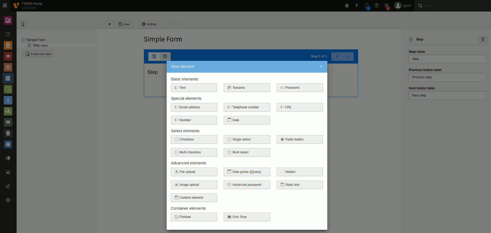
    be fewer or different elements in your installation.

Overview of all form elements included in the TYPO3 delivery. There may be
fewer or different elements in your installation.

.. _form-elements-settings:

Generally available settings of form elements
---------------------------------------------

By default, most form elements have these basic options:

- **Label**: Label of the element.
- **Description**: Descriptive explanation of the element. Can be used to
  provide the user with more information about the expected input.
- **Placeholder**: Example of the expected content. Disappears with the user's
  input.
- **Default value**: Preset value. Pre-entered by the system and does not
  disappear with the user's input.
- **Mandatory field**: Specify whether the field is a mandatory field and thus
  must be filled in by the user.
- **Custom error message**: Custom message that will be displayed to the user
  if the field is not filled in. If you don't provide a message, a default
  message is shown.
- **Validators**: Validators are used to check the data entered into the
  field. The system displays error messages in case of errors.

.. warning::

   If a form element is a required field or other validators take effect, error
   messages are displayed by the browser. Both the formatting and the text
   cannot be directly influenced by you as editor or by integrators.
   This is controlled by the browser respectively your operating system.

.. _form-elements-basic-elements:

Basic elements
--------------

.. _form-elements-basic-elements-text:

Text
====

A single-line text field, e.g. for entering short information such as name,
address, location. The settings for this element adhere to the
:ref:`default<form-elements-settings>`.

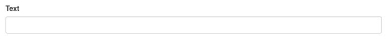

Element 'Text' - preview in the frontend.

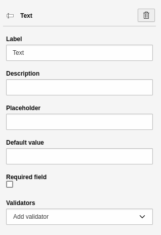

Settings for the 'Text' element.

.. _form-elements-basic-elements-textarea:

Textarea
========

A multi-line text field, e.g. for the free input of continuous text. This allows
the user to provide extensive information such as a message. The settings for
this element adhere to the :ref:`default<form-elements-settings>`.

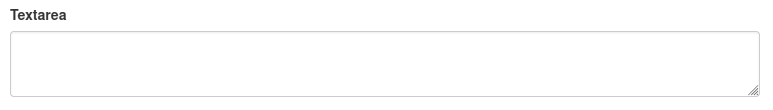

Element 'Textarea' - preview in the frontend.

Settings for the 'Textarea' element.

.. _form-elements-basic-elements-password:

Password
========

A single-line text field for entering a password. The browser "hides" the text
input, i.e. the entered characters are not visible. The settings for this element
adhere to the :ref:`default<form-elements-settings>`.

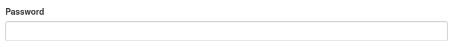

Element 'Password' - preview in the frontend.

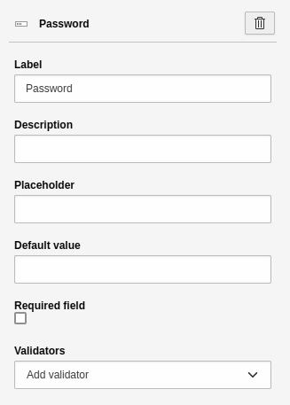

Settings for the 'Password' element.

.. _form-elements-special-elements:

Special elements
================

It is important that you understand and use special elements. Especially
smartphones and other mobile devices display different on-screen keyboards.
Instead of entering an e-mail address via the "Text" form element, you should
use the "Email address" element. The on-screen keyboard then directly contains
the "@" character in a central position. In addition, other validators take effect
immediately. For example, the "Email address" element checks for a correct
input format, e.g. "firstname.lastname@example.org".

.. _form-elements-special-elements-email:

Email address
==============

A sinlge-line field for entering an email address. The settings for this element
adhere to the :ref:`default<form-elements-settings>`. In addition, the field is
equipped with the validator `Email` and cannot receive any other validator.

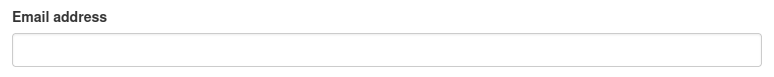

Element 'E-mail' - preview in the frontend.

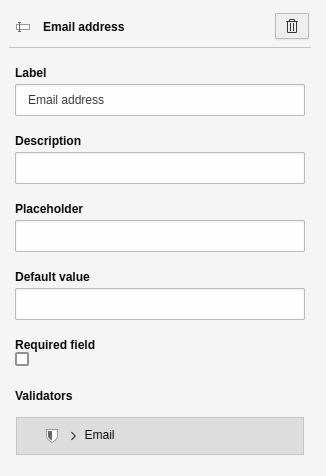

Settings for the 'E-mail' element.

.. _form-elements-special-elements-telephone-number:

Telephone number
================

A single-line text field for entering a phone number. The settings for this element
adhere to the :ref:`default<form-elements-settings>`.

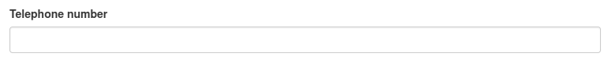

Element 'Telephone' - preview in the frontend.

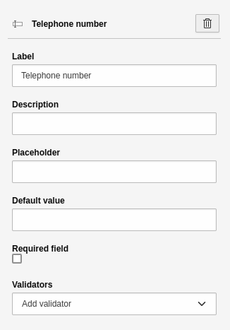

Settings for the 'Telephone' element.

.. _form-elements-special-elements-url:

URL
===

A single-line text field for entering a URL. A URL is typically an internet
address, such as that of your website. The settings for this element adhere to
the :ref:`default<form-elements-settings>`.

.. figure:: Images/form_elements_url_1.png
   :alt: Element 'URL' - preview in the frontend.

Element 'URL' - preview in the frontend.

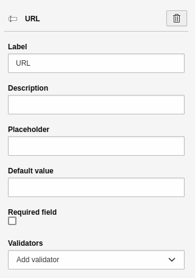

Settings for the 'URL' element.

.. _form-elements-special-elements-number:

Number
======

A single-line text field for entering a number. The user can count up and down
the entered number in preconfigured steps using visual controls in the browser.
The settings for this element adhere to the :ref:`default<form-elements-settings>`.
By default, the field is equipped with the `Number` validator. Additional settings:

- **Step**: Here you can enter a number that defines the step size. By this step
  size the number entered by the user will be counted up or down in the frontend.

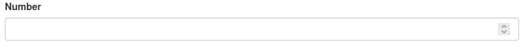

Element 'Number' - preview in the frontend.

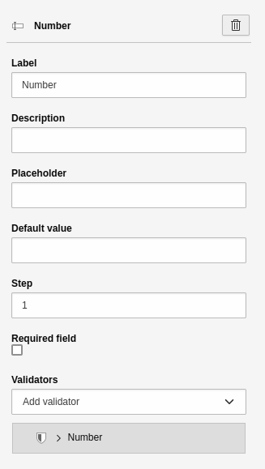

Settings for the 'Number' element.

.. _form-elements-special-elements-date:

Date
====

A single-line text field for entering a date. In addition,
`modern browsers <https://caniuse.com/input-datetime>`_ display a calendar from
which the user can select the date. At least partially 96% of browsers support
this feature. The settings for this element adhere to the
:ref:`default<form-elements-settings>`. Additional settings:

- **Frequency**: default value "1" means that the user can select every day.

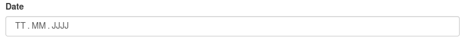

Element 'Date' - preview in the frontend.

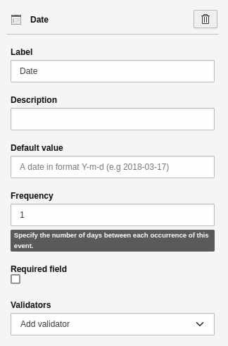

Settings for the 'Date' element.

.. _form-elements-select-elements:

Select elements
---------------

Select elements do not allow text input. Instead, they offer a predefined
number of choices. For example, you can query information such as the salutation.

.. note::

    Select elements behave differently with regard to validating those fields as
    required. For example, checkboxes with multiple choices cannot be
    validated as mandatory fields. This is not supported by the HTML standard.

.. _form-elements-select-elements-checkbox:

Checkbox
========

A simple checkbox. The settings for this element adhere to the :ref:`default<form-elements-settings>`.

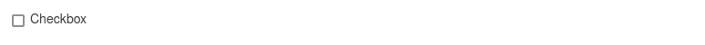

Element 'Checkbox' - preview in the frontend.

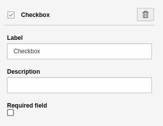

Settings for the 'Checkbox' element.

.. _form-elements-select-elements-single-select:

Single select
=============

An element to create a drop-down list. The setting for this element adhere to the
:ref:`default<form-elements-settings>`. Additional settings:

- **First option**: Define the "empty option", i.e. the first element of the
  select. You can use this to provide additional guidance for the user.
- **Choices**: A tool to insert and manage the options.
   - **Label**: Name of the option.
   - **Value**: Technical value of the option. The system automatically sets the
     "Value" to the value of the "Label". You can leave it like this if you don't
     understand what you are doing.
   - **Selected**: Check this to pre-select an option in the frontend.
   - **[ + ]**: Adds a new line for a new option.

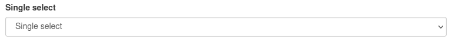

Element 'Single select' - preview in the frontend.

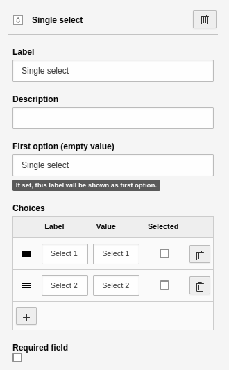

Settings for the 'Single select' element.

.. _form-elements-select-elements-radiobutton:

Radio button
============

An element to display one or more radio buttons. The settings for this element
adhere to the :ref:`default<form-elements-settings>`. Additional settings:

- **Choices**: A tool to insert and manage the options.
   - **Label**: Name of the option.
   - **Value**: Technical value of the option. The system automatically sets the
     "Value" to the value of the "Label". You can leave it like this if you don't
     understand what you are doing.
   - **Selected**: Check this to pre-select an option in the frontend.
   - **[ + ]**: Adds a new line for a new option.

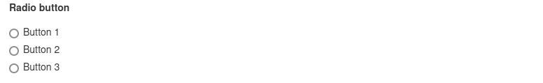

Element 'Radio button' - preview in the frontend.

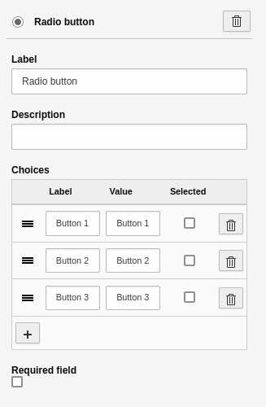

Settings for the 'Radio button' element.

.. _form-elements-select-elements-multi-checkbox:

Multi checkbox
==============

An element to create one or more checkboxes. The settings for this element adhere
tothe :ref:`default<form-elements-settings>`. Additional settings:

- **Choices**: A tool to insert and manage the options.
   - **Label**: Name of the option.
   - **Value**: Technical value of the option. The system automatically sets the
     "Value" to the value of the "Label". You can leave it like this if you don't
     understand what you are doing.
   - **Selected**: Check this to pre-select an option in the frontend.
   - **[ + ]**: Adds a new line for a new option.

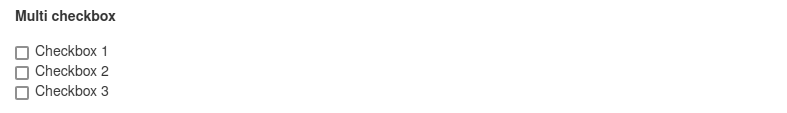

Element 'Multi checkbox' - preview in the frontend.

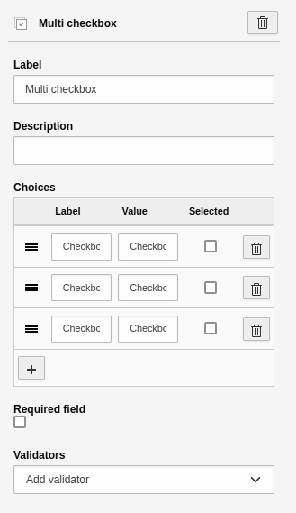

Settings for the 'Multi checkbox' element.

.. warning::

    As a required field, this element cannot directly be validated by **HTML**.
    Only after the attempt to submit the form, the element is validated and
    recognized that it must be filled.

.. _form-elements-select-elements-multi-select:

Multi select
============

An element to create a multiple selection. The settings for this element adhere
to the :ref:`default<form-elements-settings>`. Additional settings:

- **First option**: Define the "empty option", i.e. the first element of the
  select. You can use this to provide additional guidance for the user.
- **Choices**: A tool to insert and manage the options.
   - **Label**: Name of the option.
   - **Value**: Technical value of the option. The system automatically sets the
     "Value" to the value of the "Label". You can leave it like this if you don't
     understand what you are doing.
   - **Selected**: Check this to pre-select an option in the frontend.
   - **[ + ]**: Adds a new line for a new option.

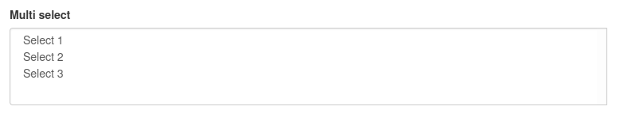

Element 'Multi select' - preview in the frontend.

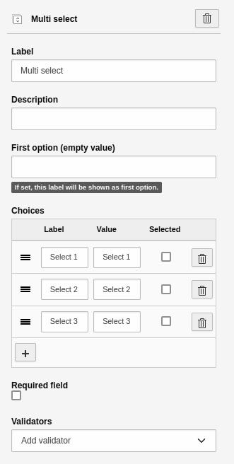

Settings for the 'Multi select' element.

.. _form-elements-advanced-elements:

Advanced elements
-----------------

.. _form-elements-advanced-elements-file-upload:

File upload
===========

An element to upload a file to the 'TYPO3 File list'. The settings for this item
adhere to the :ref:`default<form-elements-settings>`. Additional settings:

- **Allowed Mime Types**: Select the allowed file extensions a user is able to
  upload.
- **Storage path for uploads**: Select the path within your TYPO3 installation.
  This is where the uploaded file will be saved.

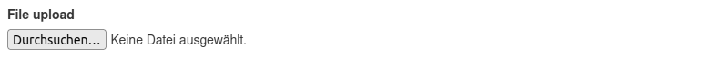

Element 'File upload' - preview in the frontend.

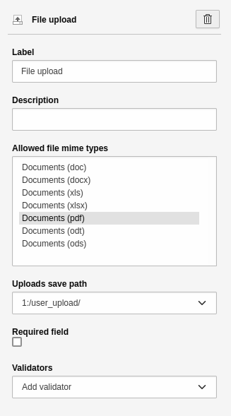

Settings for the 'File upload' element.

.. error::

    **Privacy issues**:
    Keep in mind that the storage path you choose may not be protected. The path may
    be indexed by your search and search engines. If you need to protect sensitive
    documents, contact your administrator to create a secure storage path.

.. _form-elements-advanced-elements-datepicker:

Date picker
===========

A single-line text field to select a date using a calendar. A JavaScript library
is used for this purpose. This form element is an alternative to the `Date`
element, which is also supported by older browsers (e.g. Internet Explorer 11).
However, it has limited accessibility. The settings for this element adhere to the
:ref:`default<form-elements-settings>`. Additional settings:

- **Date format**: select date format (e.g. **d.m.Y** or **Y-m-d** or **d-m-Y**)
   - **d**: stands for day
   - **m**: stands for month
   - **Y**: stands for year
- **Enable date selection**: Check this to display a calendar.
- **Show time selection**: Check this to display two drop downs for '**Hour**'
  and '**Minute**' respectively.

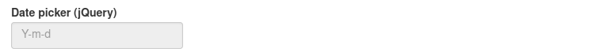

Element 'Date picker' - preview in the frontend.

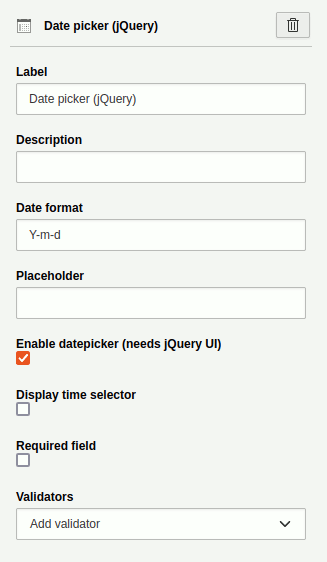

Settings for the 'Date picker' element.

.. _form-elements-advanced-elements-hidden:

Hidden
======

This field is not visible in the frontend. The form element is inside the red
rectangle in the image. Such a field is usually needed for technical aspects,
e.g. to add hidden values to the form. The settings for this element adhere to
the :ref:`default<form-elements-settings>`. Additional settings:

- **Value**: Here you can set a value for the element.

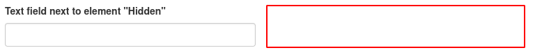

Element 'Hidden' - preview in the frontend.

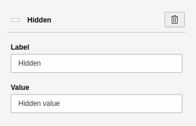

Settings for the 'Hidden' element.

.. _form-elements-advanced-elements-image-upload:

Image upload
============

An element to upload an image to the 'TYPO3 File list'. The settings for this
item adhere to the :ref:`default<form-elements-settings>`. Other settings:

- **Allowed Mime Types**: Select the allowed file extensions a user is able to
  upload.
- **Storage path for uploads**: Select the path within your TYPO3 installation.
  This is where the uploaded file will be saved.

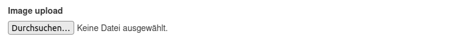

Element 'Image upload' - preview in the frontend.

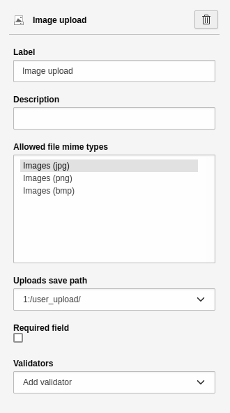

Settings for the 'Image upload' element.

.. error::

    **Privacy issues**:
    Keep in mind that the storage path you choose may not be protected. The path may
    be indexed by your search and search engines. If you need to protect sensitive
    documents, contact your administrator to create a secure storage path.

.. _form-elements-advanced-elements-advanced-password:

Advanced password
=================

The element is analogous to the `Password` form element. A single-line text
field is displayed for entering a password. The browser "hides" the text input,
i.e. the entered characters are not visible. Another field is displayed below it
so that the user has to repeat the password. This ensures that the user did not
make a typing error. Such a field is useful especially for registration
forms. The settings for this element adhere to the :ref:`default<form-elements-settings>`.
Additional settings:

- **Confirmation label**: Label for the confirmation field.

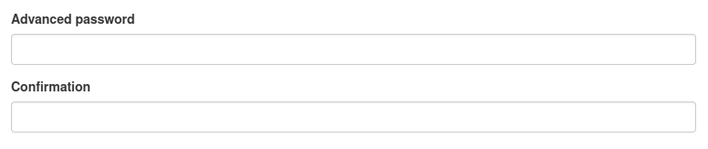

Element 'Advanced password' - preview in the frontend.

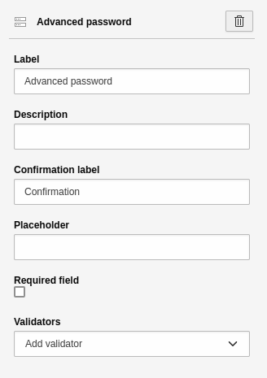

Settings for the 'Advanced password' element.

.. _form-elements-advanced-elements-static-text:

Static text
===========

A field for static text. You can't format the text, which means you can't
insert links or highlight text. Instead, the text is output in the style of
your website. The settings for this element are:

- **Heading**: Heading for the element.
- **Text**: Content for the element.

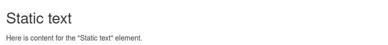

Element 'Static text' - preview in the frontend.

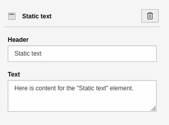

Settings for the 'Static text' element.

.. _form-elements-advanced-elements-content-element:

Content element
================

You can display any content element of your website. The settings for
this element are:

- **Content element uid**: ID of the content element you want to display. You can
  either enter the ID manually or select it comfortably via the page tree.
  To do this, click on the "Page content" button.
- **[ Page content ]**: Modal which displays the page tree. You can select
  a page and a corresponding content element.

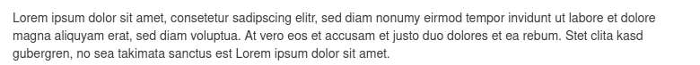

Element 'Content element' - preview in the frontend.

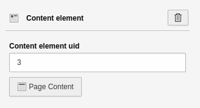

Settings for the 'Content element' element.

.. _form-elements-container-elements:

Container elements
------------------

Container elements are not directly visible. Instead, they help you structure
your form in terms of content or visual appearance. The different elements can
be combined. For example, a field group can contain several grids.

.. _form-elements-container-elements-fieldset:

Fieldset
========

You can use this container to group several elements in the form. This is a
content-based structuring, i.e. you create a context content-wise. This is
awarded by screen readers and helps you to improve the accessibility of your form.
A typical fieldset would be, for example, "Address". Within this fieldset you have
form elements for the street, house number, postal code and city. The settings for
this element are:

- **Field group name**: Heading for the field group, e.g. "Address".

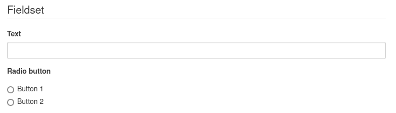

Element 'Fieldset' - preview in the frontend.

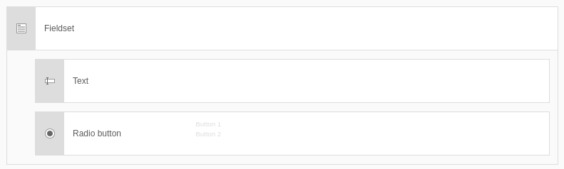

Element 'Fieldset' - preview in the backend.

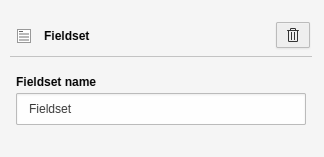

Settings for the 'Fieldset' element.

.. _form-elements-container-elements-grid:

Grid
====

You can use this container element to place fields next to each other.
Obviously, this is a visual structuring.

**The additional settings apply to the content elements within the grid**:

- **Configuration Grid Area**:
   - Areas: **xs** (Very small), **sm** (Small), **md** (Medium), **lg** (Large),
     **xl** (Extra large), **xxl** (Extra extra large).
   - These are the so-called breakpoints. These are specific ranges of
     resolutions or adaptations to the different screen sizes. Smartphones,
     for example, have a low resolution range (xs or sm), while desktop monitors
     have a high resolution range (lg, xl or xxl). You can use this to
     abstractly control how many elements are displayed next to each other in
     which resolution.
- **Number of columns for grid area "xx"**:
   - Here you can enter a number for the selected area.
   - The number determines how much space the field takes up on the various
     screen sizes and thus ultimately how many elements are displayed next to
     each other.

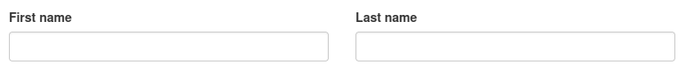

Element 'Grid' - preview in the frontend.

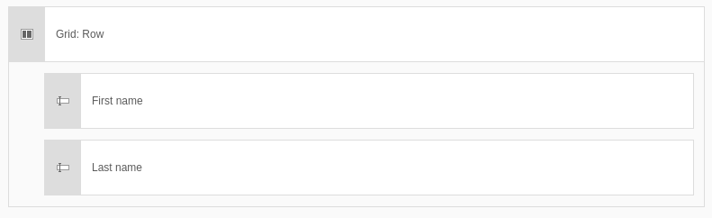

Element 'Grid' - preview in the backend.

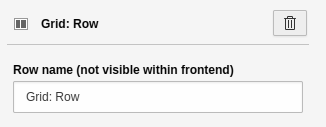

Settings for the 'Grid' element - Part 1.

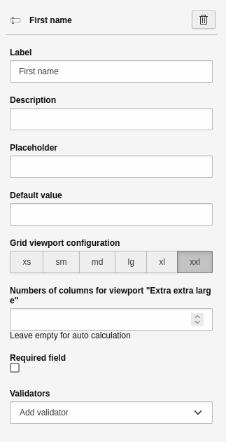

Settings for the 'Grid' element - Part 2.
