.. include:: /Includes.rst.txt

.. _validators:

==========
Validators
==========

.. _validators-introduction:

Introduction
------------

Validators can be maintained with all form elements to check input for
"validity" - presence, meaningfulness and correctness. For example, you can
determine whether a field has been filled in or the information provided is an
email address. Additionally, you can **define** your own **error messages** for
the fields. These messages can be maintained in the **form editor**. In the
following, the individual validators are **explained** and their **function**
is discussed.

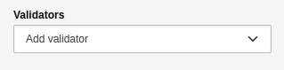

In the Inspector - setting for maintaining validators.

.. _validators-overview-of-validators:

Overview of validators
----------------------

.. _validators-alphanumeric:

Alphanumeric
============

The validator checks whether the field contains an alphanumeric string only.
"Alphanumeric" defines a combination of alphabetic and numeric characters. No
special characters may be entered in this field, only characters from
**[A-Z] and [0-9]**. The settings for the validator are as follows:

- **Custom error message**: custom error message that will be issued if
  validation fails.

**Form element where the validator is available**:

- Text
- Textarea
- Password
- Advanced password

In the Inspector - Settings element for the 'Alphanumeric' validator.

.. _validators-string-length:

String length
=============

The validator uses the *minimum* and *maximum* values to check how many
characters may be **entered** in the field. The settings for the validator
are as follows:

- **Minimum**: How many characters the field must contain as a minimum.
- **Maximum**: How many characters the field may contain as a maximum.
- **Custom error message**: Custom error message that will be displayed if
  the validation fails.

**Form element where the validator is available**:

- Text
- Textarea
- Password
- Advanced password

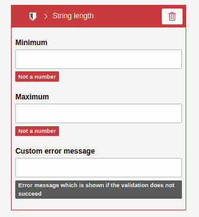

In the Inspector - settings to the validator 'String length'.

.. _validators-email:

Email
=====

The validator checks whether the specified value is a **valid email address**.
The default allows international characters and multiple occurrences of
the **@ sign**. The settings for the validator are as follows:

- **Custom error message**: custom error message issued when validation fails.

**Form element where the validator is available**:

- Text
- Email address (validator is automatically active)
- Password
- Advanced password

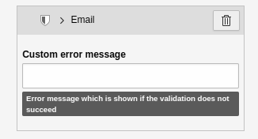

In the Inspector - Settings element for the 'E-mail' validator.

.. _validators-integer-number:

Integer number
==============

The validator checks whether the specified value is a **valid integer**. No
numbers with commas can be entered. The settings for the validator are as
follows:

- **Custom error message**: custom error message issued when validation fails.

**Form element where the validator is available**:

- Text
- Textarea
- Password
- Advanced password

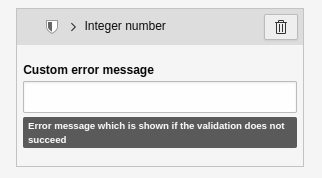

In the Inspector - settings to the validator 'Integer number'.

.. _validators-floating-point-number:

Floating-point number
=====================

The validator checks whether the specified value is a
**valid floating-point number**. Only numbers with a comma can be entered. The
settings for the validator are as follows:

- **Custom error message**: custom error message issued when validation fails.

**Form element where the validator is available**:

- Text
- Textarea
- Password
- Advanced password

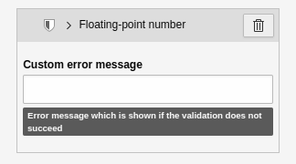
    validator.

In the Inspector - Settings element for the 'Floating-point number' validator.

.. _validators-number:

Number
======

The validator checks whether the specified value is a **valid number**. Only
numbers without a comma can be entered. The settings for the validator are as
follows:

- **Custom error message**: custom error message issued when validation fails.

**Form element where the validator is available**:

- Number (validator is automatically active).

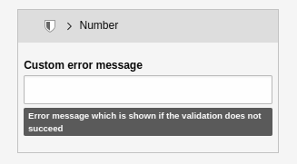

In the Inspector - Settings element for the 'Number' validator.

.. _validators-number-range:

Number range
============

The validator checks if the specified value is a number within the
**specified number range**. The settings for the validator are as follows:

- **Minimum**: The minimum value to accept.
- **Maximum**: The maximum value to be accepted.
- **Custom error message**: Custom error message that will be issued if the
  validation fails.

**Form element where the validator is available**:

- Text
- Textarea
- Password
- Number
- Advanced password

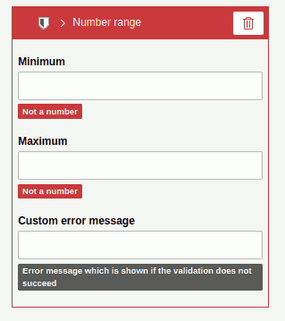

In the Inspector - Settings element for the 'Number range' validator.

.. _validators-regular-expression:

Regular expression
==================

The validator checks whether the **specified value** matches the
**specified regular expression**. The settings for the validator:

- **Regular expression**: the regular expression to use for validation.
- **Custom error message**: set your own error message if the validation fails.

Imagine the following example. You want the user to specify a domain name. The
value entered should contain only the domain, for example, "docs.typo3.org"
instead of "https://docs.typo3.org" The regular expression for this use case
would be **/^[a-z]+.[a-z]+.[a-z]$/**.

**Content elements where to maintain the validator**:

- Text
- Textarea
- Password
- Telephone number
- URL
- Advanced password

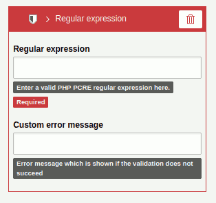

In the Inspector - Settings for the 'Regular Expression' validator.

.. _validators-date-range:

Date range
==========

The validator checks whether the specified value is within the specified
**date range**. The range can be defined by specifying a **start** and/or
**end date**. The settings for the validator are as follows:

- **Custom Error Message**: custom error message that will be issued if
  validation fails.
- **Start date**: Here you select the beginning of the date range
  (input: YYYY-MM-DD ).
- **End date**: Here you select the end of the date range (input: YYYY-MM-DD ).

**Form element where the validator is available**:

- Date

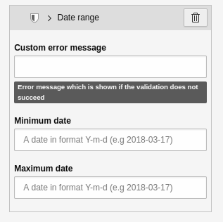

In the Inspector - Settings element for the 'Date range' validator.

.. _validators-number-of-submitted-values:

Number of submitted values
==========================

The validator checks whether the specified value, which is defined in a
*minimum* and a *maximum*, contains the specified number of elements. The
settings for the validator are as follows:

- **Minimum**: the minimum number of values submitted.
- **Maximum**: The maximum number of submitted values.
- **Custom error message**: custom error message that will be issued if the
  validation fails.

**Form element where the validator is available**:

- Multi checkbox
- Multi select

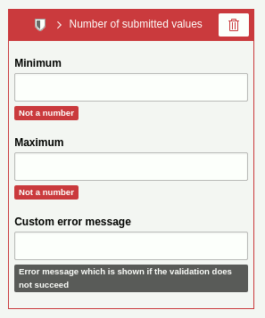
    submitted values'.

In the Inspector - Settings element for the validator'Number of submitted
values'.

.. _validators-file-size:

File size
=========

The validator checks a **file resource** for its file size. The settings for the
validator are as follows:

- **Minimum**: The minimum file size that is accepted (default: 0B).
- **Maximum**: The maximum file size that will be accepted (default: 10M).

Use the format **B | K | M | G** (byte | kilobyte | megabyte | gigabyte) when
entering file sizes. For example: **10M** means **10 megabytes**. Please note
that the maximum file size also depends on the settings of your server
environment.

**Form element where the validator is available**:

- File upload
- Image upload

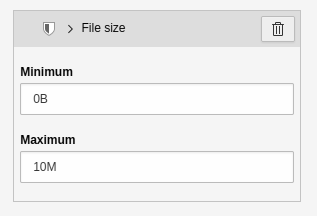

In the Inspector - Settings element for the 'File size' validator.

.. _validators-date-time:

Date/Time
=========

The validator checks if the specified value is a valid **date and/ or time**.
The settings for the validator are as follows:

- **Custom error message**: custom error message that will be issued if the
  validation fails.

**Form element where the validator is available**:

- Date picker (jQuery)

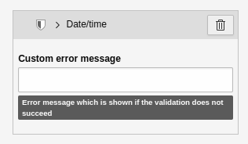

In the Inspector - Settings element for the 'Date/Time' validator.
