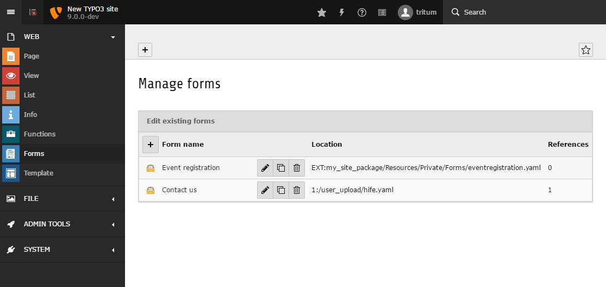

.. include:: /Includes.rst.txt

.. _concepts-formmanager:

Form manager
============

.. _concepts-formmanager-general:

What does it do?
----------------

You will find the ``form manager`` in the backend :guilabel:`Web > Forms` backend
module. Editors can use the ``form manager`` to administer forms in the
storages that they have access to. The ``form manager``:

-   lists all forms
-   allows users to search for forms
-   allows users to create, edit, duplicate, and delete forms
-   shows where each form is stored
-   gives an overview of which pages the forms are on.

The search field above the list filters the forms by their name or their
persistence identifier. The search is case-insensitive.

..  versionadded:: 13.0
    :changelog: feature-97664-1656981240

Creation and duplication of forms is made easier by a ``form wizard``.
The wizard guides the editor through form creation and offers a
variety of settings, such as the storage, the prototype, and start
templates.

   TYPO3 Backend with opened module 'Forms' displaying the form manager.

..  _concepts-formmanager-storage:

Storage
-------

..  versionadded:: 14.2
    :changelog: feature-108653-1767199420

In the step **Storage location**, editors select where the form
is saved when they create or duplicate a form:

:guilabel:`Database`
    The form is saved as a record in the database.

:guilabel:`Extension`
    The form is saved in an extension folder. This option is only
    available when integrators configure
    :ref:`allowedExtensionPaths <persistencemanager.allowedExtensionPaths>`
    and enable
    :ref:`allowSaveToExtensionPaths <persistencemanager.allowSaveToExtensionPaths>`.

If only one storage is available, the wizard skips this step. See
:ref:`Form storage <concepts-form-file-storages>` for the permissions
that each storage needs.

.. _concepts-formmanager-starttemplate:

Start templates
---------------

Editors can select a ``Start template`` when they are creating a new form. A
``Start template`` is a ``form definition`` which hasn't been assigned a
``prototypeName`` (the ``prototypeName`` property is normally used as the
foundation of a new form).

An integrator can create as many ``Start templates`` as they wish for a particular
``prototype``. After the ``Start templates`` have been defined the integrator can then:

- open :guilabel:`Web > Forms`
- create a new form by clicking on the appropriate button
- enter the 'Form name' and click the 'Advanced settings' checkbox
- select a ``Start template`` during the next steps

Integrators have to define ``Start templates`` so that they can be selected
by editors. Also, the same ``Start template``
can be used for several ``prototypes``. To do this, make sure the
``start template`` form elements are defined in the corresponding ``prototypes``.

For example, imagine an integrator has :ref:`configured<formmanager.selectablePrototypesConfiguration>`
a prototype called 'routing' which contains a form element of type
``<formElementTypeIdentifier>`` 'locationPicker'. The element is only
defined in this prototype. The integrator has created a ``Start template``
which contains the 'locationPicker' form element. A backend editor could now
select and use this ``Start template`` with the 'locationPicker' form element,
as long as the ``prototype`` is 'routing'. If the integrator
adds this form element to another ``prototype``, the process would
crash. The 'locationPicker' form element is only known to the 'routing'
``prototype``.

The following example shows a ``Start template``. A
``Start template`` requires at least the root form element
('Form') and a 'Page'.

.. code-block:: yaml

   type: 'Form'
   identifier: 'blankForm'
   label: '[Blank Form]'
   renderables:
     -
       type: 'Page'
       identifier: 'page-1'
       label: 'Page'

The ``form manager`` form wizard displays
a list of all :ref:`pre-configured<formmanager.selectableprototypesconfiguration.*.newformtemplates>`
``Start templates``.When a backend editor creates a form using a
``Start template``, a new ``form definition`` is generated based on that
``Start template``. The ``form definition`` ``propertyName`` will be that of the
chosen ``prototype``.The ``identifier`` of the root form element ('Form') is set
to the entered "Form name". This name is also used for the
property `` label`` of the 'Form' element. Finally, the ``form editor`` is
loaded and displays the newly created form.

..  versionadded:: 14.0
    :changelog: feature-106477-1753393923

    Before, a `Start template` could not import other YAML files or
    contain placeholders.

The `form manager` loads a `Start template` with the TYPO3 Core
:ref:`YAML loader <t3coreapi:yamlFileLoader>`. A `Start template` can import
other YAML files and contain environment variable placeholders such as
`%env(ENV_NAME)%`. The imports and placeholders are resolved when the new
form is created. The new form definition contains the resolved values.

..  code-block:: yaml
    :caption: EXT:my_extension/Resources/Private/Backend/Templates/FormEditor/Yaml/NewForms/ContactForm.yaml

    imports:
      - { resource: 'ContactFormPages.yaml' }
    type: Form
    identifier: contactForm
    label: 'Contact form'
    finishers:
      -
        identifier: EmailToReceiver
        options:
          subject: 'Contact request from %env(SITE_NAME)%'
          recipients:
            office@example.com: 'Office'
          senderAddress: '%env(FORM_SENDER_ADDRESS)%'

..  code-block:: yaml
    :caption: EXT:my_extension/Resources/Private/Backend/Templates/FormEditor/Yaml/NewForms/ContactFormPages.yaml

    renderables:
      -
        type: Page
        identifier: page-1
        label: 'Contact data'

.. _concepts-formmanager-translation-starttemplate:

Translation of the form manager
-------------------------------

All option values below the ``form editor`` key in the form configuration can be
translated:

.. code-block:: yaml

   formManager:

The ``form manager`` translation files are loaded as follows:

.. code-block:: yaml

   formManager:
     translationFiles:
       # custom translation file
       20: 'EXT:my_site_package/Resources/Private/Language/Form/Database.xlf'

The process searches for each option value within all of the defined
translation files. If a translation is found, the translated option value
will be used in preference.

For the following option value:

.. code-block:: yaml

   ...
   label: 'formManager.selectablePrototypesConfiguration.standard.label'
   ...

the process searches for the translation key ``formManager.selectablePrototypesConfiguration.standard.label``
in the file under key 20  ``20: 'EXT:my_site_package/Resources/Private/Language/Form/Database.xlf'``
and then the file in EXT:form ``10: 'EXT:form/Resources/Private/Language/Database.xlf'``
(loaded by default). If nothing is found, the option value will be
displayed unmodified.
