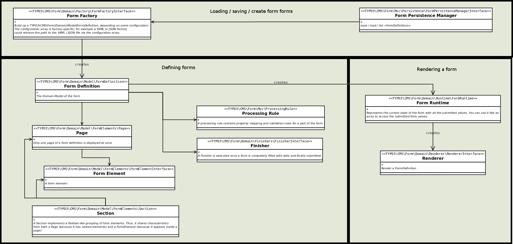

..  include:: /Includes.rst.txt

..  _concepts-frontendrendering:

==================
Frontend rendering
==================

..  _concepts-frontendrendering-templates:

Templates
=========

Fluid templates in the form framework are based on `Bootstrap`_.

..  _Bootstrap: https://getbootstrap.com/

..  _concepts-frontendrendering-templates-customtemplates:

Custom templates
----------------

In order to use your own Fluid templates for frontend forms,
register your own template paths via YAML in the form configuration
(here under the default ``standard`` prototype).

..  code-block:: yaml

    prototypes:
      standard:
        formElementsDefinition:
          Form:
            renderingOptions:
              templateRootPaths:
                100: 'EXT:my_site_package/Resources/Private/Frontend/Templates/'
              partialRootPaths:
                100: 'EXT:my_site_package/Resources/Private/Frontend/Partials/'
              layoutRootPaths:
                100: 'EXT:my_site_package/Resources/Private/Frontend/Layouts/'

If your `form definition` then references the `standard` prototype, the form
framework will look for Fluid templates in
:directory:`EXT:my_site_package/Resources/Private/Frontend/[*]`.

The `Form` element is the 'main' element. The framework will look for
:file:`Form.html` in :directory:`templateRootPaths`. For all other elements,
it will look in :directory:`partialRootPaths`. A partial has the same name
as the `formElementTypeIdentifier` property, for example,
a `Text` template will be in a partial named :file:`Text.html` in
:directory:`partialRootPaths`.

..  _concepts-frontendrendering-templates-singlevalues:

Form element values in finisher templates
-----------------------------------------

Use the :php:`RenderFormValueViewHelper` to access form element values in your
finisher templates. This ViewHelper accepts a single form
element and renders it. The following example shows the :php:`RenderFormValueViewHelper`
being called with two parameters (`renderable` and `as`) to output the value of a
`message` field. The value :fluid:`{formValue.processedValue}` can then
be manipulated with Fluid, styled, etc.

..  code-block:: html

    <formvh:renderFormValue renderable="{form.formDefinition.elements.message}" as="formValue">
        {formValue.processedValue}
    </formvh:renderFormValue>

Names of your form elements can be found in your form definition (in your
individual YAML files or in the :guilabel:`System > Configuration` module if you
have the lowlevel extension installed). Or use the debug ViewHelper in Fluid to
list all the form elements.

..  code-block:: html

    <f:debug>{page.rootForm.elements}</f:debug>

..  _concepts-frontendrendering-translation:

Translation
===========

..  _concepts-frontendrendering-translation-formdefinition:

Translate form definition
-------------------------

Translation of `form definitions` works differently to the usual translation
of the backend. Currently, there is no graphical user interface
for this translation process.

If `form definition` properties were translated in the same way as the rest of the backend,
a backend editor using the `form editor` to edit a form they would see long
unwieldy translation keys. In order to avoid this, form element *properties* are translated
instead of their values. The form framework does not look for translation keys
in a translation file. Instead, the system searches for translations
of the form element properties independent of their property values. The
property values are ignored if an entry is found in a
translation file. The form element property values are overridden by the
translated values.

This approach is a compromise between two scenarios: creating forms using the `form editor`
or creating `form definitions` (which could later be edited in the
`form editor`). An editor can create forms just using the `form editor` where
form element property values are displayed in the default language. An integrator
can provide additional language files which translate the form depending on the
prototype.

Add additional translation files to the form configuration as follows:

..  code-block:: yaml

    prototypes:
      standard:
        formElementsDefinition:
          Form:
            renderingOptions:
              translation:
                translationFiles:
                  # custom translation file
                  20: 'EXT:my_site_package/Resources/Private/Language/Form/locallang.xlf'

The translationFiles array is processed from the highest key to the lowest, i.e. your
translation file with key `20` is processed before translation files with key
'10' in EXT:form. If no key is found in the translation files, a
property value will be displayed unmodified.

The following properties can be translated:

*   label
*   properties.[*]
*   properties.options.[*]
*   properties.fluidAdditionalAttributes.[*]
*   renderingOptions.[*]

The translation keys are put together based on a specific pattern and there is a
order (fallback chain) for the translations that depends on translation scenarios.
These are the translation scenarios:

*   translation of a form element property for a specific form (`formDefinitionIdentifier) and form
    element (`ElementIdentifier`)
*   translation of a form element property for a specific form element (`formElementIdentifier`) and
    various forms
*   translation of a form element property for an element type (`elementType`) and various
    forms, e.g. the `Page` element

The look-up process searches for translation keys in all given translation
files based on the following order (the same order as the translation scenarios above):

*   `<formDefinitionIdentifier>.element.<elementIdentifier>.properties.<propertyName>`
*   `element.<formElementIdentifier>.properties.<propertyName>`
*   `element.<elementType>.properties.<propertyName>`

Translation of options (`properties.options`) in form elements, like the
`Select` element, have the following look-up order:

*   `<formDefinitionIdentifier>.element.<elementIdentifier>.properties.options.<propertyValue>`
*   `element.<elementIdentifier>.properties.options.<propertyValue>`

..  _concepts-frontendrendering-translation-formdefinition-example:

Example Form Definition
~~~~~~~~~~~~~~~~~~~~~~~

..  code-block:: yaml

    identifier: ApplicationForm
    type: Form
    prototypeName: standard
    label: 'Application form'

    renderables:
      -
        identifier: GeneralInformation
        type: Page
        label: 'General information'

        renderables:
          -
            identifier: LastName
            type: Text
            label: 'Last name'
            properties:
              placeholder: 'Please enter your last name.'
            defaultValue: ''
          -
            identifier: Software
            type: MultiSelect
            label: 'Known software'
            properties:
              options:
                value1: TYPO3
                value2: Neos

In order to translate the form element `LastName`, the process will look for the following
translation keys in the translation files:

*   `ApplicationForm.element.LastName.properties.label`
    (*<formDefinitionIdentifier>.element.<elementIdentifier>.properties.<propertyName>*)
*   `element.LastName.properties.label`
    (*element.<formElementIdentifier>.properties.<propertyName>*)
*   `element.Text.properties.label`
    (*element.<elementType>.properties.<propertyName>*)

If none of these keys exist, 'Last name' will be displayed.

In order to translate the form element `Software`, the process will look for the following
translation keys in the translation files:

*   `ApplicationForm.element.Software.properties.label`
    (*<formDefinitionIdentifier>.element.<elementIdentifier>.properties.<propertyName>*)
*   `element.Software.properties.label`
    (*element.<formElementIdentifier>.properties.<propertyName>*)
*   `element.MultiSelect.properties.label`
    (*element.<elementType>.properties.<propertyName>*)

If none of the these keys exist, 'Known software' will be
displayed. The option properties lookup process is as the following:

*   `ApplicationForm.element.Software.properties.options.value1`
    (*<formDefinitionIdentifier>.element.<elementIdentifier>.properties.options.<propertyValue>*)
*   `element.Software.properties.options.value1`
    (*element.<elementIdentifier>.properties.options.<propertyValue>*)
*   `ApplicationForm.element.Software.properties.options.value2`
    (*<formDefinitionIdentifier>.element.<elementIdentifier>.properties.options.<propertyValue>*)
*   `element.Software.properties.options.value2`
    (*element.<elementIdentifier>.properties.options.<propertyValue>*)

If none of the these keys exist, 'TYPO3' will be displayed as
label for the first option and 'Neos' for the second option.

..  _concepts-frontendrendering-translation-validationerrors:

Translation of validation messages
----------------------------------

The translation of validation messages is similar to the translation of
`form definitions` abpve. The same translation files can be used. If the look-up
process does not find a key within the files, an Extbase message will be displayed.
EXT:form translates validators by default.

The same as for  `form definitions`, the translation keys are put together based on a
specific pattern. There is also a fallback chain.

The following translation scenarios are possible:

*   translation of validation messages for a specific validator of a specific
    form element (`elementIdentifier`) and specific form (`formDefinitionIdentifier`)
*   translation of validation messages for a specific validator of various
    form elements within a specific form (`formDefinitionIdentifier`)
*   translation of validation messages for a specific validator of a specific
    form element (`elementIdentifier`) in various forms
*   translation of validation messages for a specific validator in various
    forms

In Extbase, validation messages are identified by numerical codes (UNIX
timestamps). Different codes can be used for the same validator. Read more about
:ref:`concrete validator configurations <prototypes.prototypeIdentifier.validatorsdefinition.validatoridentifier-concreteconfigurations>`.

The look-up process searches for translation keys in the translation
files in the following order (the same order as the translation scenarios above):

*   `<formDefinitionIdentifier>.validation.error.<elementIdentifier>.<validationErrorCode>`
*   `<formDefinitionIdentifier>.validation.error.<validationErrorCode>`
*   `validation.error.<elementIdentifier>.<validationErrorCode>`
*   `validation.error.<validationErrorCode>`

..  _concepts-frontendrendering-translation-validation-example:

Example Form Definition with Validator
~~~~~~~~~~~~~~~~~~~~~~~~~~~~~~~~~~~~~~

..  code-block:: yaml

    identifier: ContactForm
    type: Form
    prototypeName: standard
    label: 'Contact us'

    renderables:
      -
        identifier: Page1
        type: Page
        label: 'Page 1'

        renderables:
          -
            identifier: LastName
            type: Text
            label: 'Last name'
            properties:
              fluidAdditionalAttributes:
                required: required
            validators:
              -
                identifier: NotEmpty

If a user submits this form without providing a last name, the `NotEmpty`
validator (at the bottom of the example above) fails and
sends 1221560910 as a `<validationErrorCode>`. The system looks through the
translation keys in the following order searching for the `NotEmpty` validator for form element `LastName`:

*   ContactForm.validation.error.LastName.1221560910 (*<formDefinitionIdentifier>.validation.error.<elementIdentifier>.<validationErrorCode>*)
*   ContactForm.validation.error.1221560910 (*<formDefinitionIdentifier>.validation.error.<validationErrorCode>*)
*   validation.error.LastName.1221560910 (*validation.error.<elementIdentifier>.<validationErrorCode>*)
*   validation.error.1221560910 (validation*.error.<validationErrorCode>*)

As mentioned above, if no translation key is available,
a default Extbase framework message is displayed.

..  _concepts-finishers-translation:
..  _concepts-frontendrendering-translation-finishers:

Translation of finisher options
-------------------------------

The translation of finisher options is similar to the translation of
`form definitions` above. The same translation files can be used. If the look-up
process does not find a key in the provided translation files, the property value
will be displayed unmodified.

The same as for `form definitions`, the translation keys are put together based on a
specific pattern. There is also a fallback chain.

The following translation scenarios are possible:

*   translation of finisher options for a specific finisher (`finisherIdentifier`) of a specific form (`formDefinitionIdentifier` below)
*   translation of finisher options for a specific finisher (`finisherIdentifier`) of various forms

The look-up process searches for translation keys in all the translation
files based on the following order (the same order as the translation scenarios above):

*   `<formDefinitionIdentifier>.finisher.<finisherIdentifier>.<optionName>`
*   `finisher.<finisherIdentifier>.<optionName>`

The translation order is as follows:

1.  Default value from form definition
2.  Overridden value from a FlexForm (if any)
3.  Localized value provided by translation files (if any)

The :yaml:`translation.propertiesExcludedFromTranslation` option skips the
third step so that the translation resolves to a FlexForm value if one exists.
For an example see
`Skip translation of overridden form finisher options <https://docs.typo3.org/permalink/typo3/cms-form:concepts-finishers-confirmationfinisher-yaml-propertiesexcludedfromtranslation>`_.

..  _concepts-frontendrendering-translation-finishers-example:

Example Form Definition with Finisher
~~~~~~~~~~~~~~~~~~~~~~~~~~~~~~~~~~~~~

..  code-block:: yaml

    identifier: ContactForm
    type: Form
    prototypeName: standard
    label: 'Contact us'

    finishers:
      -
        identifier: Confirmation
        options:
          message: 'Thank you for your inquiry.'

    renderables:
      ...

The look-up process searches for the following translation keys for the
'Confirmation' finisher message option:

*   `ContactForm.finisher.Confirmation.message` (*<formDefinitionIdentifier>.finisher.<finisherIdentifier>.<optionName>*)
*   `finisher.Confirmation.message` (*finisher.<finisherIdentifier>.<optionName>*)

If no translation key exists, the message 'Thank you for your inquiry.' will
be displayed.

..  _concepts-frontendrendering-translation-arguments:

Form element translation arguments
==================================

Form element property translations and finisher option translations can have
placeholders to output translation arguments. Translations can be enriched with
variable values by passing arguments to form element properties. This
feature was introduced in :issue:`81363`.

..  _concepts-frontendrendering-translation-properties:

Form element properties
-----------------------

In the YAML form configuration you can add simple literal values:

..  code-block:: yaml

    renderables:
      - identifier: field-with-translation-arguments
        type: Checkbox
        label: This is a %s feature
        renderingOptions:
          translation:
            translationFiles:
              10: path/to/locallang.xlf
            arguments:
              label:
                - useful

This will produce the label: `This is a useful feature`.

Alternatively, you can use :typoscript:`formDefinitionOverrides` in TypoScript to set
translation arguments. One use case is a checkbox for
user confirmation which links to further information. Here it makes sense to use
YAML hashes (key value pairs) instead of YAML lists so that sections have keys. This simplifies
references in TypoScript since named keys are easy to read and can easily be reordered. With lists and numeric
keys the TypoScript setup would also need to be updated in this case.

In the following form configuration example the list of :yaml:`renderables` has been replaced with
a hash of :yaml:`renderables`, and the field :yaml:`field-with-translation-arguments`
now has a named key :yaml:`fieldWithTranslationArguments`. This key can be anything
as long as it is unique at its level in the YAML - here just the :yaml:`identifier`
in another form:

..  code-block:: yaml

    renderables:
      fieldWithTranslationArguments:
        identifier: field-with-translation-arguments
        type: Checkbox
        label: I agree to the <a href="%s">terms and conditions</a>
        renderingOptions:
          translation:
            translationFiles:
              10: path/to/locallang.xlf

If the label contains HTML markup - like in the above example - it must
be wrapped in `CDATA` tags in the :directory:`path/to/locallang.xlf` translation file,
to prevent analysis of character data by the parser. Also, the
label should be rendered using the :fluid:`<f:format.raw>`
ViewHelper in fluid templates, to prevent escaping of HTML tags:

..  code-block:: xml

    <trans-unit id="<form-id>.element.field-with-translation-arguments.properties.label">
        <source><![CDATA[I agree to the <a href="%s">terms and conditions</a>]]></source>
    </trans-unit>

The TypoScript below can  use the :typoscript:`fieldWithTranslationArguments` key to refer
to the field and adds a page URL as a translation argument for the link in the label:

..  code-block:: typoscript

    plugin.tx_form {
      settings {
        formDefinitionOverrides {
          <form-id> {
            renderables {
              0 {
                # Page
                  renderables {
                    fieldWithTranslationArguments {
                      renderingOptions {
                        translation {
                          arguments {
                            label {
                              0 = TEXT
                              0.typolink {
                                # Terms and conditions page, could be
                                # set also via TypoScript constants
                                parameter = 42
                                returnLast = url
                              }
                            }
                          }
                        }
                      }
                    }
                  }
                }
              }
            }
          }
       }
    }

The :yaml:`Page` element of the form definition is not registered with a named key so a numeric
key :yaml:`0` is used which, as mentioned above, is prone to errors when more pages are added
or reordered.

..  important::

    There must be at least one translation file with a translation for the
    form element property. Arguments are not inserted into default
    values in a form definition.

Finishers
---------

The same mechanism (YAML, YAML + TypoScript) works for finisher options:

..  code-block:: yaml

    finishers:
      finisherWithTranslationArguments:
        identifier: EmailToReceiver
        options:
          subject: My %s subject
          recipients:
            your.company@example.com: 'Your Company name'
            ceo@example.com: 'CEO'
          senderAddress: bar@example.org
          translation:
            translationFiles:
              10: path/to/locallang.xlf
            arguments:
              subject:
                - awesome

This will produce `My awesome subject`.

..  _concepts-frontendrendering-basiccodecomponents:

Basic code components
=====================

    Basic code components

..  _concepts-frontendrendering-basiccodecomponents-formdefinition:

TYPO3\\CMS\\Form\\Domain\\Model\\FormDefinition
-----------------------------------------------

The class :php:`TYPO3\CMS\Form\Domain\Model\FormDefinition` encapsulates
a complete `form definition`, with all of its

*   pages,
*   form elements,
*   validation rules, and
*   finishers which are executed when the form is submitted.

The FormDefinition domain model is not modified when the form is executed.

..  _concepts-frontendrendering-basiccodecomponents-formdefinition-anatomy:

The anatomy of a form
~~~~~~~~~~~~~~~~~~~~~

A `FormDefinition` domain model consists of multiple `Page` objects.
When a form is displayed, only one `Page` is visible at a time.
However, you can navigate back and forth between the pages. A
`Page` consists of multiple `FormElements` which represent input
fields, textareas, checkboxes, etc, on a page. The `FormDefinition`
domain model, `Page` and `FormElement` objects have `identifiers`
which must be unique for each `<formElementTypeIdentifier>`,
i.e. the `FormDefinition` domain model and a `FormElement` object may
have the same `identifier` but two `FormElement` objects cannot have the same
identifier.

..  _concepts-frontendrendering-basiccodecomponents-formdefinition-anatomy-example:

Example
"""""""

You can create a :php:`FormDefinition` domain model by calling the API methods
on it, or you can use a :php:`FormFactory` to build the form from a different
representation format such as YAML. The example below calls API methods to
add a page to a :php:`FormDefinition`  and then to add an element to the page:

..  code-block:: php

    $formDefinition = GeneralUtility::makeInstance(FormDefinition::class, 'myForm');

    $page1 = GeneralUtility::makeInstance(Page::class, 'page1');
    $formDefinition->addPage($page);

    // second argument is the <formElementTypeIdentifier> of the form element
    $element1 = GeneralUtility::makeInstance(GenericFormElement::class, 'title', 'Text');
    $page1->addElement($element1);

..  _concepts-frontendrendering-basiccodecomponents-formdefinition-createformusingabstracttypes:

Creating a form using abstract form element types
~~~~~~~~~~~~~~~~~~~~~~~~~~~~~~~~~~~~~~~~~~~~~~~~~

You can use the :php:`TYPO3\CMS\Form\Domain\Model\FormDefinition::addPage()`
and :php:`TYPO3\CMS\Form\Domain\Model\FormElements\Page::addElement()` methods as above
and create the `Page` and `FormElement` objects manually, but it is often
better to use the corresponding *create* methods (:php:`TYPO3\CMS\Form\Domain\Model\FormDefinition::createPage()`
and :php:`TYPO3\CMS\Form\Domain\Model\FormElements\Page::createElement()`).
You only need to pass them an abstract `<formElementTypeIdentifier>` such as `Text`
or `Page` and EXT:form will resolve the classname and set default values.

The :ref:`simple example <concepts-frontendrendering-basiccodecomponents-formdefinition-anatomy-example>`
shown above can then be rewritten as follows:

..  code-block:: php

    // we will come back to this later on
    $prototypeConfiguration = [];

    $formDefinition = GeneralUtility::makeInstance(FormDefinition::class, 'myForm', $prototypeConfiguration);
    $page1 = $formDefinition->createPage('page1');
    $element1 = $page1->addElement('title', 'Text');

You might wonder how the system knows that the element `Text` is
implemented with a `GenericFormElement`. This is configured in the
:php:`$prototypeConfiguration`. To make the example from above actually work,
we need to add some meaningful values to :php:`$prototypeConfiguration`:

..  code-block:: php

    $prototypeConfiguration = [
        'formElementsDefinition' => [
            'Page' => [
                'implementationClassName' => 'TYPO3\CMS\Form\Domain\Model\FormElements\Page'
            ],
            'Text' => [
                'implementationClassName' => 'TYPO3\CMS\Form\Domain\Model\FormElements\GenericFormElement'
            ],
        ],
    ];

For each abstract `<formElementTypeIdentifier>`, we have to add some
configuration. In the snippet above, we only define the `implementation
class name`. Apart from that, it is always possible to set default values
for all configuration options of such elements, as the following example
shows:

..  code-block:: php

    $prototypeConfiguration = [
        'formElementsDefinition' => [
            'Page' => [
                'implementationClassName' => 'TYPO3\CMS\Form\Domain\Model\FormElements\Page',
                'label' => 'This is the label of the page if nothing else is specified'
            ],
            'Text' => [
                'implementationClassName' => 'TYPO3\CMS\Form\Domain\Model\FormElements\GenericFormElement',
                'label' = >'Default Label',
                'defaultValue' => 'Default form element value',
                'properties' => [
                    'placeholder' => 'Text that is shown if element is empty'
                ],
            ],
        ],
    ];

..  _concepts-frontendrendering-basiccodecomponents-formdefinition-preconfiguredconfiguration:

Using pre-configured $prototypeConfiguration
~~~~~~~~~~~~~~~~~~~~~~~~~~~~~~~~~~~~~~~~~~~~

Often, it does not make sense to manually create the $prototypeConfiguration
array. Bigger parts of this array are pre-configured in the extensions's
YAML settings. The :php:`TYPO3\CMS\Form\Domain\Configuration\ConfigurationService`
contains helper methods which return the ready-to-use :php`$prototypeConfiguration`.

..  _concepts-frontendrendering-basiccodecomponents-formdefinition-rednering:

Rendering a FormDefinition
~~~~~~~~~~~~~~~~~~~~~~~~~~

To trigger the rendering of a :php:`FormDefinition` domain model, the current
:php:`TYPO3\CMS\Extbase\Mvc\Web\Request` needs to be bound to the
`FormDefinition`. This binding results in a :php:`TYPO3\CMS\Form\Domain\Runtime\FormRuntime`
object which contains the `Runtime State` of the form. Among other things,
this object includes the currently inserted values:

..  code-block:: php

    // $currentRequest needs to be available.
    // Inside a controller, you would use $this->request
    $form = $formDefinition->bind($currentRequest);
    // now, you can use the $form object to get information about the currently entered values, etc.

..  _concepts-frontendrendering-basiccodecomponents-formruntime:

TYPO3\\CMS\\Form\\Domain\\Runtime\\FormRuntime
----------------------------------------------

This class implements the runtime logic of a form, i.e. the class

*   decides which page is currently shown,
*   determines the current values of the form
*   triggers validation and property mappings.

You generally receive an instance of this class by
calling :php:`TYPO3\CMS\Form\Domain\Model\FormDefinition::bind()`.

..  _concepts-frontendrendering-basiccodecomponents-formruntime-render:

Rendering a form
~~~~~~~~~~~~~~~~

Rendering a form is easy. Just call :php:`render()` on the :php:`FormRuntime`::

..  code-block:: php

    $form = $formDefinition->bind($request);
    $renderedForm = $form->render();

..  _concepts-frontendrendering-basiccodecomponents-formruntime-accessingformvalues:

Accessing form values
~~~~~~~~~~~~~~~~~~~~~

In order to get the values the user has entered into the form, you can
access the :php:`FormRuntime` object like an array. If a form element with the
identifier `firstName` exists, you can use :php:`$form['firstName']` to
retrieve its current value. You can set values the same way.

..  _concepts-frontendrendering-basiccodecomponents-formruntime-renderinginternals:

Rendering internals
~~~~~~~~~~~~~~~~~~~

The :php:`FormRuntime` inquires the :php:`FormDefinition` domain model regarding
the configured renderer (:php:`TYPO3\CMS\Form\Domain\Model\FormDefinition::getRendererClassName()`)
and then triggers :php:`render()` on this Renderer.

This allows you to declaratively define how a form should be rendered.

..  code-block:: yaml

    prototypes:
      standard:
        formElementsDefinition:
          Form:
            rendererClassName: 'TYPO3\CMS\Form\Domain\Renderer\FluidFormRenderer'

..  _concepts-frontendrendering-basiccodecomponents-fluidformrenderer:

TYPO3\\CMS\\Form\\Domain\\Renderer\\FluidFormRenderer
-----------------------------------------------------

This class is a :php:`TYPO3\CMS\Form\Domain\Renderer\RendererInterface`
implementation which used to render a :php:`FormDefinition` domain model. It
is the default :t3ext:`form` renderer.

Learn more about
the :ref:`FluidFormRenderer Options<apireference-frontendrendering-fluidformrenderer-options>`.

..  _concepts-frontendrendering-codecomponents-customformelementimplementations:

Custom form element implementations
-----------------------------------

:t3ext:`form` ships a decent amount of hooks which are available at crucial
points of the life cycle of a `FormElement`. Most of the time, own
implementations are therefore unnecessary. An own form element can be
defined by:

*   writing some configuration, and
*   utilizing the standard implementation of :php:`TYPO3\CMS\Form\Domain\Model\FormElements\GenericFormElement`.

..  code-block:: yaml

    prototypes:
      standard:
        formElementsDefinition:
          CustomFormElementIdentifier:
            implementationClassName: 'TYPO3\CMS\Form\Domain\Model\FormElements\GenericFormElement'

With the provided hooks, this `FormElement` can now be manipulated.

..  seealso::
    *   :ref:`Hooks for runtime manipulation <apireference-frontendrendering-runtimemanipulation-hooks>`
    *   :ref:`PSR-14 events <apireference-frontendrendering-runtimemanipulation-events>`

If you insist on your own implementation, the abstract class :php:`TYPO3\CMS\Form\Domain\Model\FormElements\AbstractFormElement`
offers a perfect entry point. In addition, we recommend checking-out :php:`TYPO3\CMS\Form\Domain\Model\Renderable\AbstractRenderable`.
All of your own form element implementations must be programmed to the
interface :php:`TYPO3\CMS\Form\Domain\Model\Renderable\RenderableInterface`.
It is a good idea to derive your implementation from :php:`TYPO3\CMS\Form\Domain\Model\FormElements\AbstractFormElement`.

..  _concepts-frontendrendering-renderviewHelper:

"render" viewHelper
===================

The `RenderViewHelper` is the actual starting point for form rendering and
not the typical Extbase Controller as you may know it.

For more technical insights read more about the viewHelper's :ref:`arguments<apireference-frontendrendering-renderviewHelper-arguments>`.

..  _concepts-frontendrendering-fluidtemplate:

Render through FLUIDTEMPLATE (without controller)
-------------------------------------------------

..  code-block:: typoscript

    tt_content.custom_content_element = COA_INT
    tt_content.custom_content_element {
      20 = FLUIDTEMPLATE
      20 {
        file = EXT:my_site_package/Resources/Private/Templates/CustomContentElement.html
        settings {
          persistenceIdentifier = EXT:my_site_package/Resources/Private/Forms/MyForm.yaml
        }
        extbase.pluginName = Formframework
        extbase.controllerExtensionName = Form
        extbase.controllerName = FormFrontend
        extbase.controllerActionName = perform
      }
    }

``my_site_package/Resources/Private/Templates/CustomContentElement.html``:

..  code-block:: html

    <formvh:render persistenceIdentifier="{settings.persistenceIdentifier}" />

..  _concepts-frontendrendering-extbase:

Render within your own Extbase extension
----------------------------------------

It is straight forward. Use the `RenderViewHelper` like this and you are
done:

..  code-block:: html

    <formvh:render persistenceIdentifier="EXT:my_site_package/Resources/Private/Forms/MyForm.yaml"/>

Point the property `controllerAction` to the desired action name and
provide values for the other parameters displayed below (you might need
those).

..  code-block:: yaml

    type: Form
    identifier: 'example-form'
    label: 'TYPO3 is cool'
    prototypeName: standard
    renderingOptions:
      controllerAction: perform
      addQueryString: false
      argumentsToBeExcludedFromQueryString: []
      additionalParams: []

    renderables:
      ...

..  note::

    In general, you can override each and every `form definition` with the help
    of TypoScript (see ':ref:`TypoScript overrides<concepts-frontendrendering-runtimemanipulation-typoscriptoverrides>`').

    When using the `RenderViewHelper`, there is a second way:
    The ':ref:`overrideConfiguration<apireference-frontendrendering-renderviewHelper-overrideconfiguration>`' parameter.
    This way, you can override the form definition within your template.
    Provide an according array as shown in the example below.

    ..  code-block:: html

        <formvh:render persistenceIdentifier="EXT:my_site_package/Resources/Private/Forms/MyForm.yaml" overrideConfiguration="{renderables: {0: {renderables: {0: {label: 'My shiny new label'}}}}}"/>

..  _concepts-frontendrendering-programmatically:

Build forms programmatically
============================

To learn more about this topic, head to the chapter ':ref:`Build forms programmatically<apireference-frontendrendering-programmatically>`'
which is part of the API reference section.

..  _concepts-frontendrendering-runtimemanipulation:

Runtime manipulation
====================

..  _concepts-frontendrendering-runtimemanipulation-hooks:

Hooks
-----

:t3ext:`form` implements a decent amount of hooks that allow the manipulation of
your forms during runtime. In this way, it is possible to, for example,

*   ... prefill form elements with values from your database,
*   ... skip a whole page based on the value of a certain form element,
*   ... mark a form element as mandatory depending of the chosen value of another
    form element.

Please check out the ':ref:`API reference section<apireference-frontendrendering-runtimemanipulation-hooks>`'
for more details.

..  _concepts-frontendrendering-runtimemanipulation-typoscriptoverrides:

TypoScript overrides
--------------------

Each and every `form definition` can be overridden via TypoScript if the
:php:`FormFrontendController` of :t3ext:`form` is used to render the form. Normally,
this is the case if the form has been added to the page using the form
plugin or when rendering the form via :ref:`FLUIDTEMPLATE <concepts-frontendrendering-fluidtemplate>`.

The overriding of settings with TypoScript's help takes place after the :ref:`custom finisher settings<concepts-formplugin>`
of the form plugin have been loaded. In this way, you are able to manipulate
the `form definition` for a single page. In doing so, the altered
`form definition` is passed to the :php:`RenderViewHelper` which then
generates the form programmatically. At this point, you can still change the
form elements using the above-mentioned concept of :ref:`hooks<concepts-frontendrendering-runtimemanipulation-hooks>`.

..  code-block:: typoscript

    plugin.tx_form {
      settings {
        formDefinitionOverrides {
          <formDefinitionIdentifier> {
            renderables {
              0 {
                renderables {
                  0 {
                    label = TEXT
                    label.value = Overridden label
                  }
                }
              }
            }
          }
        }
      }
    }
