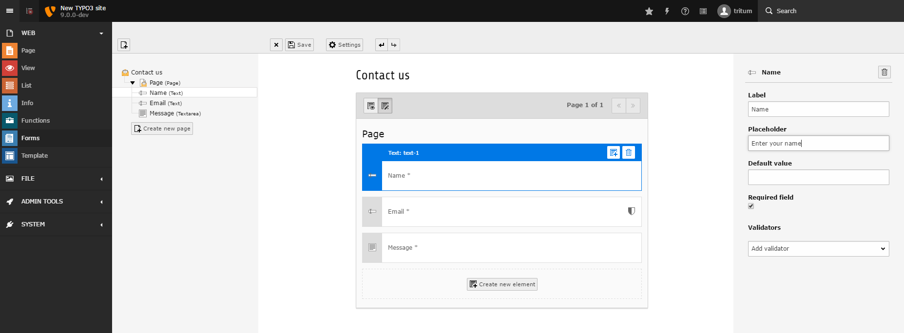

.. include:: ../Includes.txt

.. _introduction:

============
Introduction
============

.. note::

   This documentation will be extended on a constant basis. If you have
   problems understanding a certain aspect, or if you notice something
   missing, contribute to improve it. This will help you and everyone else!

   Get in touch with us:

     - Find us on `Slack <https://typo3.slack.com>`_ and join the channel
       ``#ext:form``.
     - Use the "Edit me on Github" function.

.. _what-does-it-do:

What does it do?
----------------

The ``form`` extension acts as a flexible, extendible, yet easy to use form
framework. It equally allows editors, integrators, and developers to build
all types of forms. For this task, different interfaces and techniques are
available.

As a non-technical editor, you can use the "Forms" backend module. It
allows you to create and manage your individual forms with the help of a
nifty drag and drop interface. Your work can be previewed instantly.

As an experienced integrator, you are able to build ambitious forms which
are stored directly in your site package. Those forms can utilize hefty
finishers and ship localization files.

As a developer, you can use the PHP API to forge interfaces with conditional
form elements, register new validators and finishers, as well as create
custom form elements. Plenty of hooks allow you to manipulate the generation
and processing of the both form and data.

   Form editor displaying a new form in the abstract view

Features List
-------------

The following list names some features of the form framework:

* form editor
   * fully customisable editor for building complex forms
   * replaceable and extendible form editor components
   * JS API to extend form editor
* PHP API
   * entire forms via API
   * own renderers for form and/ or form elements
   * conditional steps, form elements and validators based on other form
     elements
* configuration
   * YAML as configuration and definition language including inheritances
     and overrides
   * file based
   * behaviour and design of the frontend, plugin, and form editor can be
     adapted on a per form basis
   * 'prototypes' can be used as boilerplate
* form elements
   * own form elements possible
   * uploads handled as FAL objects
* finishers
   * ships a bunch of built-in finishers, like email, redirect, and save to
     database
   * own finishers possible
   * finisher configuration can be overridden within the form plugin
* validators
   * own validators possible
* miscellaneous
   * multiple language support
   * multiple step support
   * multiple forms on one page
   * built-in spam protection (honeypot)
