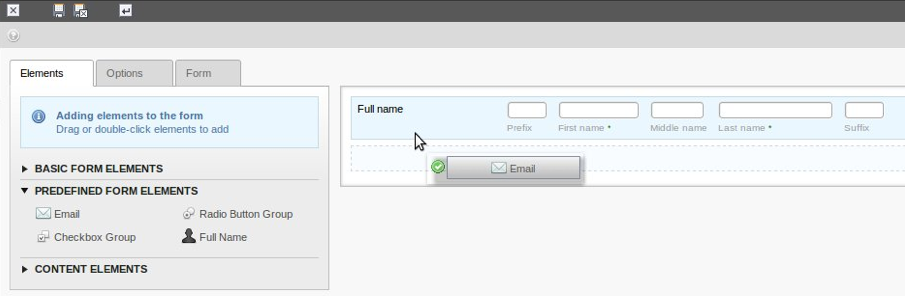

.. include:: ../Includes.txt

.. _introduction:

============
Introduction
============

.. _what-does-it-do:

What does it do?
================

This extension allows users to easily build forms using a drag and drop
interface. A WYSIWYG view simplifies the process of building a form, and
relatively non-technical editors can easily add chained validation rules
on a field-by-field basis (e.g., email or alphanumeric validation).
Furthermore, filters can be added to each field to manipulate the entered
form data.

Experienced integrators do not have to use the wizard. Instead, the form
configuration can be created just using a TypoScript like syntax.

.. _screenshots:

Screenshots
===========

    The form creation wizard with dragging & dropping of form elements

