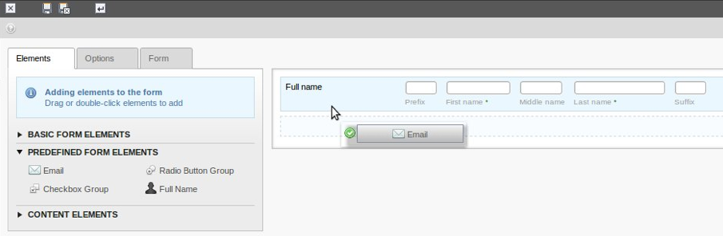

.. ==================================================
.. FOR YOUR INFORMATION
.. --------------------------------------------------
.. -*- coding: utf-8 -*- with BOM.

.. include:: ../Includes.txt

.. _introduction:

Introduction
------------

.. _what-does-it-do:

What does it do?
^^^^^^^^^^^^^^^^

This extension allows users to easily build forms using a drag and
drop interface. A WYSIWYG view simplifies the process of building a
form, and relatively non-technical editors can easily add validation
rules on a field-by-field basis (e.g., email or alphanumeric
validation).

.. _screenshots:

Screenshots
^^^^^^^^^^^

   The form creation wizard with dragging & dropping of form elements

