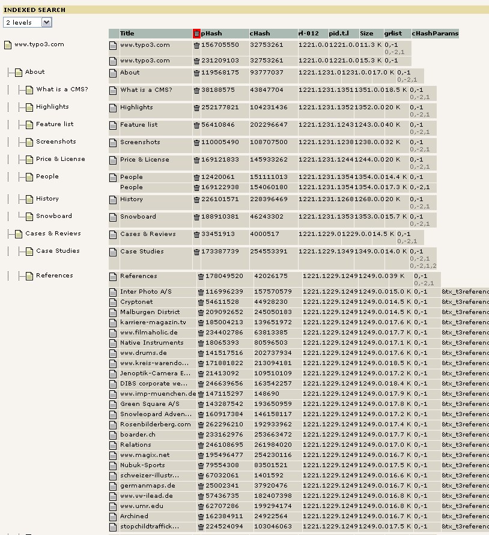
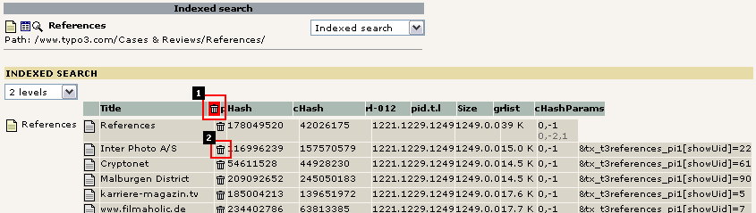
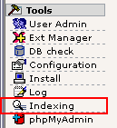
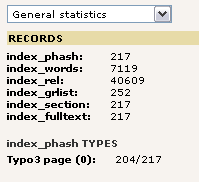
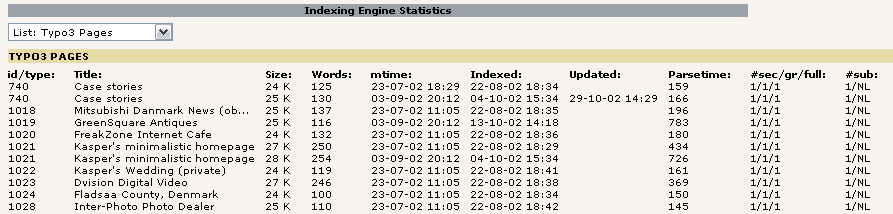

.. ==================================================
.. FOR YOUR INFORMATION
.. --------------------------------------------------
.. -*- coding: utf-8 -*- with BOM.

.. include:: ../Includes.txt

.. _administration:

Administration
--------------

.. _monitoring-indexed-content:

Monitoring indexed content
^^^^^^^^^^^^^^^^^^^^^^^^^^

The Indexed Search extension adds two backend modules, one as a global
database-wide statistics module and a page specific analysis module.

In the Web > Info module you can see an overview of how many instances
are indexed per TYPO3-page. Look at this image:

   Indexing statistics per page

As you can see most pages here are indexed only once. However a
few are indexed twice. This can happen for several reasons and here
the reason is most likely due to a user login or something related.

The most interesting occurrence is the page "References" which has more
than 20 indexed instances available. The reason is that this page
holds multiple cached views due to some parameters which are used by a
plugin on that page. Each instance will be searchable as a unique
search result.

Now imagine that you want to clear out all those instances of the
"References" page to let them be re-indexed when viewed again; Simply
click the page "References" in the page tree to the left. Then you see
this:

   Removing some indexing information to allow for reindexing

You can either click the red garbage bin (1) in order to clear all
listed instances or alternatively pick out single instances by
clicking the local garbage bin (2).

.. _monitoring-global-picture:

Monitoring the global picture of indexed pages
^^^^^^^^^^^^^^^^^^^^^^^^^^^^^^^^^^^^^^^^^^^^^^

By the Tools > Indexing module you can get statistics about the indexing
engine. Currently they are sparse and very roughly presented. This
view needs some more work to be friendly and really useful.

   Selecting the global Indexing module in the Admin Tools

.. _general-statistics:

"General statistics"
""""""""""""""""""""

This shows that 217 pages are indexed, comprising 7000+ words and
using 40.000 records in the relation table to glue things together.

   Global indexing statistics

.. _list-typo3-pages:

"List: TYPO3 Pages"
"""""""""""""""""""

This view shows a list of indexed pages with all the technical
details:

   Technical details for each page

